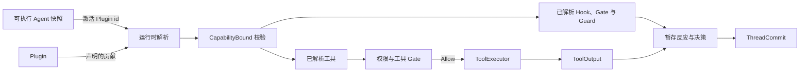
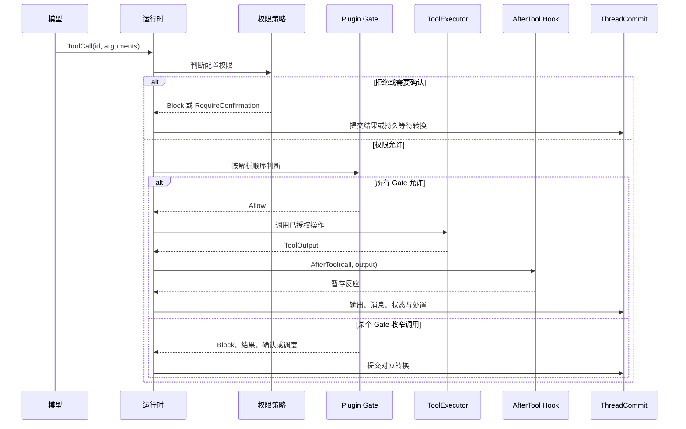

当模型需要请求一个具名操作时，选择 **Tool**。当一个功能要向运行时贡献一组有界的
工具、Hook、Gate、Guard 或状态键时，选择 **Plugin**。

如果功能只有一个工具且不需要生命周期行为，不要再套一层插件。也不要在每个工具
内部重复实现权限、重试或提交逻辑，这些职责已经有运行时所有者。

## 根据所需行为做选择

| 需求 | 使用 | 原因 |
| --- | --- | --- |
| 向模型暴露一个类型化操作 | `Tool` | 一个 id、参数模式、调用和输出 |
| 在一个或多个循环阶段改变行为 | 带 `PhaseHook` 的 `Plugin` | Hook 观察固定运行时节点 |
| 进一步限制工具调用 | 带 `ToolGate` 的 `Plugin` | Gate 只能收窄，不能授予权限 |
| 在条件满足前保持 Run 继续 | 带 `RunEndGuard` 的 `Plugin` | Guard 拥有明确的结束决策 |
| 交付包含工具和状态的完整功能 | `Plugin` | 一个能力边界覆盖整组贡献 |
| 决定工具实际在哪里执行 | `ToolExecutor` 实现 | 执行位置属于中立合约之上的编排层 |

如果需求只是日志或遥测，先使用现有事件和 tracing 接口。只有确实需要观察或改变一个
已有运行时接缝，并且该职责尚无所有者时，才应增加插件。

## 静态边界

工具实现一个操作，插件组合多项贡献。不可变 Agent 快照选择已安装插件中哪些 id 生效。
运行时解析会把插件的实际贡献与 `CapabilityBound` 比较；未声明的工具、状态键、Hook
节点、动作类型、Gate 或 Guard 都会失败关闭。

权限始终是唯一授予路径。插件 Gate 和每 Run 收窄可以减少允许集合，但不能让被权限
拒绝的调用变得可执行。

## 一次工具调用如何执行

运行时会在调用前分配持久操作标识。Provider call id 只用于协议关联，不能作为外部
副作用的幂等键。工具恢复策略单独固定，并且不能超过实现声明的恢复能力。

## 让每项职责留在唯一所有者中

| 职责 | 所有者 | 不应重复的位置 |
| --- | --- | --- |
| 类型化参数、输出与实现能力 | `Tool` | 插件配置 |
| 动态调用与执行位置 | `RawTool` / `ToolExecutor` | 模型可见模式 |
| 模型可见描述 | 已解析 Agent 快照 | 工具运行时查找表 |
| 权限授予 | 已配置权限策略 | 插件 Gate 或工具正文 |
| 贡献限制与顺序 | Plugin 解析与 `CapabilityBound` | 各个 Hook 实现 |
| 持久状态与生命周期 | `ThreadCommit` | 工具或插件直接写存储 |
| 崩溃恢复行为 | `ToolRecoveryCapability` 与固定策略 | 结果未知后的通用重试 |

## 下一步

- 用[工具 Trait](/zh/docs/agents/runtime/reference/tool-trait/)实现一个操作。
- 用[插件内部机制](/zh/docs/agents/runtime/explanation/plugin-internals/)组合多项贡献。
- 用[能力与权限](/zh/docs/agents/runtime/explanation/capability-and-permissions/)声明边界。
- 在[Run 生命周期与阶段](/zh/docs/agents/runtime/explanation/run-lifecycle-and-phases/)中查看阶段行为。
