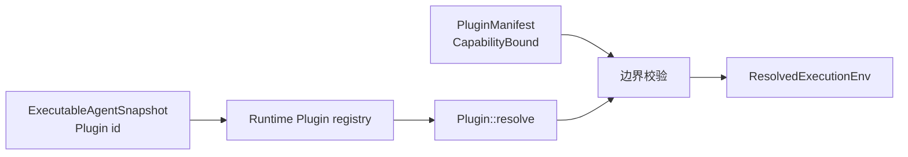
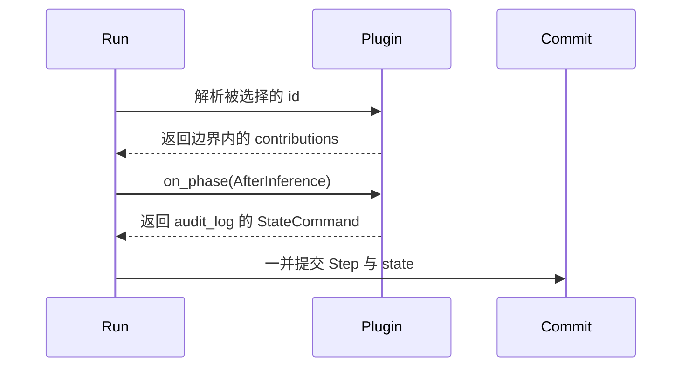

当一段行为必须进入 Agent 生命周期时，使用 Plugin。如果它只是一个由模型调用的独立
操作，请改为[添加 Tool](/zh/docs/agents/runtime/how-to/add-a-tool/)。

本页添加一个 `AfterInference` hook，用它记录 `audit_log` 状态键。当选择该 Plugin 的
Run 提交了这个状态键，任务即完成。

## 开始之前

在 Awaken 源码工作区中操作，并确保组合 Runtime 的 crate 可以使用 `awaken-runtime`、
`awaken-runtime-contract`、`awaken-agent-contract`、`async-trait` 和 `serde_json`。

## 先选择扩展接缝

| 需求 | 使用 |
| --- | --- |
| 给模型一个独立操作 | `Tool` |
| 在推理或 Tool 执行前后观察阶段、暂存状态 | Plugin phase hook |
| 决定一个 Tool call 是否可以执行 | Runtime permission gate |
| 添加模型或 Sandbox 后端 | 对应的 Runtime 端口，而不是 Plugin |

Plugin 在 `PluginManifest::bound` 中声明它可以使用的接缝；解析出的 contributions 不得
超出这个范围。



## 1. 实现一个 hook

从 hook 返回 state command。不要直接写 store 或 transcript；Runtime 会在当前 Step
中提交 reaction。

```rust
use async_trait::async_trait;
use awaken_agent_contract::agent::message::Message;
use awaken_agent_contract::agent::state::{
    Command as StateCommand, MergePolicy, Scope, Store,
};
use awaken_runtime_contract::plugin::{
    HookReaction, PhaseContext, PhaseHook, PhaseHookPoint,
};

struct AuditHook;

#[async_trait]
impl PhaseHook for AuditHook {
    fn point(&self) -> PhaseHookPoint {
        PhaseHookPoint::AfterInference
    }

    async fn on_phase(
        &self,
        ctx: &PhaseContext,
        _conversation: &[Message],
        _state: &Store,
    ) -> HookReaction {
        HookReaction::state(vec![StateCommand::set(
            Scope::Run,
            MergePolicy::Disjoint,
            "audit_log",
            serde_json::json!({ "last_inference_step": ctx.step }),
        )])
    }
}
```

## 2. 声明并注册 contribution

使用 `Contributions` 的 registrar 方法。下面的 manifest 只允许 `resolve()` 实际安装的
状态键和 hook point。

```rust
use std::sync::Arc;
use awaken_runtime_contract::plugin::{
    CapabilityBound, Contributions, IdBound, Plugin, PluginManifest,
};

struct AuditPlugin;

impl Plugin for AuditPlugin {
    fn manifest(&self) -> PluginManifest {
        PluginManifest {
            id: "audit".into(),
            requires: Vec::new(),
            config_sections: Vec::new(),
            bound: CapabilityBound {
                state_keys: IdBound::Exact(vec!["audit_log".into()]),
                phase_hooks: vec![PhaseHookPoint::AfterInference],
                ..Default::default()
            },
        }
    }

    fn resolve(&self) -> Contributions {
        let mut contributions = Contributions::new("audit");
        contributions
            .declare_state_key("audit_log")
            .register_hook(Arc::new(AuditHook));
        contributions
    }
}
```

## 3. 安装并选择 Plugin

安装让 Plugin 变得可用；不可变的 Agent snapshot 选择它之后，它才会在本次 Run 中
生效。

```rust
let runtime = Runtime::new()
    .with_llm(llm)
    .with_plugin(Arc::new(AuditPlugin));

let snapshot = ExecutableAgentSnapshot::builder("assistant")
    .instructions("Answer the request.")
    .model(model_binding)
    .plugins(["audit".to_string()])
    .build();
```



## 预期结果

物化已提交的 Run state 并读取 `audit_log`，可以看到 hook 记录的最近一次 inference
Step。没有选择 Plugin id 时，Plugin 不生效；contribution 超出声明范围时，Run 不会用
这个环境启动。

配置、依赖顺序、live refresh 和 request-only context 注入统一由
[Plugin 内部机制](/zh/docs/agents/runtime/explanation/plugin-internals/)说明。

## 源码示例

- `crates/runtime/awaken-runtime/tests/plugins.rs`
- `crates/runtime/awaken-ext-compact/src/plugin.rs`

## 下一步

- [在 Tool 与 Plugin 之间选择](/zh/docs/agents/runtime/explanation/tool-and-plugin-boundary/)
- [构建 Agent](/zh/docs/agents/runtime/how-to/build-an-agent/)
