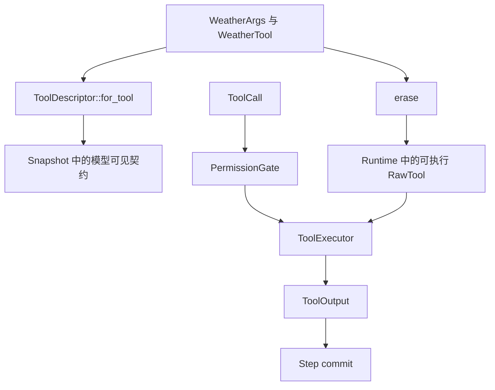

模型需要请求由 Rust 进程实现的动作时，使用本页。如果还没有跑通过受检的 `echo` 路径，
先完成[第一个 Tool](/zh/docs/agents/runtime/tutorials/first-tool/)。

## 目标

添加一项 `WeatherTool`。Rust 实现、参数 schema、模型可见 id 与 description 来自同一份
类型化契约。Runtime 通过现有 permission 与 commit 路径执行它。

## 前置条件

- owning crate 已引入 `awaken-runtime-contract`、`awaken-ext-builtin-tools`、
  `async-trait`、`serde` 与 `schemars`；
- 已有 `Runtime` 与 `ExecutableAgentSnapshot` 装配；
- 第一次测试使用确定性的 `LlmExecutor`。

## 1. 定义动作与参数

```rust
use std::sync::Arc;
use async_trait::async_trait;
use serde::Deserialize;
use awaken_runtime_contract::tool::{Tool, ToolError};

#[async_trait]
trait WeatherClient: Send + Sync {
    async fn current(&self, city: &str) -> Result<String, ToolError>;
}

#[derive(Deserialize, schemars::JsonSchema)]
#[serde(deny_unknown_fields)]
struct WeatherArgs {
    city: String,
}

struct WeatherTool {
    client: Arc<dyn WeatherClient>,
}

#[async_trait]
impl Tool for WeatherTool {
    type Args = WeatherArgs;
    type Output = String;

    const ID: &'static str = "get_weather";
    const DESCRIPTION: &'static str = "Return the current weather for one city";

    async fn call(&self, args: WeatherArgs) -> Result<String, ToolError> {
        let city = args.city.trim();
        if city.is_empty() {
            return Err(ToolError::InvalidArguments("city must not be empty".into()));
        }
        self.client.current(city).await
    }
}
```

`WeatherArgs` 同时拥有参数和 JSON Schema。错误形状会在 `call` 之前被反序列化拒绝；
`call` 处理空城市等语义检查。

## 2. 注册可执行实现

```rust
use awaken_ext_builtin_tools::erase;

let runtime = Runtime::new()
    .with_llm(llm)
    .with_tool(erase(WeatherTool { client: weather_client }));
```

`weather_client` 是应用拥有的外部服务 adapter。`erase` 是从类型化 `Tool` 到 Runtime
`RawTool` registry 的唯一 adapter。不要再写一套
adapter 或 dispatcher。

## 3. 推导模型可见描述符

```rust
use awaken_runtime_contract::resolved::ToolDescriptor;

let snapshot = ExecutableAgentSnapshot::builder("assistant")
    .instructions("Use get_weather for current weather questions.")
    .model(model_binding)
    .tool(ToolDescriptor::for_tool::<WeatherTool>("custom:weather"))
    .max_steps(8)
    .build();
```

`ToolDescriptor::for_tool` 读取 `WeatherTool::ID`、
`WeatherTool::DESCRIPTION` 与 `WeatherArgs` 的 schema。不要在手写 JSON 中重复这些值。
snapshot 决定模型能否看见 Tool；Runtime registration 决定实现能否执行。

## 4. 加入授权

把 Tool 接入现有 `PermissionGate`。根据动作后果选择 allow、block 或 approval，而不是根据
模型是否可能调用它。Tool 不应绕过这道 gate，也不应增加语义不同的第二次授权判断。

需要 approval 时，继续阅读
[启用 Tool permission HITL](/zh/docs/agents/runtime/how-to/enable-tool-permission-hitl/)。

## 5. 验证

使用脚本化模型请求一次 `get_weather`，再返回文本。在同一项测试中断言：

1. snapshot descriptor id 为 `get_weather`；
2. permission gate 允许预期参数；
3. 已提交 transcript 包含 Tool result；
4. run 以 `NaturalEnd` 结束。

还要测试错误 JSON 与空 `city`。erasure 边界会把 `ToolError` 转换成模型可见错误结果，
模型可以在后续调用中纠正，无须运维流程。只有终态结果在这套行为之后仍需外部维护者纠正时，
才增加故障排查。

## 静态结构



descriptor 与可执行实现通过唯一的 `Tool::ID` 汇合。重复注册的 id 会成为 ambiguity 并
fail closed；应移除重复 registration，不要依赖插入顺序。

## State 与外部副作用

类型化 `Tool` 返回 output，不直接写 state store。动作需要暂存 state 时，使用
[状态与快照模型](/zh/docs/agents/runtime/explanation/state-and-snapshot-model/)说明的 `RawTool`
与 `ToolOutput::with_state` 契约。为外部副作用开启自动重试前，先选择 recovery capability。
不要根据一次本地成功调用推断 replay safety。

## 下一步

- 加入经过测试的权限判断：[Tool permission HITL](/zh/docs/agents/runtime/how-to/enable-tool-permission-hitl/)。
- 选择 state 语义：[状态与快照模型](/zh/docs/agents/runtime/explanation/state-and-snapshot-model/)。
- 把 Tool 加入应用装配：[构建 Agent](/zh/docs/agents/runtime/how-to/build-an-agent/)。
