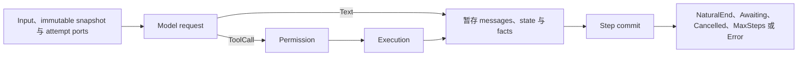

受检示例已经能在本地运行，下一项任务是把 Runtime 嵌入应用时，使用本页。本页不再复制
示例的完整源码。替换一个边界时，仍以那些示例作为可执行基线。

## 目标

应用装配一个 `Runtime`，编译或加载一份 `ExecutableAgentSnapshot`，创建一个
`RuntimeRunContext`，再读取 terminal `RunState` 与已提交 output。

## 前置条件

- [创建第一份 Agent 配置](/zh/docs/agents/runtime/tutorials/first-agent/)与
  [运行第一个 Tool](/zh/docs/agents/runtime/tutorials/first-tool/)保持不改动即可通过；
- 应用已经选择 model、Tool、permission 与 persistence 实现；
- provider credential 由应用或 Awaken Agents 服务解析，中立执行内核不读取它。

## 1. 分开三种生命周期

| 生命周期 | 所有者 | 值 |
| --- | --- | --- |
| 进程 | `Runtime` | model executor、Tool implementation、permission gate、Plugins、delegation service |
| Agent publication | `ExecutableAgentSnapshot` | instructions、固定 model candidates、Tool descriptors、Plugins、limits |
| 一次 attempt | `RuntimeRunContext` | commit/history ports、streaming、cancellation、execution scope、attempt executor |

不要在这些所有者之间同步同一个值的副本。设置只解析一次，再传给生命周期匹配的边界。

## 2. 选择 Agent publication 路径

- 应用编写 config 且需要推导 fingerprint 时，使用 `AgentConfig` 与 `compile_resolved`；
  参照 `hello_agent.rs`。
- 应用已经拥有解析后的可执行值时，使用 `ExecutableAgentSnapshot::builder`；
  参照 `direct_runtime.rs`。

进入 `Runtime::run` 前，两条路径产生同一种 snapshot contract。选择其中一条；不要先编译
`AgentConfig`，再手工重建一份 snapshot。

## 3. 每次替换一个进程 port

从受检的本地 model double 开始，只替换应用需要的 port：

1. 绑定显式配置的 `LlmExecutor`；
2. 通过[实现类型化 Tool](/zh/docs/agents/runtime/how-to/add-a-tool/)添加 Tool；
3. 让所有 Tool execution path 共用一个 `PermissionGate`；
4. 只有 Agent 确实需要时才加入 Plugin 或 delegation。

每替换一项就运行基线测试。这样 provider error、Tool contract error 与 permission decision
仍能分开判断。

## 4. 选择 attempt 的持久化方式

`RuntimeRunContext::new()` 允许 ephemeral run。应用需要 durable transcript 或 state 时，
加入 `CommitCoordinator`；后续 run 需要继续已提交历史时，再加入匹配的 read port。跨进程
重启的持久化使用 `awaken-store-*` backend。

没有 commit coordinator 不是 Runtime fault，而是一项明确的 ephemeral 选择。只有应用
要求 durable output 却没有提供该 port 时，才需要外部维护者修正装配。

## 5. 运行并处理终态结果

全新的一次性 thread 使用 `Runtime::run`。approval 可能让 run 进入 `Awaiting` 时，使用
stable-thread 的 `start_run` 与 `resume` 路径，或使用 `run_to_completion`。

`Awaiting` 是等待 resume 的状态，不是需要重启的故障。Tool invocation error 会成为模型可见
结果。连续 inference failure 会在 loop 内重试，直到 Runtime threshold。只有返回的终态结果
或显式 configuration error 在这套恢复之后仍需外部改动时，才采取动作。

## 6. 验证

应用路径至少测试以下结果：

| 原因 | 预期效果 |
| --- | --- |
| 模型只返回文本 | `NaturalEnd`，并提交 assistant output |
| 允许的 Tool request | 下一次 model turn 前提交一次 Tool result |
| 需要 approval | `Awaiting` 带 resumable ticket，随后只继续到一个终态 |
| Tool 参数错误 | 模型可见 error result；进程不崩溃 |
| 需要 durable output 但未提供 commit port | application assembly test 在验收前失败 |

把 cause、expected effect 与覆盖的 rule 写进对应测试注释。测试注释拥有一份 decision table，
不要另建平行的 test-design 文档。

## 下一步

- 持久化 history：[使用 File Store](/zh/docs/agents/runtime/how-to/use-file-store/)或[使用 Postgres Store](/zh/docs/agents/runtime/how-to/use-postgres-store/)。
- 加入 approval：[Tool permission HITL](/zh/docs/agents/runtime/how-to/enable-tool-permission-hitl/)。
- 通过 owning service plane 暴露应用：[Awaken Agents](/zh/docs/agents/)。
