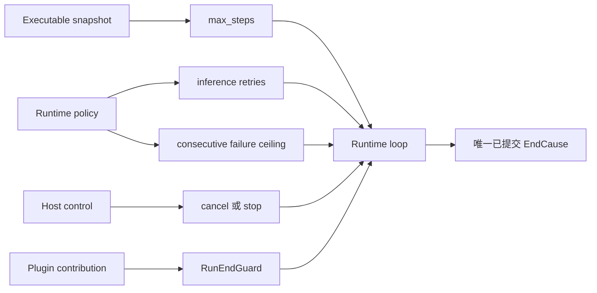
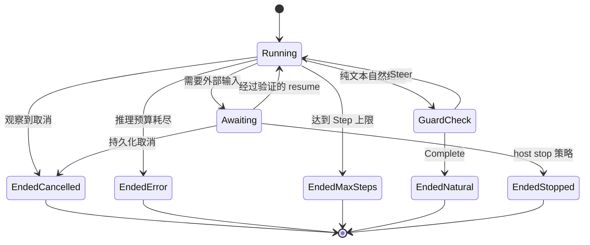

一个 Run 只通过一个已提交的 `EndCause` 结束。按照必须结束工作的原因选择控制方式，
不要叠加表达同一策略的多重限制。

| 需要完成的事 | 权威控制 | 已提交结果 |
| --- | --- | --- |
| 限制模型与 Tool 循环 | `ExecutableAgentSnapshot.resolved_spec.max_steps` | `EndCause::MaxSteps` |
| 限制可重试推理工作 | `with_infer_retries` 加 `with_max_consecutive_inference_failures` | 两层预算结束后为 `EndCause::Error(Failure::Inference)` |
| 按请求停止活跃工作 | `CancellationToken` 或 `LiveCommand::Cancel` | `EndCause::Cancelled` |
| 持久化取消排队或等待中的工作 | 通过已提交控制路径调用 `Runtime::cancel_run` | `EndCause::Cancelled` |
| 因应用策略结束未运行的工作 | `Runtime::stop_run(reason)` | `EndCause::Stopped(reason)` |
| 自然结束前检查一个条件 | 一个有界 `RunEndGuard` | `Complete` 后为 `NaturalEnd`，`Steer` 后再执行一个 Step |
| 限制耗时 | host timer 取消 attempt | `Cancelled` |

`RunState::Ended` 是吸收态。UI 响应、取消信号或 timeout 都不是终态事实；对应状态
提交后才算结束。

## 静态结构



## 设置硬循环上限

已发布的默认值是 `16` 个 Step。当 Agent 工作需要不同的失控保护范围时，在 snapshot
上设置更小或更大的值。

```rust
let snapshot = ExecutableAgentSnapshot::builder("assistant")
    .instructions("Complete the task and report the result.")
    .model(ModelBinding::new("provider", "model", "backend"))
    .max_steps(25)
    .build();
```

每个被吸收的推理失败和每个 guard 引导的 continuation 都会消耗一个 Step。即使其他
策略继续循环，硬上限仍然有效。

## 单独限制推理失败

```rust
let runtime = Runtime::new()
    .with_llm(llm)
    .with_infer_retries(2)
    .with_max_consecutive_inference_failures(3);
```

`with_infer_retries(2)` 允许在一个失败的 inference Step 内再尝试两次。它结束后，
连续失败上限再决定循环是否可以尝试下一个 Step。一次成功推理会重置第二个计数。
连续失败上限传入零时会被收紧为一，因此故障不会意外变成永不终止。

provider failover 是另一项决定。只有尚未产生 partial、且错误分类允许下一候选时才
能 failover。一旦已有部分输出，恢复会留在同一个模型路径。

## 取消活跃工作，终结非活跃工作

host 拥有活跃 attempt 时，把 `CancellationToken` 挂到 `RuntimeRunContext`。循环会
在 inference 前、inference 执行中、Step 边界和 Tool 执行中检查它。
`LiveCommand::Cancel` 会到达同一个活跃 attempt 控制。

排队或等待中的工作应通过持久化 ingress 路径调用 `Runtime::cancel_run`。只有未运行
Run 因应用策略结束，例如外部预算耗尽时，才使用 `Runtime::stop_run(reason)`。两者
都会清除 awaiting ticket，后续 resume 会关闭失败。

## 守住自然结束条件

`RunEndGuard` 读取不可变 conversation、物化 state、forced continuation 次数与可选
cancellation token，并返回 `Complete` 或 `Steer`。通过一个 Plugin 注册它，并把
id 写入该 Plugin 的 `CapabilityBound.run_end_guards`。

guard 适合检查已完成 conversation 上的条件，不适合复制步数、时间或 inference
预算。若它可能 `Steer`，为该条件设置自己的小型 continuation 上限；`max_steps`
仍是最终保护。

## 动态行为



## 把 `Indeterminate` 当作终态不确定性

`EndCause::Indeterminate` 表示外部异步执行返回时无法判断 effect。它是终态，并投影
为 code 是 `indeterminate` 的 `RunFailed`；系统不承诺稍后自动出现另一个 Run
fact。使用 Runtime 自有 operation identity 检查外部系统并对账，之后才能决定新
Run 是否可以再次发出请求。不要依据展示消息直接重试。

## 确认所选控制已经生效

用所选限制或控制运行一项有代表性的任务，再读取已提交的 `RunState`。只有出现与该
控制相符的 `EndCause`，才能确认配置已生效。单独的实时事件或 UI 确认并不充分。

精确控制路径见[取消参考](/zh/docs/agents/runtime/reference/cancellation/)，提交与恢复顺序见
[Run 生命周期](/zh/docs/agents/runtime/explanation/run-lifecycle-and-phases/)。
