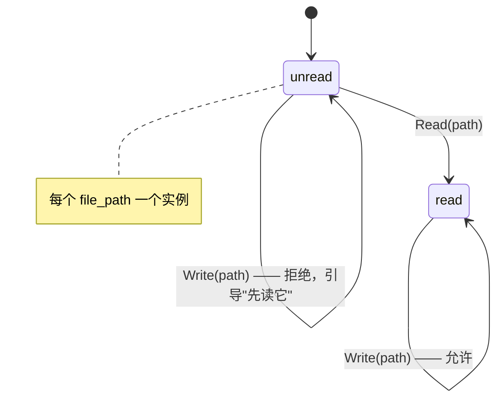

当你想强制工具调用的顺序——比如先读后写——时使用它：用一个声明式状态机来门控、引导并提醒。

## 问题

模型可以在任意时刻调用任何暴露出来的工具。有些任务有一个*顺序*，无论模型如何决定都必须成立：只有在读过一个文件之后才写它、只有在确认过一条记录之后才删除它、只有在一次 dry run 通过之后才发布。权限规则可以放行或拒绝一个工具，但它们无法表达“只有在*这个*文件的 `Read` 跑过之后才允许 `Write`”——它们不携带 run 中更早发生过什么的记忆。

`awaken-ext-state-machine` 插件弥合了这个缺口。它加载一个声明式的有限状态机（JSON 或 YAML），监视一族工具调用，保持一份小的按实例划分的状态（例如每个 `file_path` 一个状态），并在每次调用时决定该调用是被允许、被拒绝、还是必须暂停以待审批。一次调用运行后它推进实例状态，并可以向模型浮现一条提醒。它从不授予授权——权限仍是*放行*一次调用的唯一途径；一个状态机只能*收窄*一个 gate 已经允许的东西。

状态机的 `emit` action 会在 transition 触发时注入已配置 reminder；reminder 行为由
这一个 state-machine 实现拥有。

## 前置条件

- 一个可用的 awaken agent 运行时（见[第一个 Agent](/zh/docs/agents/runtime/tutorials/first-agent/)）
- 在 `Cargo.toml` 中加入 `awaken-ext-state-machine` crate

```toml
[dependencies]
awaken-runtime = { git = "https://github.com/AwakenWorks/awaken" }
awaken-ext-state-machine = { git = "https://github.com/AwakenWorks/awaken" }
tokio = { version = "1", features = ["full"] }
serde_json = "1"
```

## 插件贡献了什么

`StateMachinePlugin`（id `STATE_MACHINE_PLUGIN_ID` = `"state_machine"`）在其 `CapabilityBound` 下安装三个接缝，全都由同一套编译好的状态机集驱动：

| 接缝 | 贡献 | 效果 |
|------|--------------|--------|
| 执行前 gate | 一个 `ToolGateHook` | 一次前置条件违规把 `deny` → 阻断该调用，`ask` → 挂起以待审批，`warn`/无违规 → 放行 |
| 执行后 hook | 一个 `AfterTool` phase hook | 依据结果推进实例状态，发出提醒消息，记录 metrics 与一份违规日志 |
| Run 结束守卫 | 一个 `RunEndGuard` | 只要还有任何状态机实例处于非终止状态就强制继续，直到一个上限 |

它还声明了四个状态键——`tool_fsm_thread_state`、`tool_fsm_run_state`、`tool_fsm_metrics`、`tool_fsm_violation_log`——因此实例状态、metrics 与违规日志会像任何其他状态一样被提交并可重放。

## DSL 的形状

顶层配置是 `StateMachineConfig`：一个 `machines` 列表加上共享的 `continuation` 设置。

```yaml
machines:
  - name: read-before-write     # unique machine name
    scope: thread               # thread (persists across runs) | run (resets each run)
    key: "{file_path}"          # instance key template, extracted from tool args
    key_normalizer: path        # none | trim | lowercase | path | url
    initial: unread             # starting state for a fresh instance
    strict: false               # true => a keyed call matching no transition is a violation
    on_unmatched: null          # fallback target when a call is allowed but no `when` matched
    terminal: [written]         # states that count as "done" for the run-end guard
    transitions:
      - on: 'Read(file_path ~ "*")'   # tool-call pattern
        from: [unread, read, written] # one state or a list
        to: read
      - on: 'Write(file_path ~ "*")'
        from: read
        to: written
        when: { status: success }     # advance only on a successful result
        emit:
          target: system              # system | suffix_system | session | conversation
          content: "Wrote {file_path}"
          cooldown_turns: 2
        on_violation:
          action: deny                # deny | ask | warn
          reason: "Read {file_path} before writing."
continuation:
  max_continuations: 25         # 0 disables the run-end guard
  message: "Finish the protocol work: {summary}"
```

关键部件：

- **实例键（Instance key）**——`key` 是一个 `KeyTemplate`。`"{file_path}"` 提取
  `file_path` 参数，`"{target.path}"` 遍历嵌套对象，
  `"{items[0].name}"` 索引数组。一个空模板产生一个全局实例。`key_normalizer` 规范化渲染出的键（`path` 折叠
  `.`/`..` 与分隔符；`url` 把 scheme/host 转小写并丢弃 fragment）。
- **转移 `on`**——一个由 `awaken-tool-pattern` 解析的工具调用模式，例如
  `Write(file_path ~ "*")` 匹配一个其 `file_path` 以 glob 匹配 `*` 的 `Write`。
- **`when`**——一个执行后被求值的 `ResultMatcher`：`"any"`、`"success"`、
  `"error"`，或一个结构化的 `{ status, content }`，其中 `content` 是对字符串化结果的一个 glob。缺省的 `when` 仅在成功时触发。
- **`emit`**——转移触发时注入的一条提醒。`target` 放置它
  （`system` 在基础提示词之后，`suffix_system` 在历史之后——侵入性最小的默认值，
  `session`/`conversation` 作为一个 turn）。`cooldown_turns`
  节流同一提醒的再注入；`role`（`user`/`assistant`）
  仅作用于带位置的 target。
- **`on_violation`**——当调用匹配了一个转移但实例不处于其某个 `from` 状态时会发生什么：`deny`（用一个反馈给模型的错误拒绝这一次调用）、`ask`（挂起以待人机协同
  审批）、或 `warn`（放行，然后在执行后注入一条警告）。`reason`
  是一个用工具参数插值的模板。
- **`continuation`**——`max_continuations` 限定 run 结束守卫把模型引导回去完成一个非终止实例的次数；`message` 的
  `{summary}` 会被填入未完成的实例。

## 步骤

1. 编写状态机并编译插件。

   `StateMachineConfig::from_yaml_str` / `from_json_str` 解析这个 DSL；
   `StateMachinePlugin::from_config` 预先编译模式与模板，
   于是一个坏的模式会在构造时而非 run 中途快速失败。

```rust
use std::sync::Arc;
use awaken_ext_state_machine::{StateMachineConfig, StateMachinePlugin};

const READ_BEFORE_WRITE: &str = r#"
machines:
  - name: read-before-write
    key: "{file_path}"
    key_normalizer: path
    initial: unread
    terminal: [written]
    transitions:
      - on: 'Read(file_path ~ "*")'
        from: [unread, read, written]
        to: read
      - on: 'Write(file_path ~ "*")'
        from: read
        to: written
        when: { status: success }
        emit: { target: system, content: "Wrote {file_path}", cooldown_turns: 2 }
        on_violation: { action: deny, reason: "Read {file_path} before writing." }
continuation:
  max_continuations: 25
"#;

let config = StateMachineConfig::from_yaml_str(READ_BEFORE_WRITE)?;
let plugin = Arc::new(StateMachinePlugin::from_config(config)?);
# Ok::<(), Box<dyn std::error::Error>>(())
```

2. 安装插件并在 run 上激活它。

   与任何插件一样，`with_plugin` 安装它，而 run 的 `plugins([...])`
   列表才是激活它的东西（一个已安装但未列出的插件是惰性的）。见
   [添加 Plugin](/zh/docs/agents/runtime/how-to/add-a-plugin/)。

```rust
use awaken_ext_state_machine::STATE_MACHINE_PLUGIN_ID;
use awaken_runtime::Runtime;
use awaken_runtime_contract::resolved::ModelBinding;
use awaken_runtime_contract::snapshot::ExecutableAgentSnapshot;

let runtime = Runtime::new()
    .with_llm(llm)
    .with_plugin(plugin);

let config = ExecutableAgentSnapshot::builder("assistant")
    .instructions("Read a file before writing it.")
    .model(ModelBinding::new("demo", "stub", "stub"))
    .plugins([STATE_MACHINE_PLUGIN_ID.to_string()]) // activate for this run
    .build();
```

3. （另一种做法）交付基础状态机，并让每个 agent 添加自己的。

   注册一次 `StateMachinePlugin::empty()`，并通过 `state_machine` 配置节把状态机给到每个 run。插件把基础状态机与该配置节的状态机合并（一个在两处都声明的名字是配置错误，失败即关闭）。该配置节通过 `plugin_config` 以 `STATE_MACHINE_PLUGIN_ID` 为键。

```rust
let section = serde_json::json!({
    "machines": [ /* MachineEntry objects, same shape as the YAML above */ ],
    "continuation": { "max_continuations": 25 }
});

let config = ExecutableAgentSnapshot::builder("assistant")
    .instructions("Read a file before writing it.")
    .model(ModelBinding::new("demo", "stub", "stub"))
    .plugins([STATE_MACHINE_PLUGIN_ID.to_string()])
    .plugin_config([(STATE_MACHINE_PLUGIN_ID.to_string(), section)])
    .build();
```

## 先读后写状态机的行为



- 模型先调用 `Write(file_path = "src/a.rs")`。`src/a.rs` 的实例处于
  `unread`，它不是 `Write` 转移的一个 `from` 状态——gate **拒绝**该调用并反馈 "Read src/a.rs before
  writing."
- 模型调用 `Read(file_path = "src/a.rs")`。它匹配 `Read`
  从 `unread` 出发的转移，于是实例推进到 `read`。
- 模型重试 `Write(file_path = "src/a.rs")`。现在实例处于
  `read`，gate 放行它，在一个成功的结果上实例推进到
  `written`，并发出 "Wrote src/a.rs" 提醒（节流到至多
  每两步一次）。
- 因为 `written` 是唯一的 `terminal` 状态，run 结束守卫会引导模型去完成任何仍卡在 `unread`/`read` 的实例——至多
  `max_continuations` 次。

把 `on_violation.action` 切到 `warn` 让写入通过但事后推动一下模型，或切到 `ask` 让该调用挂起以待外部审批（gate
返回一张挂起票据由 host 解决——见
[启用工具权限 HITL](/zh/docs/agents/runtime/how-to/enable-tool-permission-hitl/)）。

## 验证

1. 用一个先写后读的序列驱动 agent。第一次 `Write` 应当
   作为一个点出你 `reason` 的错误结果返回；第二次（在一次 `Read` 之后）
   应当成功。
2. 检查已提交的状态：成功写入之后，`tool_fsm_thread_state` 应当持有
   `read-before-write → { "src/a.rs": "written" }`，而
   `tool_fsm_metrics` 应当记录那次拒绝与那次转移。
3. 让一个实例留在非终止状态时结束 run，并确认 run 结束守卫
   用你的 `continuation.message` 重新引导模型。

## 常见错误

| 症状 | 原因 | 修复 |
|---------|-------|-----|
| 构造时 `StateMachineConfigError::Pattern` | `on` 中一个格式错误的工具调用模式 | 修正模式，例如 `Read(file_path ~ "*")` |
| `StateMachineConfigError::Action` / `::Status` | 未知的 `on_violation` action 或 `when` status | 使用 `deny`/`ask`/`warn` 与 `any`/`success`/`error` |
| `StateMachineConfigError::DuplicateMachine` | 两个状态机共享一个 `name` | 重命名其一；名字必须唯一（在 base + config 节之间也是） |
| 状态机从不触发 | 插件 id 不在 run 的 `plugins([...])` 中 | 把 `STATE_MACHINE_PLUGIN_ID` 加入激活列表 |
| 实例从不推进 | `key` 模板没能对该工具的参数解析出来 | 确认该字段存在于工具参数中；一个未解析的键会跳过该状态机 |
| 提醒从不出现 | 仍在冷却中 | 降低 `cooldown_turns`，或接受这个节流 |

## 代码引用

- `crates/runtime/awaken-ext-state-machine/src/config.rs` —— DSL 条目与编译测试（JSON 与 YAML 形式的 read-before-write）
- `crates/runtime/awaken-ext-state-machine/src/plugin.rs` —— `CapabilityBound` 下 gate、`AfterTool` phase hook 与 run 结束守卫的接线
- `docs/design/tool-state-machine.md` —— 状态模型、四个运行时接缝与持久性保证

## 关键文件

| 路径 | 用途 |
|------|---------|
| `crates/runtime/awaken-ext-state-machine/src/lib.rs` | 模块根与公开再导出 |
| `crates/runtime/awaken-ext-state-machine/src/config.rs` | `StateMachineConfig`、`ContinuationSettings`、DSL 解析 |
| `crates/runtime/awaken-ext-state-machine/src/machine.rs` | `Machine`、`Transition`、`Violation`、`ViolationAction`、`Emit`、`EmitTarget`、`KeyTemplate`、`KeyNormalizer`、`MachineScope` |
| `crates/runtime/awaken-ext-state-machine/src/result.rs` | `ResultMatcher`、`StatusMatcher`、`ContentMatcher`、`ToolResultView` |
| `crates/runtime/awaken-ext-state-machine/src/plugin.rs` | `StateMachinePlugin`、`STATE_MACHINE_PLUGIN_ID` |

## 相关

- [添加 Plugin](/zh/docs/agents/runtime/how-to/add-a-plugin/)
- [通过配置调优 Agent 行为](/zh/docs/agents/how-to/configure-agent-behavior/)
- [启用工具权限 HITL](/zh/docs/agents/runtime/how-to/enable-tool-permission-hitl/)
- [Tool Trait](/zh/docs/agents/runtime/reference/tool-trait/)
