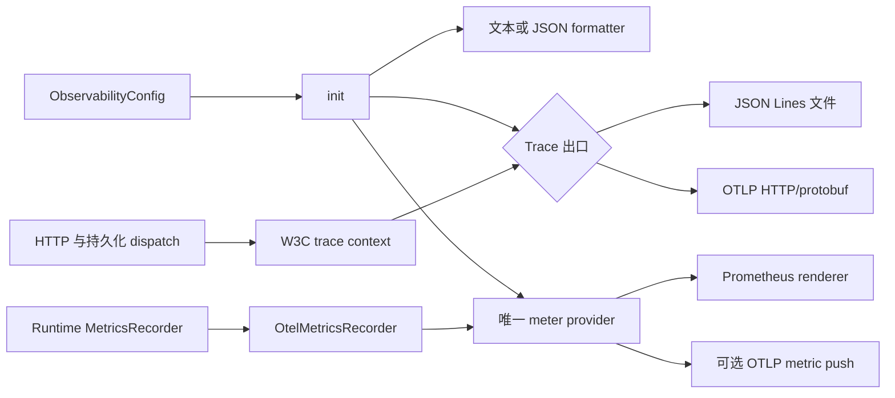
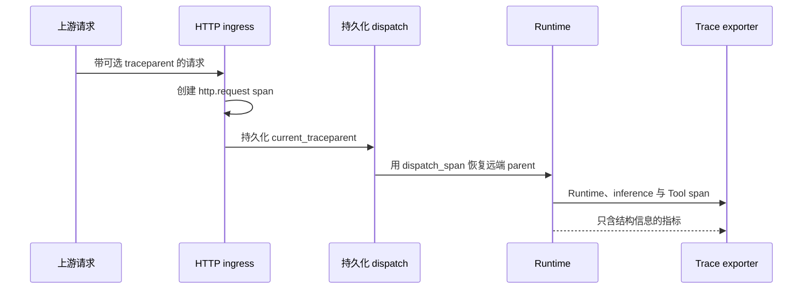

先写下要回答的问题，再启用能够回答它的最小信号。

| 问题 | 信号 | 可用出口 |
| --- | --- | --- |
| 这个进程发生了什么？ | 经过 filter 的文本或 JSON 日志 | 进程输出 |
| 一次请求把时间花在哪里？ | OpenTelemetry spans | JSON Lines trace 文件或 OTLP/HTTP |
| 多个 Run 的行为是否在变化？ | counter、histogram 与 gauge | Prometheus scrape 与可选 OTLP push |
| 一个 trace 是否跨过 HTTP 或持久化 dispatch？ | W3C `traceparent` | `trace_http`、持久化 carrier 与 `dispatch_span` |

该库只负责进程级管线。Runtime、HTTP、dispatch 与 Worker 组件分别发出描述自身
工作的 span 和指标。

## 静态结构



## 嵌入式进程只初始化一次

进入 Tokio runtime 后调用 `init`，再创建 `OtelMetricsRecorder`。在 runtime 仍能
驱动 exporter 时调用 `shutdown`。最终 flush 对 trace 最多等待三秒，对指标也最多
等待三秒。

```rust
use awaken_observability::{
    LogFormat, ObservabilityConfig, OtelConfig, OtelMetricsRecorder,
};

let config = ObservabilityConfig {
    filter: "info,awaken_runtime=debug".into(),
    log_format: LogFormat::Json,
    trace_file: Some("/tmp/awaken-trace.jsonl".into()),
    otel: OtelConfig::default(),
};

awaken_observability::init(&config);
let metrics = OtelMetricsRecorder::new();

// 把 `metrics` 交给 Runtime 或 host 的 MetricsRecorder 端口。

awaken_observability::shutdown();
```

初始化是进程全局且幂等的。后续调用不会用新策略替换 subscriber 或 meter provider。

## 配置 `awaken` binary

binary 从自己的 TOML 文件解析显式配置；observability 库不读取环境中的部署变量。

```toml
log_filter = "info,awaken_runtime=debug"
log_format = "json"
trace_file = "/var/log/awaken/traces.jsonl"

# 可选的 OTLP/HTTP Collector，用于指标。若 trace 也要发送到这里，请删除 trace_file。
otlp_endpoint = "http://otel-collector:4318"
otlp_protocol = "http/protobuf"
otel_service_name = "awaken"
otel_service_version = "1.0.0"
otel_metric_export_interval_ms = 60000
```

resolver 会拒绝未知 `log_format`、不支持的协议拼写、空 filter、空 header 名称，以及
为零的 timeout 或 metric interval。非空但无效的 filter 会到达库层，并回退为
`info`。

### 当前 exporter 边界

请使用 `http/protobuf`。当前构建没有 OTLP/gRPC transport；选择 `grpc` 会产生
warning，并改用 HTTP/protobuf。类型化配置目前虽然接受 `http/json`、headers 和
export timeout，exporter builder 并未应用这三项，因此不要依赖它们。远端后端需要
鉴权时，先发送到可达的本地 Collector，再由 Collector 负责带鉴权转发。

对 trace 而言，`trace_file` 的优先级高于 OTLP endpoint。指标仍使用同一个 meter
provider：始终可以由 Prometheus 获取；配置 OTLP endpoint 后也会 push。没有 trace
出口时，日志和 Prometheus 指标仍正常，但不会导出 span。

## 跨边界延续一个 trace

在组装好的 Axum router 上只挂载一次 `trace_http`。路由匹配成功时，它记录稳定的
route template，避免不透明 id 造成无界 cardinality。创建持久化 dispatch 时保存
`current_traceparent()`，消费进程再把保存值传给 `dispatch_span()`。



格式错误的 carrier 会被忽略，请求得到一个新的 trace。这个情况不需要修复流程。

## 从出口向内验证

1. 先使用 `trace_file`，运行一个确定性 Agent 轮次，调用 `shutdown`，确认 JSON Lines
   文件中出现具有 parent 关系的 span tree。
2. 产生一次 inference 或 Tool 结果，再读取进程已配置的 admin `/metrics` endpoint；
   确认出现 `gen_ai_client_*` 或 `awaken_*` 指标族。
3. 用 OTLP/HTTP endpoint 替换 trace 文件，确认 Collector 收到 trace；指标至少等待
   一个已配置的 interval。
4. 发送有效 `traceparent`，确认 HTTP、dispatch、Runtime、inference 与 Tool span
   保持同一个 trace id。

exporter 或 meter 初始化失败时，进程会记录错误并继续运行。如果业务要求导出，而
信号持续缺失，先重复 trace 文件检查。若文件检查成功，修正 Collector endpoint 或
网络路径；若失败，修正进程权限或初始化顺序。telemetry 不可用时，Runtime 的已提交
执行事实仍是权威。

## 内容边界

`OtelMetricsRecorder` 只使用模型 id、Tool id 与 outcome 等结构化 label，不记录
prompt 或 Tool result 内容。trace 可能包含发出组件提供的更详细属性；所有 trace
出口都应按敏感运行数据管理，并在 Runtime 之外审查保留策略。

组件归属见[架构](/zh/docs/agents/runtime/explanation/architecture/)，确定性可观测性检查见
[测试策略](/zh/docs/agents/runtime/how-to/testing-strategy/)。
