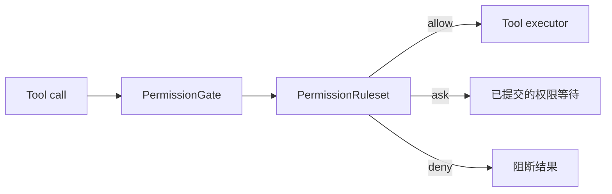
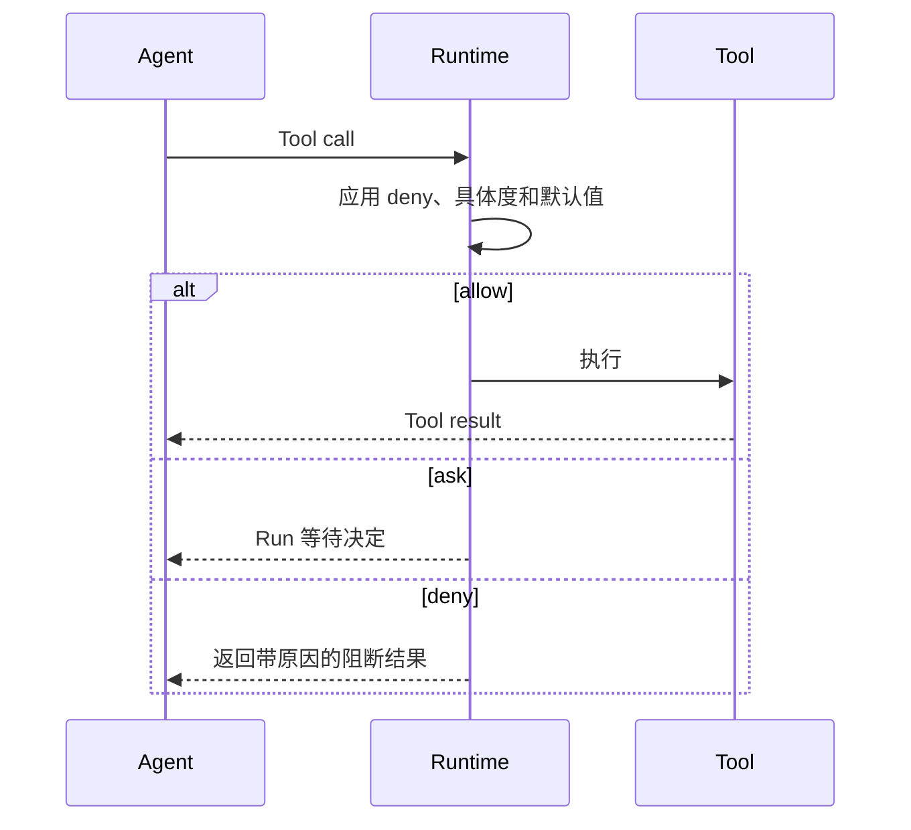

先以 `RequireConfirmation` 作为默认行为，再为日常读取添加范围明确的 `Allow`，并为绝不
允许执行的操作添加 `Deny`。当 Runtime 在每次 Tool call 执行前应用同一策略，任务即完成。

## 开始之前

从已经安装模型和 Tool 的 Runtime 开始，并添加 `awaken-ext-permission`。该 crate 的
ruleset 将成为 Runtime gate 使用的策略。

## 1. 定义策略

Tool id 和字段名区分大小写。内置 Hand 使用 `read`、`write`、`edit`、`bash` 等 id，
公开参数包括 `file_path` 和 `command`。规则必须匹配实际发布给 Agent 的 descriptor。

```rust
use awaken_ext_permission::{
    Mode, PermissionRule, PermissionRuleset, RuleBasedToolPermissionPolicy,
    ToolCallPattern, ToolPermissionBehavior,
};

let rule = |pattern: &str, behavior| {
    PermissionRule::new(
        ToolCallPattern::parse(pattern).expect("valid glob pattern"),
        behavior,
    )
};

let ruleset = PermissionRuleset {
    default_behavior: ToolPermissionBehavior::RequireConfirmation,
    mode: Mode::Default,
    rules: vec![
        rule("read", ToolPermissionBehavior::Allow),
        rule("bash(command ~ \"cargo test *\")", ToolPermissionBehavior::Allow),
        rule("write(file_path ~ \"src/**\")", ToolPermissionBehavior::RequireConfirmation),
        rule("edit(file_path ~ \"src/**\")", ToolPermissionBehavior::RequireConfirmation),
        rule("bash(command ~ \"*rm *\")", ToolPermissionBehavior::Deny),
    ],
};
```

规则使用 glob，而不是正则表达式。任何匹配的 deny 都优先；否则由最具体的 allow 或 ask
规则决定，未匹配的调用使用 mode 默认值。

## 2. 安装 gate

`PermissionGate` 把规则策略接到 Tool 执行前必经的 gate。它对整个 Runtime 生效，不是
由 `plugin_ids` 选择的 Plugin。

```rust
use std::sync::Arc;
use awaken_runtime::{PermissionGate, Runtime};

let policy = RuleBasedToolPermissionPolicy::new(ruleset);
let gate = PermissionGate::new(Arc::new(policy));
let runtime = Runtime::new()
    .with_llm(llm)
    .with_gate(Arc::new(gate));
```



## 调用方会看到什么



allow 会抵达 executor；ask 会在 Tool 执行前让 Run 等待；deny 返回阻断结果。票据校验和
allow/deny 恢复步骤只有一个说明页面：
[人机协同](/zh/docs/agents/runtime/explanation/human-in-the-loop/)。

## 源码示例

- `crates/runtime/awaken-ext-permission/tests/`
- `crates/devtools/awaken-runtime-examples/src/coding_agent/mod.rs`

## 下一步

- [能力与权限](/zh/docs/agents/runtime/explanation/capability-and-permissions/)
- [Tool Trait 参考](/zh/docs/agents/runtime/reference/tool-trait/)
