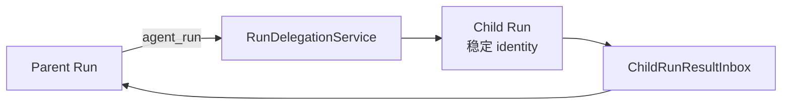
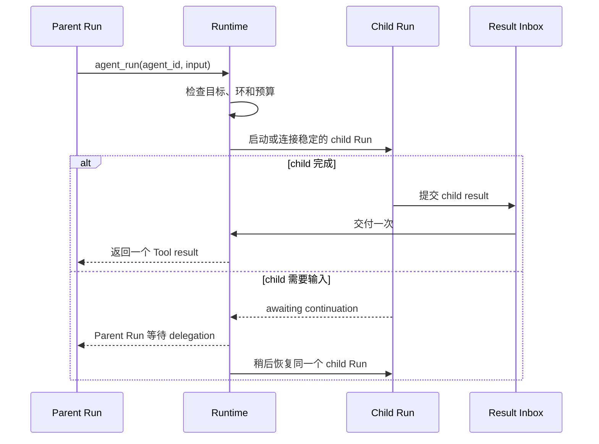

当父 Agent 需要一个专业 Agent 返回单个有界结果，并在收到结果后继续当前任务时，使用
`agent_run`。不要在 `Tool::call` 内启动另一个 Agent loop；那会产生第二条执行路径，
绕过恢复、取消和结果交付所依赖的 child Run identity。

## 开始之前

- 发布目标 Agent，并允许父 Agent 委派给它。
- 本地或 A2A 的常规路径使用 Host 提供的 delegation service。
- 只有添加新的执行后端时，才自行实现 `RunDelegationService`。

模型看到的输入只有一种类型：

```json
{
  "agent_id": "researcher",
  "input": "Summarize the migration risks in these files."
}
```

## 静态结构



Host 通常在组合 Runtime 时安装这个 service：

```rust
let runtime = Runtime::new()
    .with_llm(llm)
    .with_run_delegation(delegation_service);
```

`agent_run` 由 Runtime 识别，不作为普通可执行 Tool 注册。发布的 Tool descriptor 提供
`{ agent_id, input }` schema；service 把该 id 解析到已固定的目标 publication。

## 执行过程



## 预期结果

父 Agent 以 `agent_run` Tool result 收到 child 的终态文本，并继续自己的 Run。child
暂停时，Runtime 稍后恢复同一个 child identity；应用不需要保存进程内 child handle。

一个确定的操作应使用普通 Tool；需要让责任超出父任务生命周期时，应使用外部工作流或
Workforce。详细状态、限制、失败与取消契约统一由
[多 Agent 模式](/zh/docs/agents/runtime/explanation/multi-agent-patterns/)说明。

## 源码示例

- `crates/runtime/awaken-runtime/tests/delegation.rs`
- `crates/server/awaken-runtime-host/src/delegate.rs`

## 下一步

- [选择委派或责任交接](/zh/docs/agents/runtime/how-to/use-agent-handoff/)
- [从 Tool 延迟一个调用](/zh/docs/agents/runtime/how-to/start-background-work-from-a-tool/)
