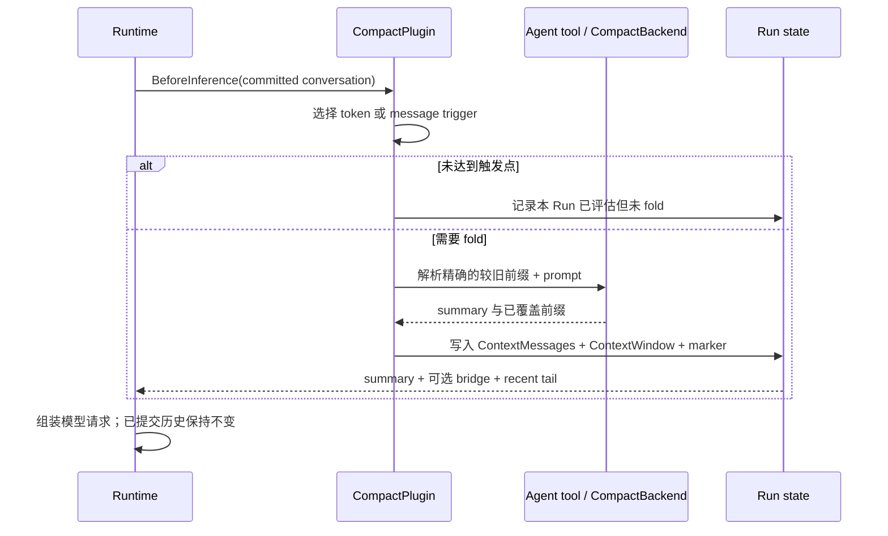

Awaken 提供两种互相独立、均不破坏持久真相的上下文控制：

| 控制 | Owner | 效果 |
|---|---|---|
| 请求裁剪 | executable snapshot 中的 `ContextPolicy` | 在每次模型请求中保留固定的近期消息后缀。 |
| 压缩 | `compact` plugin | summary 可用后，以 summary 替换请求中的较旧前缀。 |

两条路径都不会删除或改写已提交的 Thread message。

## 静态结构

`ExecutableAgentSnapshot.resolved_spec.context_policy` 拥有简单裁剪策略。
`CompactConfig` 拥有压缩策略。`CompactPlugin` 贡献一个 `BeforeInference` hook，并通过
共享的 `ContextMessages` 与 `ContextWindow` state key 写入 request-only 数据。host
通过 Agent-backed `RawTool` 或 `CompactBackend` 提供实际总结工作；不存在第二套
compaction store 或 registry。

## 请求裁剪

默认值是 `ContextPolicy::KeepAll`。`KeepLast` 保留开头的 system 前缀，以及模型请求
中最后 `keep_last` 条非 system message。因此 `keep_last: 0` 只留下 system 前缀。

```rust
use awaken_runtime_contract::resolved::{ContextPolicy, ModelBinding};
use awaken_runtime_contract::snapshot::ExecutableAgentSnapshot;

let snapshot = ExecutableAgentSnapshot::builder("assistant")
    .instructions("You are a helpful assistant.")
    .model(ModelBinding::new("anthropic", "claude-sonnet", "anthropic"))
    .context_policy(ContextPolicy::KeepLast { keep_last: 12 })
    .build();
```

## 压缩策略

`CompactConfig` 支持两种触发模式：

- 设置 `max_tokens` 时，确定性的估算会在 `max_tokens * trigger_ratio` 处触发。
- 不知道模型窗口时，`threshold` 是按消息条数计算的回退值。

最近 `keep_last` 条消息保持原样。`prefetch_ratio` 可以在硬触发点前启动尽力而为的
后台总结；硬触发时若缓存未命中，仍会解析同一个具有稳定身份的 compactor Run。

```rust
use awaken_ext_compact::CompactConfig;

let compact = CompactConfig {
    agent_id: "team-compactor".into(),
    agent_instructions: None,
    threshold: 40,
    keep_last: 8,
    max_tokens: Some(200_000),
    trigger_ratio: 0.8,
    prefetch_ratio: 0.75,
    instructions: Some(
        "Preserve open tasks, decisions, paths, identifiers, and commands.".into(),
    ),
};
```

`agent_id` 选择一个普通的已发布辅助 Agent。`instructions` 是每次压缩任务的 prompt；
`agent_instructions` 可选地覆盖被选 compactor Agent 的 system instructions。反序列化
会拒绝空 `agent_id`、`threshold == 0`、`max_tokens == 0`、不在 `(0, 1]` 内的
`trigger_ratio`，以及不在 `(0, 1)` 内的 `prefetch_ratio`。

hosted composition 可用 `SharedHost::with_compaction(threshold, keep_last)` 接入按消息数
压缩，或用 `SharedHost::with_compaction_tokens(max_tokens, trigger_ratio, keep_last)` 接入
token-aware 路径。二者复用同一个 `CompactPlugin` 和普通 compactor Agent 基础设施。

## 动态行为



hook 在每个 Run 中至多评估一次。已完成的后台 artifact 只是加速器，不是第二权威：
仅当其覆盖前缀适合当前 fold point 时才会被接受。request-only summary state 会在后续
step 和同一 Run 的 resume 中重放。

## 输出截断恢复是另一条路径

压缩管理输入窗口。输出截断由另一机制处理：推理在部分文本后因 `MaxTokens` 停止时，
runtime 可以继续同一个 step。`Runtime::with_max_continuation_retries` 设置该重试预算
（默认 `2`）。

```rust
let runtime = Runtime::new()
    .with_llm(llm)
    .with_max_continuation_retries(3);
```

## 验证

1. 使用较低 threshold，确认请求包含 `Summary of earlier conversation:` 和 recent tail。
2. 确认已提交 Thread 仍保留原始 message。
3. 对 token-aware 压缩测试刚低于和刚达到配置比例的值。
4. 重启或 resume 同一个 Run，确认复用已记录 summary，而不是重新计算。

## 关键文件

- `crates/runtime/awaken-runtime-contract/src/resolved.rs` —— `ContextPolicy`
- `crates/runtime/awaken-ext-compact/src/config.rs` —— `CompactConfig`
- `crates/runtime/awaken-ext-compact/src/plugin.rs` —— `CompactPlugin`
- `crates/runtime/awaken-ext-compact/src/backend.rs` —— `CompactBackend`
- `crates/server/awaken-runtime-host/src/host/build.rs` —— host composition helper
- `crates/runtime/awaken-runtime/src/runtime.rs` —— 输出 continuation 重试预算

## 相关

- [配置参考](/zh/docs/agents/runtime/reference/config/)
- [Plugin 内部机制](/zh/docs/agents/runtime/explanation/plugin-internals/)
- [添加 Plugin](/zh/docs/agents/runtime/how-to/add-a-plugin/)
