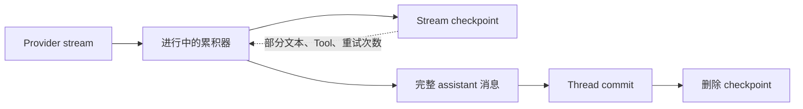
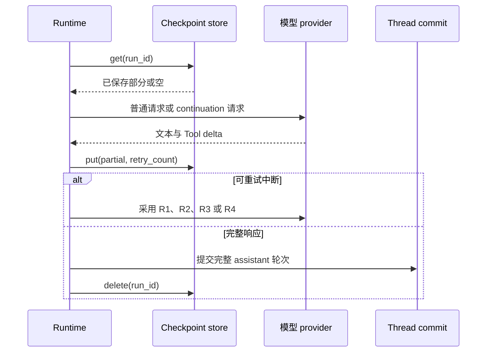

多数应用不需要配置流式恢复。输出开始前的可重试故障，以及已有部分输出后的可重试
中断，都由 Runtime 处理。只有当一个进行中的模型轮次还必须跨进程替换继续时，才
增加 `StreamCheckpointStore`。

| 需求 | 做法 |
| --- | --- |
| 同一进程会保持运行 | 使用 Runtime 重试策略；不需要 checkpoint store。 |
| 一个模型轮次中可能重启 | 在 `RuntimeRunContext` 上挂载持久化 `StreamCheckpointStore`。 |
| 多个进程可能恢复同一 Run | 在一个共享后端实现该契约，并保持其 fencing 语义。 |
| provider 错误不可重试 | 返回分类后的错误；checkpoint 不会使它变得可重试。 |

## 分开保存两种持久化记录



Thread commit 始终是消息与 `RunState` 的权威。stream checkpoint 只包含尚未完成的
轮次：Run 和 Thread id、模型、部分文本、部分 Tool call 与重试次数。它不是另一份
对话存储。

## 选择 checkpoint 后端

```rust
use std::sync::Arc;
use awaken_agent_contract::store::stream_checkpoint::StreamCheckpointStore;
use awaken_store_fs::FsStreamCheckpointStore;

let checkpoints: Arc<dyn StreamCheckpointStore> =
    Arc::new(FsStreamCheckpointStore::open("/var/lib/awaken/stream-checkpoints")?);

let context = context.with_stream_checkpoint(checkpoints);
```

确定性测试使用内存实现。只有一个进程拥有目录时才使用文件实现；它通过临时文件、
sync 和 rename 写入。多个进程需要共享时，在一个共享后端上实现同一契约，不要在
旁边同步第二种 checkpoint 格式。

`get`、`put` 和 `delete` 返回 `Result<_, StreamCheckpointError>`。后端必须报告
存储与 fencing 错误。Runtime 在调用处记录错误并选择尽力继续，因此问题仍可观察，
而 checkpoint 故障不会成为第二个 Run 生命周期权威。

## 中断后会发生什么

| 恢复情况 | 已保存内容 | Runtime 行为 |
| --- | --- | --- |
| R1 | 只有文本 | 把文本作为仅用于请求的 assistant 前缀，并要求模型继续。 |
| R2 | 至少一个 Tool call 具有完整 JSON 参数 | 不再调用模型，直接合成完整 Tool-use 轮次。 |
| R3 | 文本加未闭合或格式错误的 Tool call | 丢弃未完成 Tool call，从文本继续。 |
| R4 | 没有可复用内容 | 不带部分前缀，重新开始模型请求。 |

仅用于 continuation 请求的消息不会提交。只有累积参数能够解析为完整 JSON 的 Tool
call 才会执行。正常返回后，完整 assistant 消息通过普通 Thread 边界提交，然后
尝试删除 checkpoint。



只有 adapter 提供重试提示时，Runtime 才会采用它，并且最长为 60 秒。可重试分类见
[错误参考](/zh/docs/agents/runtime/reference/errors/)；应用代码不要从展示文本推断分类。

## 确认跨进程恢复

如果已经挂载持久化 checkpoint store，在一项有代表性的 Run 产生部分输出后中断它，
替换进程，再读取已提交 Thread。替换进程产生一个完整 assistant 轮次，且没有执行
未完成 Tool call，就说明配置生效。详细 fault injection 属于 store 与 Runtime 测试，
参见[测试策略](/zh/docs/agents/runtime/how-to/testing-strategy/)。

单次 warning 不需要外部修复，Runtime 会继续或完成轮次。如果持续的 checkpoint
warning 已破坏你的重启要求，应先修正后端连通性、权限或 fencing，再声称支持跨
进程恢复。即使 checkpoint 清理产生 warning，已经完成的 Thread commit 仍然有效。

## 边界

- 该机制不会重试永久性 provider 错误。
- 它不会执行未完成或格式错误的 Tool call。
- 它不保证逐字节续写；provider 会从保存的前缀生成 continuation。
- 它不替代已提交 Thread 历史或 Tool effect 恢复。外部 effect 见
  [Tool 恢复](/zh/docs/agents/runtime/reference/tool-trait/)。
