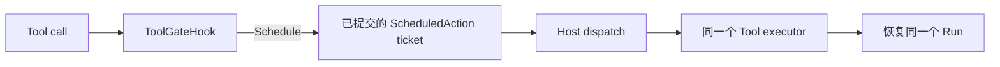
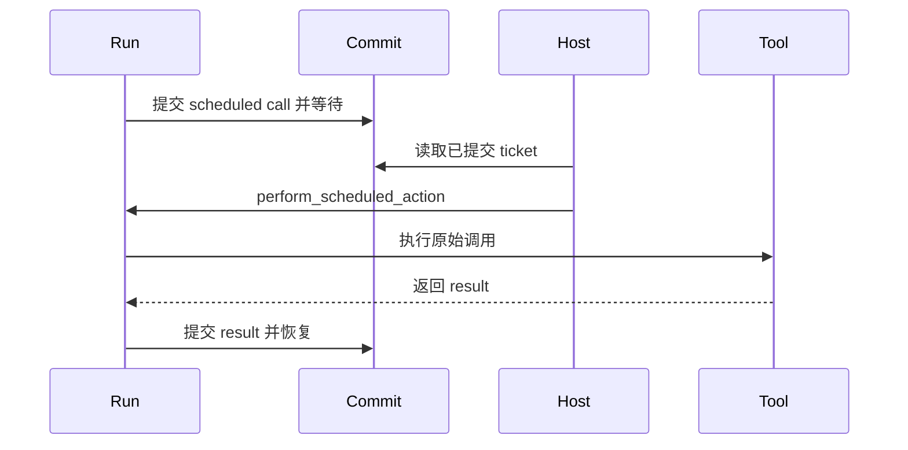

当一个 Tool call 应在当前 Step 之外执行，并把结果返回同一个 Run 时，使用 scheduled
action。它不是 cron 服务，也不是通用工作流引擎。

## 开始之前

Runtime 中应已注册待延迟的 Tool，并且 Run 与执行 scheduled action 的 Host 进程都能
使用同一个持久 commit coordinator。

## 选择合适的生命周期

| 需求 | 使用 |
| --- | --- |
| 在当前 Tool result 返回前完成 | 普通 Tool call |
| 延迟一个 Tool call，再恢复同一个 Run | 本页的 scheduled action |
| 向另一个 Agent 请求有界结果 | child Run delegation |
| 协调长期工作、定时器或多个服务 | 外部工作流或 Awaken Workforce |

## 静态结构



## 1. 在 gate 处安排调用

把 Tool call id 放进 correlation id，避免不同调用共享同一个幂等键。普通延迟调用的
`action_kind` 保持为 `None`。

```rust
use awaken_runtime_contract::permission::{GateOutcome, ToolGateHook};
use awaken_runtime_contract::tool::ToolCall;

struct DeferExports;

#[async_trait::async_trait]
impl ToolGateHook for DeferExports {
    async fn gate(
        &self,
        call: &ToolCall,
        _state: &awaken_agent_contract::agent::state::Store,
    ) -> GateOutcome {
        if call.tool_id == "start_export" {
            GateOutcome::Schedule {
                correlation_id: format!("sched-{}", call.call_id),
                action_kind: None,
            }
        } else {
            GateOutcome::Allow
        }
    }
}
```

## 2. 安装 Tool 与 gate

```rust
let runtime = Runtime::new()
    .with_llm(llm)
    .with_tool(my_export_tool)
    .with_gate(Arc::new(DeferExports));
```

模型选择 `start_export` 后，gate 不会立即执行它。scheduled action 提交后，Run 返回
`RunState::Awaiting`。

## 3. 执行已提交的 action

Host 读取等待中的 Run，再让 Runtime 执行那一个已经提交的调用：

```rust
let ticket = commit
    .resume_ticket_for(&run_id)
    .expect("scheduled action is committed");
assert_eq!(ticket.reason(), AwaitReason::ScheduledAction);

let state = runtime
    .perform_scheduled_action(
        &run_id,
        commit.as_ref(),
        RuntimeRunContext::new().with_commit(commit.clone()),
        now_ms,
    )
    .await?;
```



## 预期结果

第一次执行返回 `RunState::Awaiting` 时，Tool 尚未运行。
`perform_scheduled_action` 消费已提交 ticket 时才执行 Tool，随后把输出送入同一个 Run。
重复投递，或 Run 已不再等待后的投递，不会再次执行 Tool。

精确 ticket 匹配、contributed `action_kind` 行为和终态统一由
[Scheduled Actions](/zh/docs/agents/runtime/reference/scheduled-actions/)说明。

## 下一步

- [添加 Tool](/zh/docs/agents/runtime/how-to/add-a-tool/)
- [委派有界任务](/zh/docs/agents/runtime/how-to/invoke-sub-agent-from-tool/)
