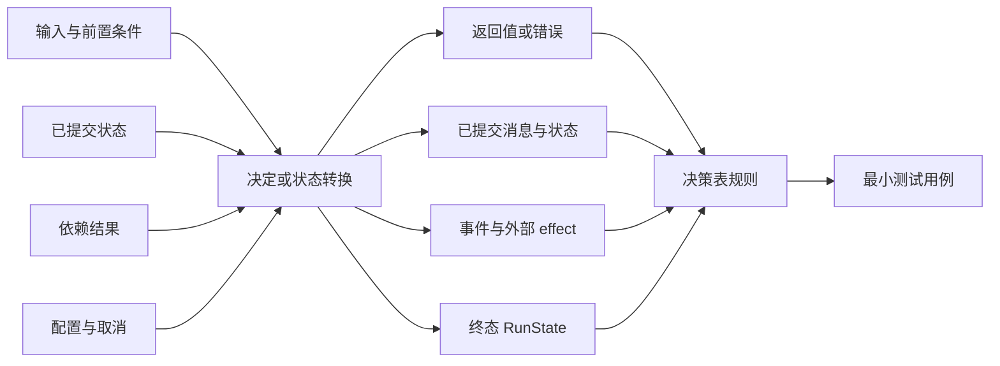
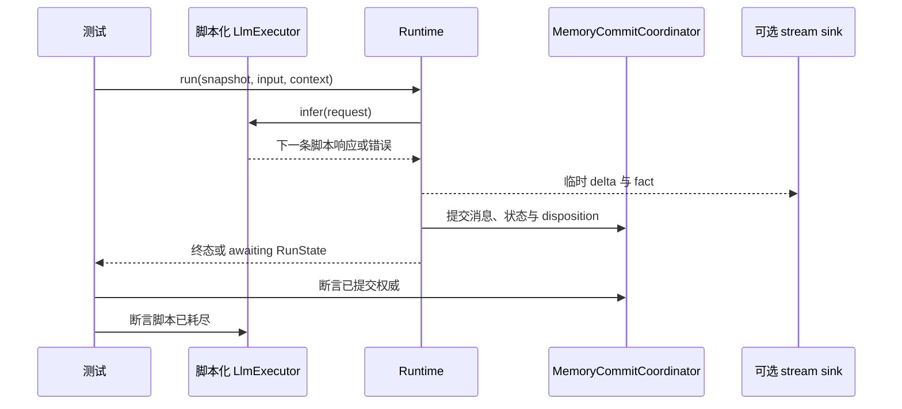

从一条行为结论开始，而不是从测试数量开始。列出所有可能触发它的条件和所有可观察
结果，再选择能够使这条结论失败的最低边界。

## 选择测试边界

| 结论 | 最小有效测试 | 可观察证据 |
| --- | --- | --- |
| Tool 能验证输入并返回正确值 | 直接单元测试类型化 `Tool` | `Output` 或精确 `ToolError` |
| Plugin contribution 没有超出声明边界 | Plugin resolution 或 hook 单元测试 | Contributions 或 bound rejection |
| 状态命令能正确 merge | 纯状态测试 | 物化 `Store` 或 `MergeError` |
| 模型与 Tool 循环提交正确结果 | 使用脚本化 `LlmExecutor` 的 `Runtime` 集成测试 | 消息、状态、事实与终态 `RunState` |
| 多种 store 遵守同一契约 | backend conformance suite | 每个 adapter 通过同一组规则 |
| HTTP、重启或 Worker 组合正确 | 进程或协议 E2E | served response 与已提交恢复证据 |
| 有限状态安全性质对所有有界输入成立 | 对生产 transition kernel 运行 Kani | 指定边界内的证明结果 |
| Agent 的语言质量或 Tool trajectory 可接受 | 带版本的 evaluation set | metric、threshold、model、重复次数与日期 |

不要用真实模型测试确定性的 Runtime 规则。不要用单元测试声称进程重启、后端
durability 或协议兼容已经成立。

## 从原因和结果推导测试



把原因、结果和决策规则写进对应测试用例的注释。这些注释就是测试设计权威；不要
再维护一份可能与测试漂移的独立矩阵。

修改 Runtime 时，先从下表开始，再删除已经证明不可达的行：

| 规则 | 模型结果 | Tool 或状态 effect | 取消 | 预期结果 |
| --- | --- | --- | --- | --- |
| R1 | 最终文本 | 无 | 否 | 提交最终消息与 `NaturalEnd` |
| R2 | Tool call | 成功 | 否 | 提交 call/result，再继续 |
| R3 | 可重试错误 | 无 | 否 | 在策略内重试，只提交最终分类结果 |
| R4 | 任意进行中工作 | 未知 | 是 | 丢弃工作并提交 `Cancelled` |
| R5 | 最终文本 | state conflict | 否 | 拒绝 batch 并提交 `Failure::StateConflict` |

只有条件会改变结果时才增加它。三个条件相互作用时，pairwise 组合并不足够；必须
保留所有可达规则。

## 复用当前 API 权威

不要把 `Tool`、Plugin、state 或 event API 复制进测试指南。先从权威页面构建实现，
再测试其公开结果：

- [添加 Tool](/zh/docs/agents/runtime/how-to/add-a-tool/) 维护类型化 `Tool` 契约、schema
  派生、注册与授权路径。
- [添加 Plugin](/zh/docs/agents/runtime/how-to/add-a-plugin/) 维护 Plugin manifest、
  contribution、hook 与 capability bound。
- [状态键](/zh/docs/agents/runtime/reference/state-keys/) 维护类型化状态访问与 merge 选择。
- [事件](/zh/docs/agents/runtime/reference/events/) 维护实时与已提交事件形状。

这样，测试示例不会变成一份已经过期的第二 API 参考。

## 不连接 provider，测试一条真实 Runtime 路径

沿用 `crates/runtime/awaken-runtime/tests/run.rs` 中的脚本化 executor 模式：

1. 实现 `LlmExecutor`，让它按顺序返回一组 `ChatResponse` 或分类错误。
2. 构建一个 `ExecutableAgentSnapshot` 和一个带内存 commit coordinator 的
   `RuntimeRunContext`。
3. 调用 `Runtime::run`。
4. 断言返回的 `RunState` 与已提交 transcript。只有实时事件顺序属于结论时，才增加
   `MemoryStreamSink`。
5. 断言脚本恰好被消费完。未使用的响应或意外多出的一次 inference call 都是工作流
   回退。



stream sink 是尽力交付的进度。恢复与终态行为应对 commit coordinator 断言，而不是
对 live sink 断言。

## 只有结论跨边界时才扩大测试

从 Awaken 源码根目录先运行最小 focused suite：

```bash
cargo test -p awaken-runtime --test run
cargo test -p awaken-runtime --test tools
cargo test -p awaken-store-fs --test conformance
cargo test -p awaken-observability
```

然后执行改动 crate 所要求的更广检查。store adapter 只有通过共享 conformance 规则
才算完成。协议或重启结论需要对应的 served-binary 或多进程测试；编译通过不是这类
证据。

普通 CI 应继续忽略真实 provider 测试，只在明确需要时运行：

```bash
AWAKEN_GENAI_MODEL=gpt-4o-mini \
  cargo test -p awaken-provider-genai --test live -- --ignored
```

记录 provider、model、日期、源码 revision、输入、重复次数和 threshold。一次在线
测试通过只能证明 provider 可达，不能证明一般性的 Agent 质量。

## 分开测试与 evaluation

测试对自有行为给出二元结论：权限 gate 阻止了调用、commit 被 fenced，或者终态具有
吸收性。evaluation 测量可变行为：回答质量、groundedness、Tool trajectory、延迟
或成本。

只有 dataset、metric、threshold、重复次数和可接受方差经过审查后，才能把 evaluation
提升为 release gate。把生产失败作为带日期的输入加入 dataset；不要把内部 fixture
或一次成功运行写成客户证据。

## 完成门槛

一项改动只有在测试注释保留原因、结果、约束和选中的决策规则，focused suite 与
要求的更广测试通过，最终 diff 只含预期行为，并且 commit 记录结果后才算完成。
coverage 百分比可以辅助审查，但不能替代原因结果清单或跨边界证据。
