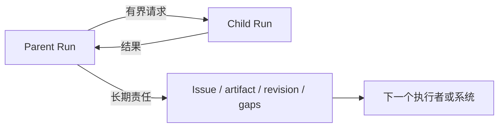
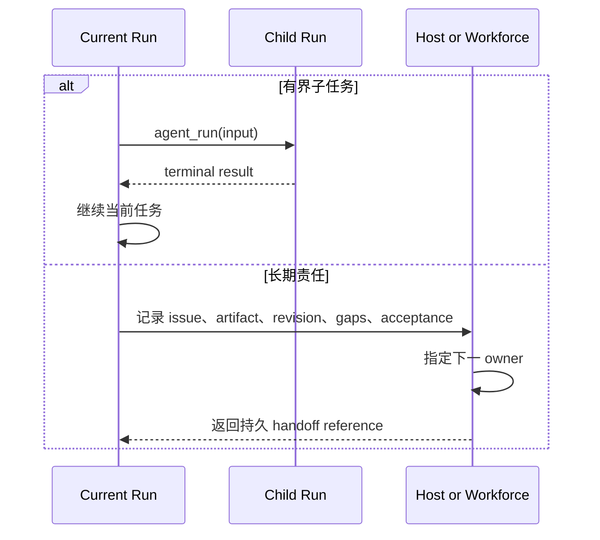

Awaken Agents 没有定义在一个 Run 内替换 active Agent 的
`Handoff { target_agent_id }`。应该根据当前任务结束后仍需保留的内容选择机制。

| 需求 | 使用 | 结果所有者 |
| --- | --- | --- |
| 另一个 Agent 向父级返回一个有界结果 | `agent_run` child Run | parent Run commit |
| child 暂停并在稍后继续 | delegation wait and resume | child committed state |
| 工作、证据、缺口和验收需要超出本次 Run | Host 或 Awaken Workforce | 产品控制面 |

## 静态边界

委派保留 parent，并给 child 一个独立 Run identity。责任交接则保留产品层工作对象，
不能用一次 Runtime 内的 Agent 切换代替业务过程。

## 准备责任交接

只携带下一个执行者能够继续使用的信息：

- 工作或 issue 标识；
- 当前 artifact 与不可变 revision；
- 已接受的结果和仍未解决的缺口；
- 可以判定完成的条件；
- 接下来负责推进的执行者或系统。

不要把 Sandbox placement 当成交接记录。delegated child 可以共享 parent Session 环境，
也可以使用另一个 Sandbox；这个选择不能在 Run 结束后保存责任。

## 动态过程

## 下一步

- [委派有界任务](/zh/docs/agents/runtime/how-to/invoke-sub-agent-from-tool/)
- [多 Agent 模式](/zh/docs/agents/runtime/explanation/multi-agent-patterns/)
- [Awaken Workforce](/zh/docs/workforce/)
