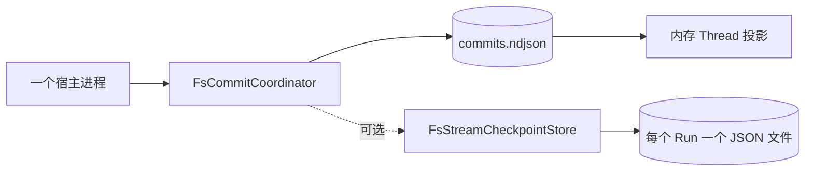
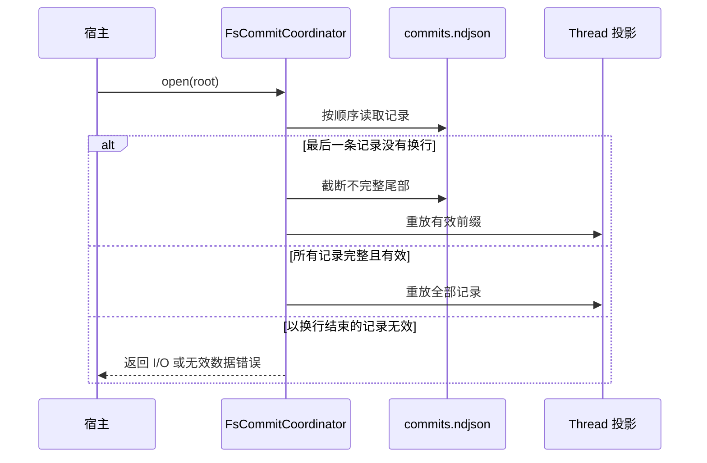

当一个进程独占 Runtime 持久化，而且状态必须跨重启保留时，使用文件适配器。不要
让两个进程打开同一个存储目录。适配器会在单个进程内串行化写入，但不会在共享目录
上的多个进程之间建立文件系统 Fence。

一个存储根目录可以包含多个 Thread 的提交。根目录是一份存储权威，不是每个
Thread 一个目录。

## 打开提交存储

```toml
[dependencies]
awaken-store-fs = { git = "https://github.com/AwakenWorks/awaken" }
```

```rust
use awaken_store_fs::FsCommitCoordinator;

let store = FsCommitCoordinator::open("./data/runtime").await?;
```

`open` 会在需要时创建目录，并重放 `commits.ndjson`。每次成功提交对应一条以换行
结束的 JSON 记录。适配器在确认提交之前会刷新文件。



## 只在需要时增加流检查点

模型流在进程重启后仍须继续时，使用 `FsStreamCheckpointStore`。

```rust
use awaken_store_fs::FsStreamCheckpointStore;

let checkpoints =
    FsStreamCheckpointStore::open("./data/runtime/stream-checkpoints")?;
```

它先写临时文件并刷新，再覆盖重命名到上一个 Run 检查点，最后刷新目录。流检查点
只保存尽力恢复的推理进度；下一次成功的 Thread 提交仍是权威。

## 理解重启恢复



中断的最后一次追加会被自动移除，不要手工修复。以换行结束的损坏记录不同：系统
无法判断后续记录是否依赖它，因此恢复会失败关闭。

## 验证边界

1. 为至少两个 Thread ID 提交数据。
2. 等提交调用返回后停止进程。
3. 用同一个绝对根目录重新打开。
4. 分别读取两个 Thread，确认消息、状态、Run 和票据彼此隔离且仍然存在。

检查 `commits.ndjson` 可以确认当前根目录确实收到记录。进程运行时不要编辑该文件。

## 只处理已返回的失败

| 已返回结果 | 系统仍无法解决的原因 | 外部操作 |
| --- | --- | --- |
| `open` 返回 `io::Error` | 进程无法创建、读取或写入根目录 | 修正绝对路径、所有权或挂载权限，再重新打开 |
| `Coordinator` 返回包含 `append commit` 的错误 | 记录没有得到持久确认 | 恢复可写磁盘空间或权限，再由调用方的正常提交策略重试 |
| 完整记录触发无效数据错误 | 自动截断只适用于不完整尾部 | 停止写入，保留目录，恢复已知良好副本，或先定位具体损坏记录 |

`open` 已成功截断不完整尾部时，不需要额外处理。

## 相关文档

- [选择运行时状态与存储](/zh/docs/agents/runtime/state-and-storage/)
- [把运行时状态存入 PostgreSQL](/zh/docs/agents/runtime/how-to/use-postgres-store/)
- [状态与快照模型](/zh/docs/agents/runtime/explanation/state-and-snapshot-model/)
