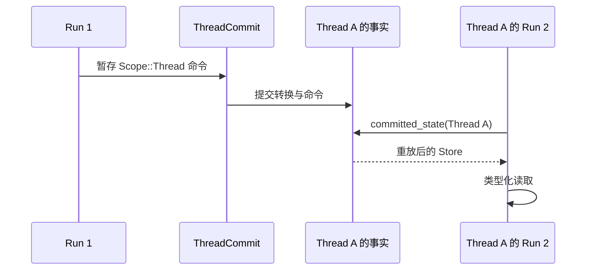
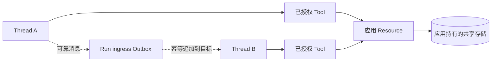

同一 Thread 的后续 Run 需要某个值时，使用 `Scope::Thread`。不要用
`Scope::Shared` 或 `Scope::Profile` 在多个 Thread 之间共享值。当前已提交状态
读取端始终按一个 `ThreadId` 重建命令；这两种作用域只区分该 Thread 状态中的地址。

写代码前先确定权威：

| 需求 | 权威 |
| --- | --- |
| 只用于一个 Run 及其恢复的临时状态 | Runtime `Scope::Run` |
| 同一 Thread 的后续 Run 需要读取 | Runtime `Scope::Thread` |
| 用户、Agent 或 Thread 共同使用的业务数据 | 应用存储，经 Resource 与 Tool 暴露 |
| 向另一个 Thread 可靠投递消息 | Run ingress Outbox |

## 在一个 Thread 中保留值

优先使用类型化键，让数据结构漂移失败关闭。

```rust
use awaken_agent_contract::agent::state::{MergePolicy, Scope, StateKey};
use serde::{Deserialize, Serialize};

#[derive(Default, Serialize, Deserialize)]
struct ReviewState { approved: bool }

struct ReviewStateKey;

impl StateKey for ReviewStateKey {
    const KEY: &'static str = "review_state";
    const SCOPE: Scope = Scope::Thread;
    const MERGE: MergePolicy = MergePolicy::Disjoint;
    type Value = ReviewState;
}

let command = ReviewStateKey::try_write(&ReviewState { approved: true })?;
```

把命令附到引发变化的 Tool 输出或 Hook 反应中，Runtime 会将它与同一次转换一起
提交。下一个 Run 从 `CommittedThreadView::committed_state(thread_id)` 重建
Thread `Store`，再调用 `ReviewStateKey::load`。



## 把跨 Thread 数据放在 Runtime 状态之外

如果 Thread A 和 Thread B 都要读取同一客户记录、任务看板或 Profile，应由应用
持有该记录。注入包含客户端或 Repository 的 Resource，再通过 Tool 暴露有限的读写
操作。Tool 的权限策略仍是唯一执行授权。



这样，共享记录只有一个所有者、一套并发策略和一条迁移路径，也不会把客户数据复制
进每个 Thread 事实日志。需求是消息投递而不是共同查询时，使用 Outbox。

## 选择一次提交内的合并行为

| 策略 | 适用情况 |
| --- | --- |
| `Disjoint` | 一个预期生产者持有键，后一个值替换前一个值 |
| `Commutative` | 独立 JSON 对象字段可以浅合并 |
| `Exclusive` | 同一批次的第二个 `Set` 必须拒绝整批 |

这些策略不会协调跨 Thread 或跨进程写入。应用持有的共享存储必须定义自己的事务
或乐观并发规则。

## 只在状态无法解释时介入

`StateKey::load` 返回 `StateError` 时，先把持久化值迁移到声明结构，再恢复 Thread。
`Exclusive` 批次被拒绝时，移除重复生产者，或选择符合真实写入关系的策略。正常重放、
键不存在和 Outbox 重试都不需要修复。

## 相关文档

- [选择状态键](/zh/docs/agents/runtime/reference/state-keys/)
- [状态管理](/zh/docs/agents/runtime/explanation/state-management/)
- [Awaken Agents 执行架构](/zh/docs/agents/runtime/explanation/architecture/)
- [多 Agent 模式](/zh/docs/agents/runtime/explanation/multi-agent-patterns/)
