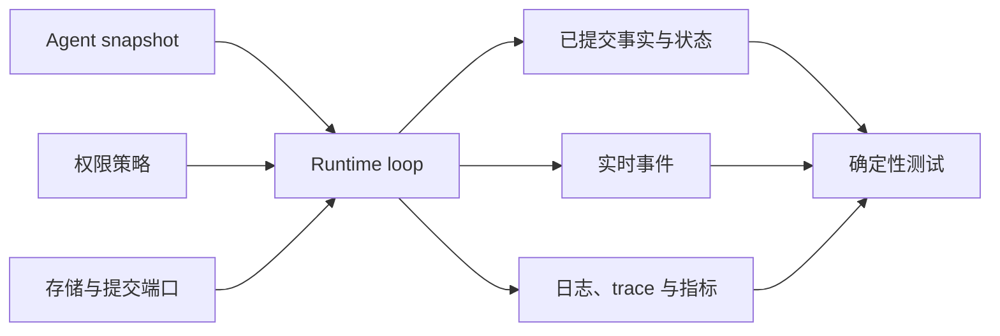
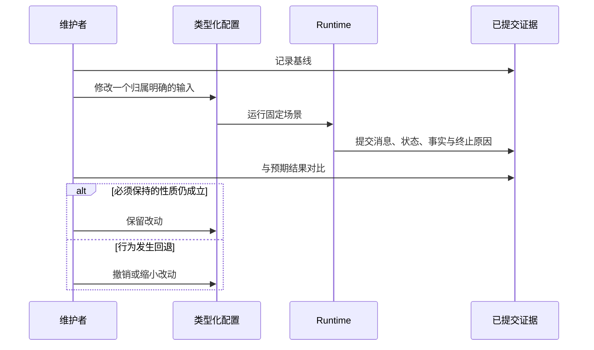

先确定要改变什么。本页只负责把任务送到正确位置；具体契约和操作由链接页面维护。

| 需要完成的事 | 改动或检查对象 | 前往 |
| --- | --- | --- |
| 弄清一个 Run 为何结束 | 已提交的 `RunState`、`EndCause` 与事实 | [Run 生命周期](/zh/docs/agents/runtime/explanation/run-lifecycle-and-phases/) |
| 保住中断的模型流 | 重试策略与可选的进行中 checkpoint | [恢复流式 LLM](/zh/docs/agents/runtime/how-to/recover-streaming-llms/) |
| 限制或停止工作 | 步数上限、推理失败上限、取消或结束 guard | [配置 Run 终止](/zh/docs/agents/runtime/how-to/configure-stop-policies/) |
| 查看延迟、失败和执行路径 | 日志、trace、指标与 trace 传播 | [启用可观测性](/zh/docs/agents/runtime/how-to/enable-observability/) |
| 比较行为改动 | 在最低有效边界执行确定性测试 | [测试策略](/zh/docs/agents/runtime/how-to/testing-strategy/) |
| 改变 Tool 授权 | 权限策略与持久化审批 | [人在回路中](/zh/docs/agents/runtime/explanation/human-in-the-loop/) |
| 改变持久化或共享方式 | 提交存储、读取模型与应用自有状态 | [状态与存储](/zh/docs/agents/runtime/state-and-storage/) |

## 先认清改动边界

Agent snapshot 负责 instructions、模型绑定、Tools、Plugins 与步数上限。host 负责
存储、取消、模型和 Tool executor，以及进程可观测性。恢复以已提交事实为准；实时
事件与 telemetry 用来解释过程，不能取代已提交事实。

## 每次只改变一个原因

1. 为固定场景记录 Run id、snapshot fingerprint、模型绑定、Tool 清单和终态
   `RunState`。
2. 写清希望改变的结果，以及必须保持不变的结果。
3. 只在归属边界修改一个类型化输入。
4. 用脚本化模型重放场景，对比已提交消息、状态命令、事实、用量和终止原因。
5. 只有当结论跨越存储、协议、重启或进程边界时，才运行更广的 conformance 或
   进程测试。

Runtime 会自行重试符合条件的模型故障、恢复受支持的部分流、拒绝过期提交，并让
终态保持吸收性。这些正常路径不需要另写处理流程。只有内置策略结束后仍持续出现
明确错误，而且链接页面给出了外部修正方法时，才需要处理。

## 何时使用 Awaken Agents 服务能力

当配置、凭据、持久化 dispatch 或运行 HTTP endpoint 需要跨进程共享时，使用
Awaken Agents。Runtime 仍是执行内核；Agents 服务层负责组合它，而不是建立第二个
执行权威。参见 [Awaken Agents 配置任务](/zh/docs/agents/how-to/configure-providers-models-credentials/)。
