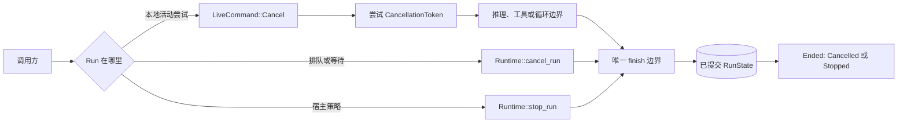
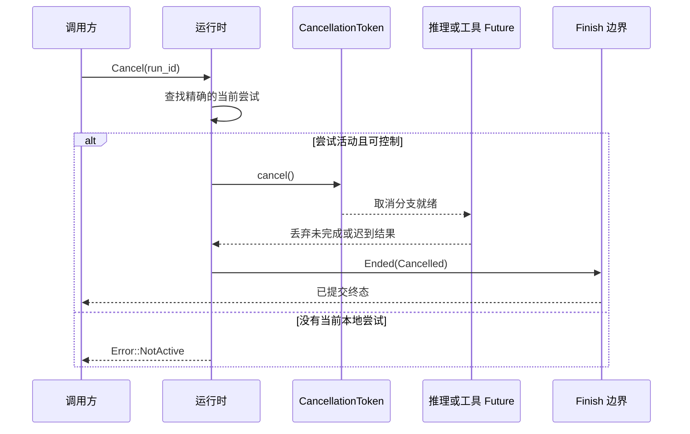

先判断 Run 在哪里：

| Run 情况 | 调用 | 结果 |
| --- | --- | --- |
| 当前进程正在执行且尝试仍有效 | 投递 `LiveCommand::Cancel` | 发出协作取消信号，循环提交 `Ended(Cancelled)` |
| 正在排队或等待，没有活动尝试 | `Runtime::cancel_run` | 提交 `Ended(Cancelled)` 并清除恢复票据 |
| 因预算等宿主策略结束 | `Runtime::stop_run` | 提交 `Ended(Stopped(reason))` |

取消和 stop 都是终态。暂停不是取消，它会提交 `Awaiting` 票据，以后仍可恢复。

## 静态控制路径



活动尝试注册表是进程内 cancel、pause、wake 与 live inbox 查找的唯一来源。注册带有代际，
旧尝试不能注销同一 Run 的替代尝试。持久宿主还会在投递前校验 claim 所有权。

信号不是持久事实，成功提交的终态才是。

## 嵌入协作取消

为一次尝试绑定一个 `tokio_util::sync::CancellationToken`：

```rust
use awaken_runtime_contract::runtime_context::RuntimeRunContext;
use tokio_util::sync::CancellationToken;

let token = CancellationToken::new();
let context = RuntimeRunContext::new().with_cancellation(token.clone());

// 用 `context` 执行 Run，在需要时请求取消。
token.cancel();
```

`RuntimeRunContext::is_cancelled()` 返回当前信号。进程内子 Run 接收 child token：取消
父 Run 会传播到子 Run，取消子 Run 不会反向取消父 Run。实时流、inbox 和暂停 handle
不会继承，因为它们指向特定 Run。

对于已经由 `Runtime::execute` 注册的 Run，按 Run id 投递：

```rust
use awaken_runtime_contract::control::{LiveCommand, LiveRunControl};

runtime.deliver(LiveCommand::Cancel {
    run_id: run_id.clone(),
})?;
```

当持久分派必须在投递前再次确认所有权时，使用 `deliver_to_current_attempt`。

## 实时取消后发生什么



运行时会在工作开始前、循环边界，以及等待普通推理和工具 Future 时观察取消。因此，
即使 Provider 或工具 Future 永不返回，取消分支胜出后也可丢弃它。终态决定之后不会
提交部分迟到结果。

## 取消排队或等待中的工作

没有活动尝试时，使用已提交路径：

```rust
let state = runtime
    .cancel_run(run_id, thread_id, context)
    .await?;

assert_eq!(state, RunState::Ended(EndCause::Cancelled));
```

这条路径与实时执行共用 finish 边界。如果 Run 正在等待，终态转换会移除恢复票据。
之后到达的恢复命令或调度结果会失败关闭，不会重新唤醒已取消工作。

在持久部署中，应先持久化并 claim 取消意图，再调用 Runtime API。实时投递可以缩短等待，
但不能成为第二份取消权威。

## Stop 表示另一种终态原因

```rust
let state = runtime
    .stop_run(run_id, thread_id, "budget exhausted".into(), context)
    .await?;
```

当原因由宿主拥有时使用 `Stopped(reason)`，例如预算、策略或其他明确上限。外部请求停止
工作时使用 `Cancelled`。保留这个区别，调用方就无需解析文本来解释结果。

## 调用方如何处理拒绝

实时投递返回 `Error::NotActive`，表示该 Run 此刻不受当前进程控制。不要盲目重试同一
实时命令。

1. 读取已提交 Run 状态。
2. 如果 Run 正在排队或等待，转到持久取消路径。
3. 如果活动尝试属于其他 Worker，通过该部署的持久控制服务发送请求。
4. 如果 Run 已结束，返回已提交终态。

Token 已观察到的取消、迟到推理或工具结果、等待票据移除和迟到恢复拒绝，都由运行时
自动处理，不需要另写修复步骤。

## 相关文档

- [Thread 模型](/zh/docs/agents/runtime/reference/thread-model/)
- [Run 生命周期与阶段](/zh/docs/agents/runtime/explanation/run-lifecycle-and-phases/)
- [人在回路中](/zh/docs/agents/runtime/explanation/human-in-the-loop/)
- [Live Inbox](/zh/docs/agents/protocols/live-inbox/)
