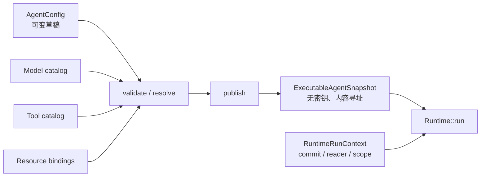
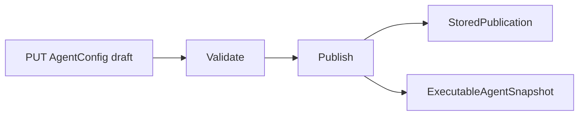
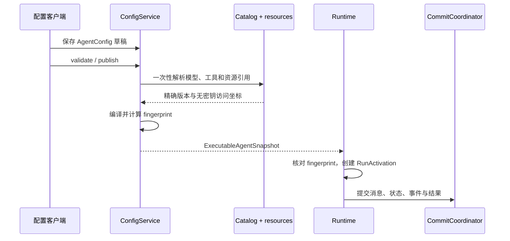

用 `AgentConfig` 修改未来 Run 的行为。发布后得到不可变的
`ExecutableAgentSnapshot`。一次 Run 使用的 reader、committer、scope 与 cancellation 通过
`RuntimeRunContext` 传入，不要把这些实时能力写进 Agent 配置。

| 要修改的内容 | 修改位置 | 生效方式 |
|---|---|---|
| instructions、model choice、Tool visibility、Plugin config、limit 或 context policy | `AgentConfig` | 只在新 publication 后生效 |
| 新 Run 的精确行为 | 选择已发布的 `ExecutableAgentSnapshot` | Run 在等待与恢复期间始终保留该 snapshot |
| 一次调用的 commit、history、execution scope 或 cancellation | `RuntimeRunContext` | 影响该 Run call，不产生新的配置 revision |
| 正在运行的 Run 的 published behavior | 不要修改 | 发布新 revision，供未来 Run 使用 |

这是唯一的配置主线。Runtime 不读取一套平行的可变 execution-config 模型。



## AgentConfig：编写权威

`awaken_agent_config::AgentConfig` 是控制面的可变聚合。字段按责任分为：

| 责任 | 当前字段 |
|---|---|
| 身份与生命周期 | `id`、`name`、`description`、`metadata`、`disabled_at`、`archived_at` |
| 行为与循环 | `instructions`、`max_steps`、`delegation_limits`、`context_policy`、`compaction` |
| 模型 | `model_binding: ModelSelection`、`inference`、`model_fallbacks`（wire 名 `model_candidates`） |
| 工具与插件 | `tool_ids`、`toolsets`、`client_tools`、`tool_patterns`、`tool_overrides`、`recovery_policies`、`plugin_ids`、`plugin_config` |
| 协作与外部能力 | `multiagent`、`mcp_servers`、`skills` |

`ModelSelection` 是一套封闭的 authoring vocabulary：`Auto`、`Profile`、`Target`、
`BackendDefault`、`BackendExact` 或 `Pinned(ModelBinding)`。发布边界把所有非 pinned
选择解析成精确执行事实；Runtime 不会在执行中重新选择 provider、route 或 credential。

File、Memory 与 Repository 默认输入不复制进另一种 Agent 配置；它们由
`AgentInputBindingRepository` 保存，并在发布/Session 解析边界进入资源清单。

## ExecutableAgentSnapshot：执行权威

`awaken_runtime_contract::snapshot::ExecutableAgentSnapshot` 是可持久化、可重放的无密钥
值，包含：

```rust
pub struct ExecutableAgentSnapshot {
    pub id: ExecutableAgentSnapshotId,
    pub metadata: AgentSnapshotMetadata,
    pub root_agent_id: AgentId,
    pub resolved_spec: ResolvedSpec,
    pub fingerprint: CatalogFingerprint,
}
```

`metadata` 分别记录源 `AgentConfig` revision、外部 publication version、完整
`ResolutionManifest` 与内容 fingerprint；这些坐标不能互相替代。`ResolvedSpec` 固定
instructions、步数与委托上限、完整有序模型候选、模型可见工具、插件配置、上下文策略和
工具呈现。每个 `ResolvedModelCandidate` 同时固定 `ModelBinding` 与无密钥
`ModelProvisioning`；credential 只保留访问引用，明文不进入快照。

`CatalogFingerprint` 是规范配置的派生内容地址，不是调用方手填的标签。运行时解析前会
核对快照 envelope 与 `ResolvedSpec` 中的 fingerprint，不一致则失败关闭。

## 两条构造路径，一个执行入口

平台路径使用 `ConfigService`：



嵌入式程序可以调用 `compile_resolved(&config, catalog, metadata)`，也可以使用
`ExecutableAgentSnapshot::builder(id)` 直接构造测试或本地快照。两条路径最终都进入：

```rust
runtime.run(&snapshot, input, RuntimeRunContext::new()).await?;
```

`RuntimeRunContext` 携带一次 Run 的动态端口和可信作用域，例如 commit coordinator、
history reader 与 execution scope；这些运行期能力不应重新塞回 Agent 配置。

## 生命周期边界



草稿变化只影响下一次发布；已启动或等待恢复的 Run 继续使用原快照。运行时凭据撤销、
权限和租约仍会在动作发生时重新检查，但不能把执行漂移到未发布候选。

## 代码坐标

- `crates/control/awaken-agent-config/src/config.rs`：`AgentConfig`、`ModelSelection`
- `crates/control/awaken-config-service/src/config_plane.rs`：validate / publish
- `crates/runtime/awaken-runtime-contract/src/snapshot.rs`：快照与发布元数据
- `crates/runtime/awaken-runtime-contract/src/resolved.rs`：`ResolvedSpec` 与模型候选
- `crates/runtime/awaken-runtime-contract/src/snapshot_builder.rs`：嵌入式 builder
- `crates/runtime/awaken-runtime/src/run.rs`：唯一执行入口

## 相关

- [配置解析与 Agent 委派](/zh/docs/agents/runtime/explanation/agent-resolution)
- [模型发布与凭据执行边界](/zh/docs/agents/reference/provider-model-config)
- [Session 把 Agent、资源与可恢复 Run 绑定在一起](/zh/docs/agents/concepts/sessions-and-events)
