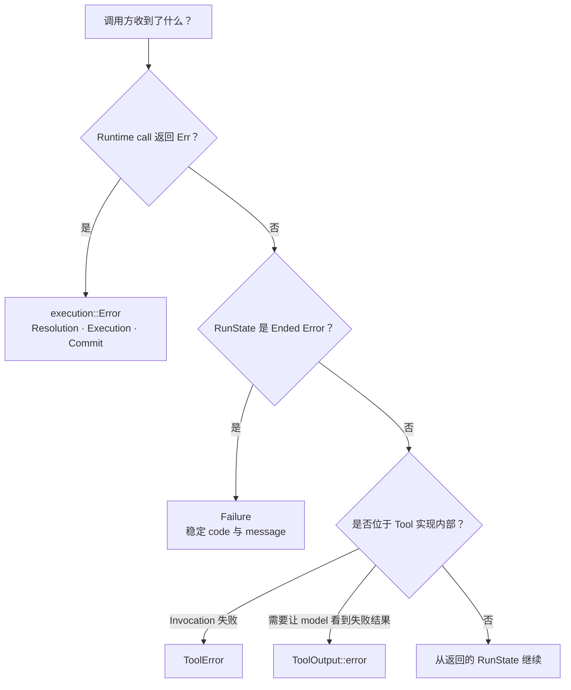
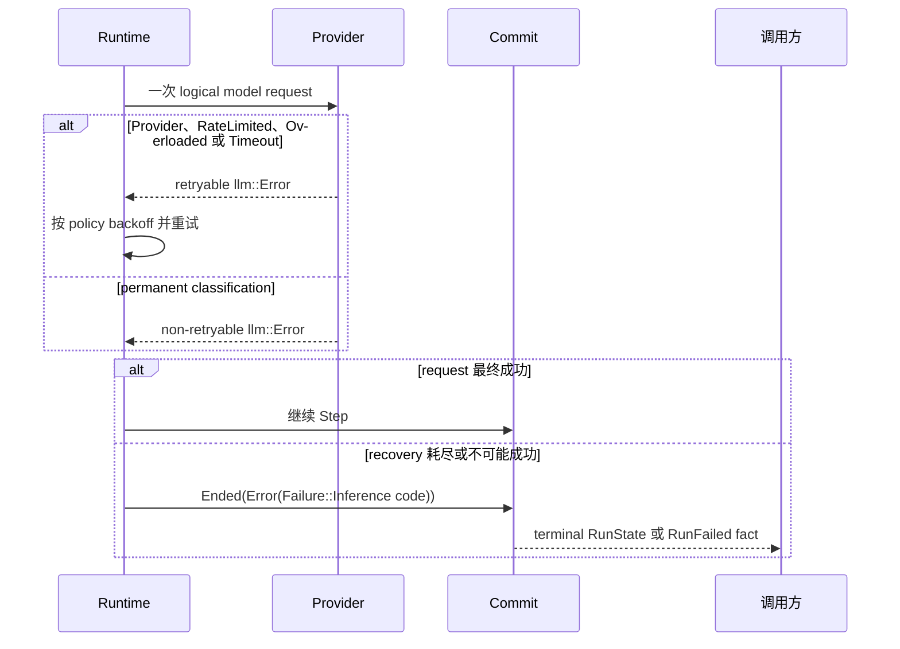

先判断错误从哪里返回。Runtime call 失败、Run 进入故障终态、Tool invocation 失败，以及
model 可见的 Tool 失败结果，各有不同 owner。按 enum variant 或稳定 failure code 分支；
error message 是诊断文本，不是兼容性契约。

## 按返回表面选择



| 返回表面 | 含义 | 调用方决定 |
|---|---|---|
| `Result<RunState, execution::Error>` | 本次 run 或 resume call 未能完成其契约 | 处理 `Resolution`、`Execution` 或 `Commit`；重复工作前先重读已提交 state |
| `RunState::Ended(EndCause::Error(Failure))` | Runtime 在执行完自身恢复策略后进入已提交故障终态 | 按 `Failure::code()` 分支，不重开同一个 Run |
| `Fact::RunFailed { code, message }` | 同一终态故障的协议投影 | 与 `Failure` 使用相同的 code-based 决定 |
| `ToolError` | Tool invocation 无法返回 `ToolOutput` | 应用 Tool/executor 的 recovery contract |
| `ToolOutput::error(...)` | Tool 已完成，并给出 model 可见的失败结果 | 交给 model loop 消费；它不是 Runtime call 失败 |

## Runtime call 错误

嵌入式调用方直接收到的表面是：

```rust
pub enum awaken_runtime_contract::execution::Error {
    Resolution(String),
    Execution(String),
    Commit(String),
    StateConflict, // internal; converted to a terminal Failure
}
```

| Variant | 边界 | 安全的下一步 |
|---|---|---|
| `Resolution` | 无法解析不可变 snapshot 或必要 Runtime capability | 修正精确 snapshot、backend registration 或必要端口，再重新开始 |
| `Execution` | 当前 run/resume command 无法继续 | 读取最新已提交的 `RunState`、message、ToolBatch 与 ticket；按类型化 state 处理，不盲目重放 call |
| `Commit` | 提议的 frontier 未被接受 | 重读已接受 frontier，只通过权威 commit/resume 路径重试 |
| `StateConflict` | exclusive-key batch 冲突产生的内部信号 | 应转换为 `Failure::StateConflict`，不应逃出 `RunExecutor` |

字符串说明具体失败，但不是稳定的错误子类型。host 需要更细的公共错误时，在自己的 adapter
边界映射这些中立 variant。

## Model failure 与重试所有权

`awaken_runtime_contract::llm::Error` 对一次 model request 分类。该 request 是否重试由
Runtime 决定。



| `llm::Error` 分组 | Runtime 行为 | 成为终态后的处理 |
|---|---|---|
| `Provider`、`RateLimited`、`Overloaded`、`Timeout` | 按配置 backoff 重试；rate/overload hint 可以影响等待时间 | 返回的 `Failure::Inference` 表示恢复已耗尽；只按 host policy 稍后重试 |
| `Binding`、`ModelNotFound`、`InvalidRequest`、`ContextOverflow` | 不重试同一 request | 修正已发布 model binding，或 request/context shape |
| `Unauthorized`、`LoginRequired` | Runtime 不自动重试或刷新 credential | 在 credential owner 边界修复，再通过普通 host 路径启动或恢复 |
| `UsageLimit` | 记录 reset hint，但不自行调度 | 等待容量恢复，或修改 owner 的 quota/model 决定 |
| `ContentFiltered` | 不重试同一 request | 修改内容或 policy 决定，不循环发送原请求 |

model failure 无法恢复时，Runtime 提交
`Failure::Inference { code, message }`。稳定 code 来自 `llm::Error::code()`。

## Tool invocation 与 Tool result

```rust
pub enum ToolError {
    Unknown(String),
    InvalidArguments(String),
    UnavailableBeforeDispatch(String),
    Execution(String),
}
```

只有 `UnavailableBeforeDispatch` 能证明请求没有越过 executor dispatch 边界，recovery
policy 可以重放它。`Execution` 不能证明 external effect 是否发生；读取已提交 ToolBatch，
并使用其 recovery policy 或 downstream reconciliation contract。

失败只是 model 可以继续处理的普通领域结果时，返回
`ToolOutput::error(call_id, content)`，不要把它转换成 `ToolError`。

## 终态与组合错误

`Failure` 是已提交的 Run-level 分类：

```rust
pub enum Failure {
    Inference { code: String, message: String },
    CapabilityBound,
    StateConflict,
}
```

`CapabilityBound` 表示 Plugin 试图贡献或调度超出 published bound 的能力。
`StateConflict` 表示同一 commit batch 对一个 `Exclusive` `(Scope, Key)` 写入多次。两者
都会失败关闭；应修正 Plugin contribution 或 state-command 构造，再创建新 Run。

Plugin 作者在解析一个 `ResolvedExecutionEnv` 时，可能收到 `PluginConfigError`、
`BoundViolation` 或 `MergeError`。在该边界修正 malformed config、missing dependency、
cycle、duplicate id 或越界 contribution。Runtime 不会通过静默丢弃 contribution 来让 Run
启动。重复 Plugin id 的精确分类是 `MergeError::DuplicatePlugin`。

```rust
pub enum MergeError {
    Bound(BoundViolation),
    DuplicateTool { id: String, first: String, second: String },
    DuplicateActionKind { id: String, first: String, second: String },
    MissingDependency { plugin: String, missing: String },
    DependencyCycle,
    DuplicatePlugin { id: String },
    Config(PluginConfigError),
}
```

## 相关

- [Tool Trait](/zh/docs/agents/runtime/reference/tool-trait/)
- [状态键](/zh/docs/agents/runtime/reference/state-keys/)
- [Run、Step 与 ToolBatch state](/zh/docs/agents/runtime/explanation/run-lifecycle-and-phases/)
