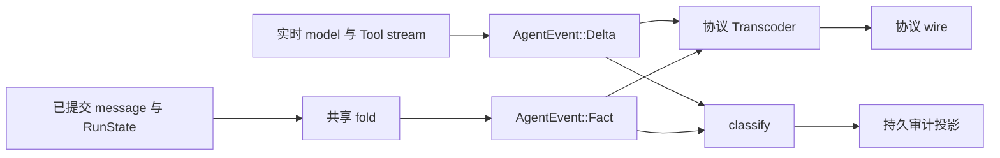
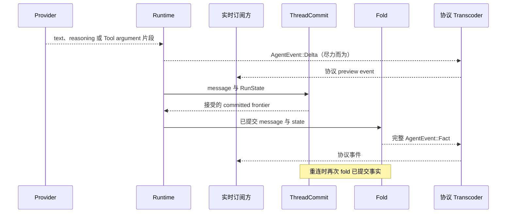

应用需要从已提交 Thread state 派生完整事件时，使用 `Fact`。只想在 model 或 Tool 仍在
产生内容时展示进度，使用 `Delta`。重连与恢复必须读取已提交 message 和 `RunState`，
不能重放某个客户端碰巧收到的片段。

```rust
pub enum AgentEvent {
    Fact(Fact),
    Delta(Delta),
}
```

## 静态所有权



fold 是完整 `Fact` 的唯一生产者，实时 stream 是 `Delta` 的唯一生产者。一个协议只实现
一个 `Transcoder`：`fact` 必须穷举处理，`delta` 可以忽略该协议不展示的片段类型。

## 事件词汇

| 层级 | 变体 | 消费规则 |
|---|---|---|
| `Fact` | `RunStarted`、`AssistantMessage`、`AssistantThinking`、`ToolCall`、`ToolResult`、`Awaiting`、`Continuation`、`RunFinished`、`RunFailed` | 处理全部变体，把它视为完整投影 |
| `Delta` | `TextDelta`、`ReasoningDelta`、`ToolCallDelta` | 展示支持的片段；允许 transport 边界丢失或重复 |

`ToolCallDelta.args_delta` 始终是后缀片段。provider adapter 会在发送前统一处理 provider
返回的累计格式。完整 Tool input 随后出现在 `Fact::ToolCall.input` 中。

## 从实时进度到已提交事实



## 终态映射

| 已提交 `RunState` | 派生的 `Fact` |
|---|---|
| `Awaiting` | `Awaiting { pending_tool_use_id }` |
| `Ended(MaxSteps)` | `RunFinished { exhausted: true }` |
| `Ended(Error(failure))` | `RunFailed { code: failure.code(), message: failure.message() }` |
| `Ended(Indeterminate)` | `RunFailed { code: "indeterminate", ... }` |
| 其他所有 `Ended` 成因 | `RunFinished { exhausted: false }` |

`Indeterminate` 绝不会被投影为成功。断线后需要继续的调用方只需读取已提交 Thread fact，
不需要修复事件 stream。

## Audit 是投影，不是真相

`classify` 是唯一的路由决定。Delta 只进入实时通道。`RunStarted` 同时可实时发送和审计。
content fact 由权威 message 重建，不再复制进 audit log。Awaiting、continuation、finish 与
failure fact 可以进入 audit。

审计记录服务于观测与读侧视图。它不替代 message log，不重建 Run，也不是第二套公共
事件 API。

## 相关

- [线程模型](/zh/docs/agents/runtime/reference/thread-model/)
- [Run、Step 与 ToolBatch state](/zh/docs/agents/runtime/explanation/run-lifecycle-and-phases/)
- [取消](/zh/docs/agents/runtime/reference/cancellation/)
