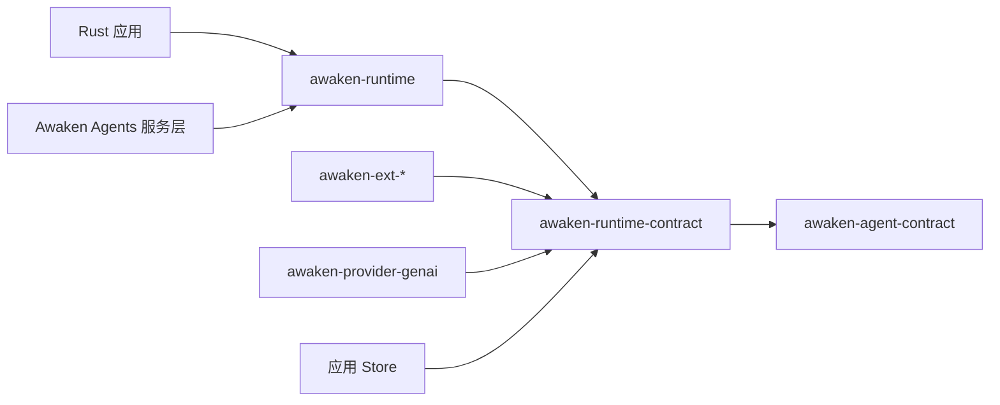

用本页找到这次修改的权威契约。先选择最窄的 crate。只有当修改涉及服务、部署、公共协议
或持久工作投递时，才进入 Awaken Agents 服务路径。

## 按任务选择

| 要修改的内容 | 从这里开始 | 继续阅读 |
|---|---|---|
| message、content、Run state、等待、类型化 state 或中立事件 | `awaken-agent-contract` | 对应的 Reference 页面 |
| Tool、Plugin、hook、gate、guard、snapshot、执行或控制端口 | `awaken-runtime-contract` | [Tool Trait](/zh/docs/agents/runtime/reference/tool-trait/)或[Plugin 内部机制](/zh/docs/agents/runtime/explanation/plugin-internals/) |
| model/Tool loop、run、resume、cancel 或 commit orchestration | `awaken-runtime` | [Runtime 架构](/zh/docs/agents/runtime/explanation/architecture/) |
| model-provider 映射 | `LlmExecutor` 后的 `awaken-provider-genai` | [错误处理](/zh/docs/agents/runtime/reference/errors/) |
| permission、compaction、memory、skills、MCP、goal 或状态机行为 | 对应的 `awaken-ext-*` crate | [Tool 与 Plugin 边界](/zh/docs/agents/runtime/explanation/tool-and-plugin-boundary/) |
| 嵌入式应用的进程内持久化 | `awaken-store-inmem`，或应用对相同端口的实现 | [State 与 snapshot 模型](/zh/docs/agents/runtime/explanation/state-and-snapshot-model/) |
| HTTP/SSE、Managed Session、IAM、发布、Worker、lease、Sandbox 或运维 | [Awaken Agents](/zh/docs/agents/) | 对应的 Agents 指南 |

## 依赖方向

`awaken-agent-contract` 拥有持久领域值，`awaken-runtime-contract` 拥有端口与可执行契约，
`awaken-runtime` 驱动循环。Extension、provider、store 与 Awaken Agents 服务依赖这些契约，不重新
定义 `RunState`，也不建立第二条 commit 路径。

Awaken Agents 没有 facade crate。嵌入式应用只需依赖自己使用的契约和实现。完整组件图，
以及一次 run 从 activation 到终态的过程，见
[Runtime 架构](/zh/docs/agents/runtime/explanation/architecture/)。
