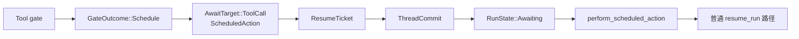
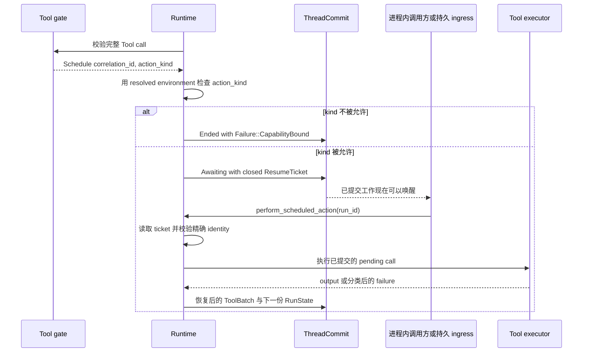

Tool call 需要稍后执行，但仍属于同一个 Run 时，使用 scheduled action。gate 提交精确的
pending call，Run 进入 `Awaiting`，随后由系统恢复这份已提交请求。不要把这个契约当作
cron、通用 timer service 或第二套 background-task registry。

## 选择 gate outcome

| 所需行为 | `GateOutcome` | 后续行为 |
|---|---|---|
| 立即执行 | `Allow` | Runtime 进入 Tool executor |
| 跳过并说明原因 | `Block` | model 收到 blocked result |
| 使用 gate 已知的结果 | `SetResult` | Runtime 提交该 Tool result |
| 等待人工决定 | `RequireConfirmation` | 提交 permission ticket |
| 由系统稍后执行同一个 call | `Schedule` | 提交 scheduled-action ticket |

```rust
GateOutcome::Schedule {
    correlation_id: String,
    action_kind: Option<String>,
}
```

## 静态结构



scheduled action 复用现有的封闭等待模型。`ResumeTicket` 在内部保存
`AwaitTarget::ToolCall`。通过 `reason()`、`call_id()`、`pending_tool()`、`target()` 或
`tool_call()` 读取，不要用相互独立的 reason 与 pending Tool 字段拼装 ticket。

系统没有增加 scheduled-action 状态机或 commit 字段。已提交 target 只说明下一份结果
由谁提供：`ScheduledAction` 由系统执行，其他等待种类由对应外部决定提供。

## 提交、执行与恢复



`Runtime::perform_scheduled_action` 读取当前已提交 ticket。它只接受
`AwaitReason::ScheduledAction`，把已提交的 correlation、Run、Thread、snapshot 与 catalog
fingerprint 复制进 `ResumeCommand`，然后进入普通 `resume_run` 路径。未完成 commit 的
候选不可唤醒。

嵌入式路径可以在进程内调用这个方法。Awaken Agents 的持久能力由 run ingress 与 dispatch
拥有；进程丢失后，它们可以重新发现同一份已提交 ticket。Runtime 不拥有另一套持久
scheduler。

## Action-kind 边界

`action_kind: None` 调度普通的 resolved Tool call。Plugin 设置 action kind 时，该 id 必须
存在于本次 run 的 `ResolvedExecutionEnv`。Plugin 通过 `CapabilityBound.action_kinds` 声明
允许的 id；merge 会拒绝重复 id，未被选中的 Plugin 不贡献任何 kind。缺失即拒绝。

不被允许的 kind 让 Run 以 `Failure::CapabilityBound` 结束，不提交 ticket，也不执行 Tool。

## 投递与 side effect 保证

该契约提供的是以下更窄的保证：

- 只从已提交的 scheduled-action ticket 开始执行；
- identity 不匹配、wait kind 错误、ticket 过期与未提交候选都会在 Tool 执行前被拒绝；
- cancel 或 stop 会清除 ticket，迟到的 perform 会被拒绝；
- 恢复结果成功提交后，再次 perform 找不到 waiting ticket，会在 Tool 执行前被拒绝。

这不代表任意第三方 side effect 都天然只发生一次。external system 已接受工作、恢复结果
尚未提交时，进程仍可能失败。此时应使用 Tool 固定的 recovery policy、稳定 operation
identity，以及 downstream system 的幂等或 reconciliation 契约。Runtime 恢复规则见
[Run、Step 与 ToolBatch state](/zh/docs/agents/runtime/explanation/run-lifecycle-and-phases/)。

## 相关

- [从 Tool 启动后台工作](/zh/docs/agents/runtime/how-to/start-background-work-from-a-tool/)
- [Run、Step 与 ToolBatch state](/zh/docs/agents/runtime/explanation/run-lifecycle-and-phases/)
- [错误处理](/zh/docs/agents/runtime/reference/errors/)
