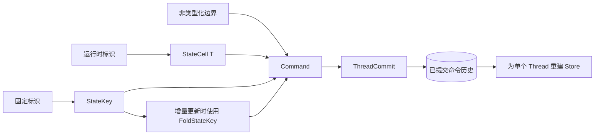
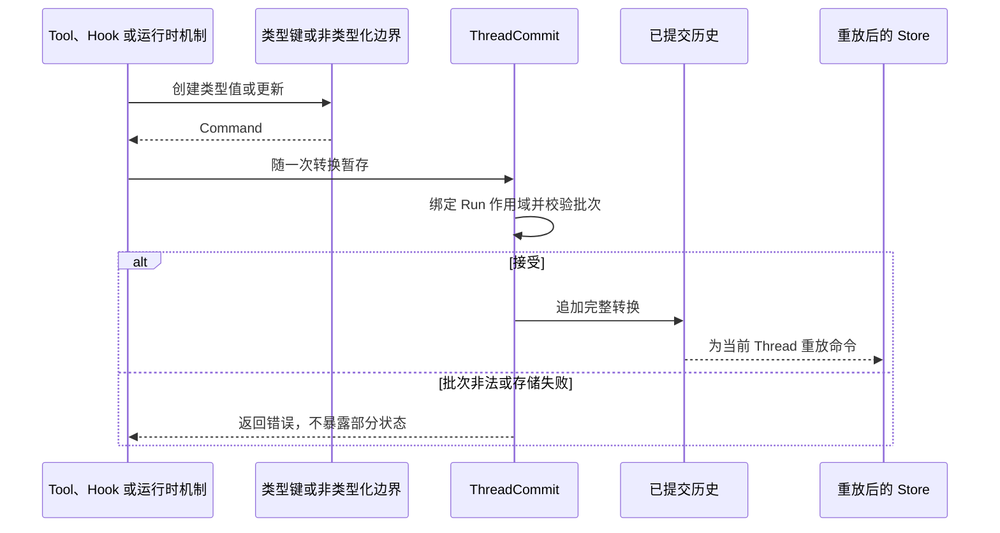

先看程序如何得到键地址。地址包含运行时标识时，使用 `StateCell<T>`；地址固定时，
使用 `StateKey`；调用方提交类型化增量时，使用 `FoldStateKey`；只有非类型化集成边界
才直接使用 `Command`。

这四种方式都生成同一种持久化 `Command`，也都读取同一个重放后的 `Store`。它们
不会创建新的注册表或存储路径。

## 选择最小接口

| 已知条件 | 使用 | 读取结果 | 写入结果 |
| --- | --- | --- | --- |
| `outcome/{id}/state` 这类运行时地址 | `StateCell<T>` | `Result<Option<T>, StateError>` | `Result<Command, StateError>` |
| 一个固定地址和完整类型值 | `StateKey` | 缺失时返回 `Default`，数据错误时失败 | 一个完整值 `Command` |
| 一个固定地址和类型化增量 | `FoldStateKey` | 失败关闭的类型化读取 | 折叠后生成一个完整值 `Command` |
| 边界本身就是 JSON | `Command` 与 `Store` | `Option<&Value>` | 非类型化 `Set` 或 `Remove` |



## 动态地址使用 `StateCell<T>`

```rust
use awaken_agent_contract::agent::state::{MergePolicy, Scope, StateCell};

let cell = StateCell::<ReviewState>::new(
    Scope::Thread,
    MergePolicy::Disjoint,
    format!("review/{review_id}/state"),
);

let command = cell.write(&ReviewState { approved: true })?;
let current = cell.load(&store)?; // 单元不存在时返回 None
```

`StateCell<T>` 为运行时选定的地址负责序列化。已存在的值与类型不符时，它返回
`StateError`。`remove` 生成命令，不会直接修改 `Store`。

## 固定地址使用 `StateKey`

```rust
use awaken_agent_contract::agent::state::{MergePolicy, Scope, StateKey};
use serde::{Deserialize, Serialize};

#[derive(Default, Serialize, Deserialize)]
struct ReviewState { approved: bool }

struct ReviewStateKey;

impl StateKey for ReviewStateKey {
    const KEY: &'static str = "review_state";
    const SCOPE: Scope = Scope::Thread;
    const MERGE: MergePolicy = MergePolicy::Disjoint;
    type Value = ReviewState;
}

let command = ReviewStateKey::try_write(&ReviewState { approved: true })?;
let current = ReviewStateKey::load(&store)?;
```

只有单元不存在时，`load` 才返回 `Default`。已提交 JSON 与声明类型不符时，它返回
`StateError`。只有明确要丢弃异常持久化数据时才使用 `load_or_default`。可失败边界
使用 `try_write`；`write` 会把序列化失败视为类型契约被破坏。

## 类型化增量使用 `FoldStateKey`

```rust
pub trait FoldStateKey: StateKey {
    type Update;
    fn apply(value: &mut Self::Value, update: Self::Update);
    fn commit(store: &Store, update: Self::Update) -> Result<Command, StateError>;
}
```

`commit` 读取当前类型值，应用一次确定性更新，再返回完整值命令。`apply` 应保持完备
且确定，使已接受历史在重放时不会崩溃，也不会得到另一种结果。

## 理解持久化核心

```rust
pub struct Key(pub String);
pub enum Scope { Run, Thread, Shared, Profile }
pub enum MergePolicy { Disjoint, Commutative, Exclusive }
pub struct Command {
    pub key: Key,
    pub scope: Scope,
    pub merge: MergePolicy,
    pub run_id: Option<RunId>,
    pub action: Action,
}
pub enum Action { Set(serde_json::Value), Remove }
```

`ThreadCommit::assemble` 会为 `Scope::Run` 命令写入 `run_id`，调用方不要自行填写。
`Scope::Shared` 和 `Scope::Profile` 只区分一个 Thread 状态中的地址；当前已提交状态
读取端不会让它们跨 Thread 可见。

合并策略只在一次提交批次内校验：

| 策略 | 同一 `(scope, key)` 的重复写入 |
| --- | --- |
| `Disjoint` | 后一个值替换前一个值 |
| `Commutative` | JSON 对象浅合并，其他值替换 |
| `Exclusive` | 第二个 `Set` 拒绝整批；`Remove` 不算第二次设置 |



类型化读取返回 `StateError` 时，先检查持久化值，再将它迁移到声明的数据结构，
之后恢复执行。值不存在或自动重放成功时，不需要排查。

## 关键文件

- `crates/contract/awaken-agent-contract/src/agent/state.rs`
- `crates/contract/awaken-agent-contract/src/thread/commit/staged.rs`

## 相关文档

- [状态管理](/zh/docs/agents/runtime/explanation/state-management/)
- [让状态跨 Run 保留](/zh/docs/agents/runtime/how-to/use-shared-state/)
- [状态与快照模型](/zh/docs/agents/runtime/explanation/state-and-snapshot-model/)
