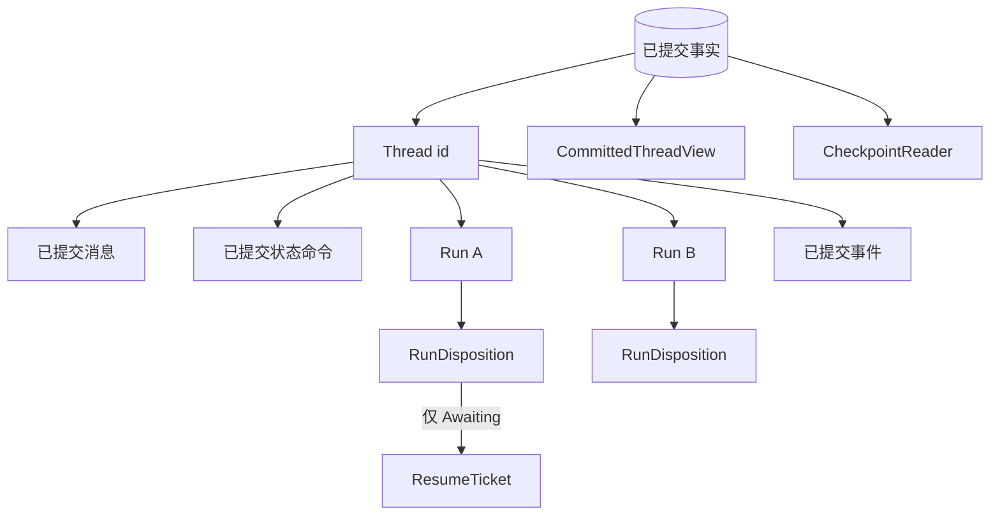
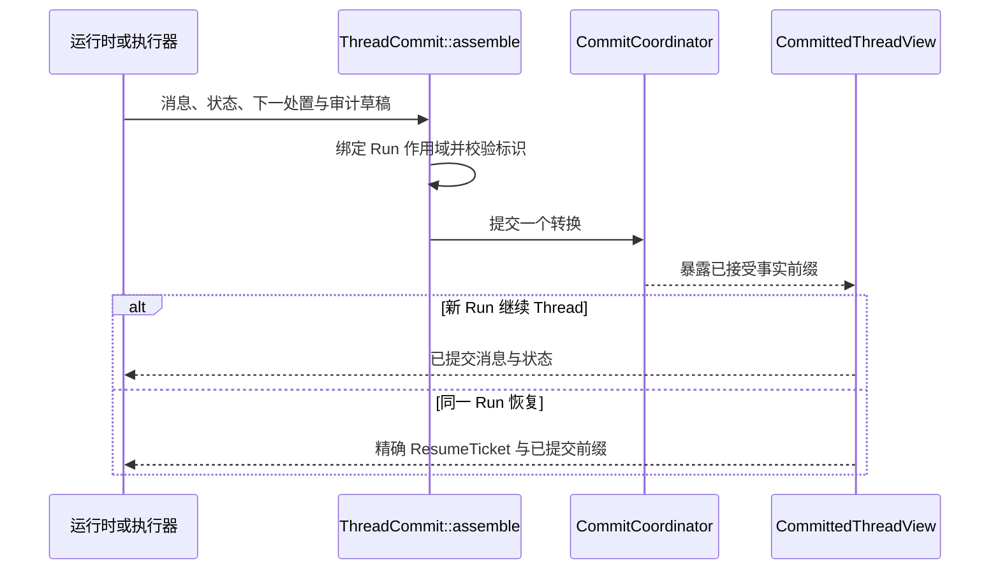

用 **Thread** 标识已提交对话的连续性。每次在该 Thread 上开始一段有界执行时创建
一个 **Run**。第二轮用户输入通常是在同一 Thread 上创建新 Run；恢复 `Awaiting`
Run 则继续同一个 Run。

不要用 Run id 代替对话标识，也不要为处理已有恢复票据创建新 Run。

## 聚合结构



### 标识记录

```rust
pub struct thread::Id(pub String);

pub struct thread::Record {
    pub id: thread::Id,
    pub latest_run_id: Option<run::Id>,
}

pub struct run::Id(pub String);

pub struct run::Record {
    pub id: run::Id,
    pub thread_id: thread::Id,
    pub state: RunState,
}
```

`latest_run_id` 标识聚合当前头部，但不能代替按特定 Run id 查询。读取合约明确区分
这两个问题。

## 唯一存储的生命周期权威

```rust
pub enum RunState {
    Running,
    Awaiting,
    Ended(EndCause),
}
```

`Running` 和 `Awaiting` 可以接受下一次生命周期提交；`Ended` 是吸收态。不要在它
旁边再存一份 `is_complete`、重试状态或结果标志。

```rust
pub enum EndCause {
    NaturalEnd,
    MaxSteps,
    Cancelled,
    Stopped(String),
    Error(Failure),
    Indeterminate,
}

pub enum Failure {
    Inference { code: String, message: String },
    CapabilityBound,
    StateConflict,
}
```

`Cancelled` 记录外部取消；`Stopped(reason)` 记录宿主策略决定，例如预算上限；
`Indeterminate` 表示异步分派结果目前无法确定，不能映射为成功。判断推理失败类型时，
使用稳定 `code`，不要解析消息文本。

## `RunDisposition` 保证每次提交一致

`ThreadCommit` 不分别接收 `RunState` 和可选票据，而是接收一个闭合处置：

```rust
pub enum RunDisposition {
    Running { run_id: run::Id },
    Awaiting(Box<ResumeTicket>),
    Ended { run_id: run::Id, cause: EndCause },
}
```

只有 `Awaiting` 携带 `ResumeTicket`。票据包含 Run 与 Thread 标识、不可变可执行快照
标识、目录指纹、关联 id、闭合等待目标和可选截止时间。Running 或 Ended 提交不能
携带票据，Awaiting 提交也不能缺少票据。

闭合目标区分：

- 带原因、call id 和待执行工具的工具调用；
- 带原因和 call id 的远程输入；
- 不虚构 call 载荷的暂停。

精确恢复校验与决定处理见[人在回路中](/zh/docs/agents/runtime/explanation/human-in-the-loop/)。

## `ThreadCommit`

```rust
pub struct ThreadCommit {
    pub thread_id: thread::Id,
    pub run: RunDisposition,
    pub messages: Vec<Message>,
    pub state: Vec<StateCommand>,
    pub events: Vec<AuditDraft>,
}
```

使用 `ThreadCommit::assemble` 构造转换。它把 Run 作用域状态命令绑定到处置中的 Run
id，并在一个位置生成生命周期审计草稿。后端写入前，校验会拒绝空标识或不匹配标识。



## 读取合约

`CommittedThreadView` 是一份内部一致的执行视图。它可以从本地已提交事实生成，也可
从受 claim fencing 保护的恢复快照生成：

```rust
pub trait CommittedThreadView: Send + Sync {
    fn committed_messages(&self, thread_id: &ThreadId) -> Vec<Message>;
    fn run(&self, run_id: &RunId) -> Option<RunRecord>;
    fn latest_run(&self, thread_id: &ThreadId) -> Option<RunRecord>;
    fn resume_ticket(&self, run_id: &RunId) -> Option<ResumeTicket>;
    fn run_state(&self, run_id: &RunId) -> Option<RunState>;
    fn committed_state(&self, thread_id: &ThreadId) -> Vec<StateCommand>;
}
```

它还负责固定、截取和校验只追加的对话快照。

`CheckpointReader` 是提交后的持久读取仓库。它在同一视图上增加按全部事实、某个 Thread
或某个 Run 读取有序事件的能力。它不是第二套 Thread 或 Run 存储。

```rust
pub enum EventScope {
    All,
    Thread(ThreadId),
    Run(RunId),
}

pub trait CheckpointReader: CommittedThreadView {
    fn list_events(
        &self,
        scope: &EventScope,
        from: Option<u64>,
        limit: usize,
    ) -> Vec<EventRecord>;
}
```

## 使用规则

1. 需要延续对话时保留 Thread id。
2. 新工作创建新 Run；匹配票据的恢复继续同一 Run。
3. 任意 Run 用 `run` 查询，Thread 头部用 `latest_run` 查询。
4. 从 `RunState::Ended(EndCause)` 推导终态含义。
5. 消息、状态、处置和审计草稿一起提交。
6. 从已提交视图读取恢复事实，不从实时流恢复。

## 相关文档

- [Run 生命周期与阶段](/zh/docs/agents/runtime/explanation/run-lifecycle-and-phases/)
- [人在回路中](/zh/docs/agents/runtime/explanation/human-in-the-loop/)
- [状态与快照模型](/zh/docs/agents/runtime/explanation/state-and-snapshot-model/)
- [取消](/zh/docs/agents/runtime/reference/cancellation/)
