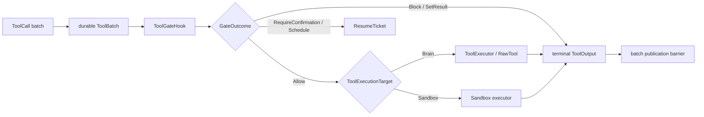

Awaken Agents 只有一条 tool-call pipeline。模型产生的 batch 先以 `Requested` 提交；每个调用
随后经过 permission gate，只有 `Allow` 才抵达已解析 executor。所有调用终态前，结果
都留在 batch publication barrier 后，不会暴露给模型 transcript。

`ToolExecutionTarget` 是可执行 `RawTool` 的可信属性，不是 agent authoring 可选择的
execution mode：

```rust
pub enum ToolExecutionTarget {
    Brain,   // 默认：在 model/runtime 旁执行
    Sandbox, // 经已配置 sandbox executor 执行
}
```

Host 仍拥有 `ToolExecutor` 的物理运行位置。执行内核不会从模型输入选择 transport、
sandbox tier 或 fleet topology。

## 静态结构



核心契约位于 `awaken_runtime_contract::tool`：

```rust
pub struct ToolOutput {
    pub call_id: String,
    pub content: Vec<ContentBlock>,
    pub is_error: bool,
    pub state: Vec<Command>,
}

#[async_trait]
pub trait ToolExecutor: Send + Sync {
    fn recovery_capability(&self, tool_id: &str) -> ToolRecoveryCapability;
    async fn invoke(&self, call: &ToolCall) -> Result<ToolOutput, ToolError>;
}
```

`ToolOutput::text()` 只是派生 plain-text view；结构化 content block 才是存储与投影
结果。State command 在 commit 边界暂存和校验，tool 不直接写 committed state。

## 动态行为

1. 在进入任何 executor 前，持久化完整 `ToolBatch` 与 assistant tool-use block。
2. 按模型顺序处理调用。唯一优化例外是：batch 全部为 delegation call，且 executor
   显式支持 parallel completion；该分支启动前所有 gate 必须都返回 `Allow`。
3. 解析 gate outcome：
   - `Allow` 校验 recovery policy、记录 `Executing`，再调用 Brain 或 Sandbox executor；
   - `Block` 与 `SetResult` 直接产生 terminal result；
   - `RequireConfirmation` 与 `Schedule` 提交 awaiting ticket 并停靠 Run。
4. 独立提交每个调用的 execution outcome，但不向模型 transcript 发布 partial batch。
5. 所有调用成为 `Completed` 或 `Indeterminate` 后，校验并 finalize batch，再按序发布
   result message 与 staged state。

Recovery 使用 durable call phase 与 pinned `ToolRecoveryPolicy`。
`UnavailableBeforeDispatch` 证明尚未跨过 external dispatch boundary；dispatch 后失败仍为
`Execution`，只有 executable capability 与 pinned policy 都允许时才可 replay。

## 投影契约

`awaken_agent_contract::event::ToolDisposition` 向 protocol consumer 描述已提交 tool call：

```rust
pub enum ToolDisposition {
    Executed,
    PendingClient,
    PendingBuiltin,
}
```

它是 read projection，不是 execution-placement selector。`PendingClient` 表示
client-executed tool 正等待外部结果；`PendingBuiltin` 表示 builtin tool 正等待权限决策。

## 关键文件

- `crates/runtime/awaken-runtime-contract/src/tool.rs` —— tool、output、target、recovery 与 executor contract
- `crates/runtime/awaken-runtime-contract/src/tool_batch.rs` —— durable batch state machine 与 publication barrier
- `crates/runtime/awaken-runtime-contract/src/permission.rs` —— gate outcome
- `crates/runtime/awaken-runtime/src/engine/dispatch.rs` —— ordered dispatch 与有边界的 parallel-delegation 分支
- `crates/contract/awaken-agent-contract/src/event/agent.rs` —— protocol projection disposition

## 相关

- [工具 Trait](/zh/docs/agents/runtime/reference/tool-trait/)
- [能力与权限](/zh/docs/agents/runtime/explanation/capability-and-permissions/)
- [人机协同（HITL）](/zh/docs/agents/runtime/explanation/human-in-the-loop/)
- [Awaken Agents 执行放置](/zh/docs/agents/concepts/brain-and-hand/)
