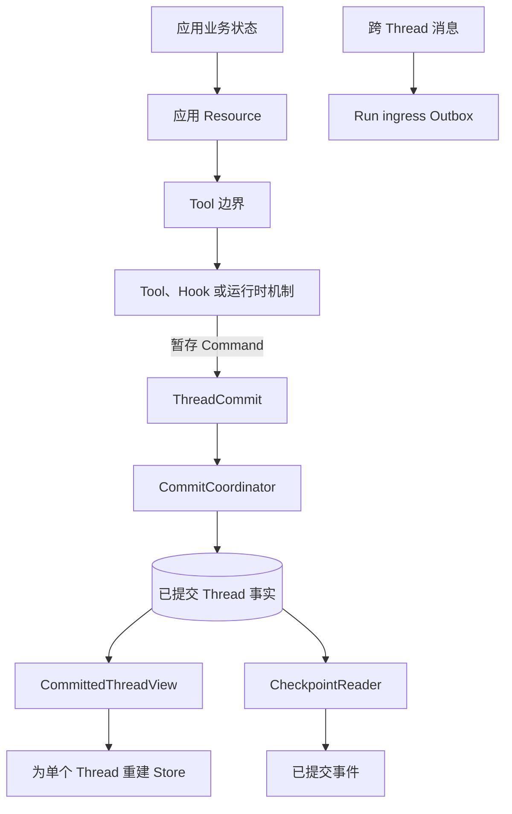
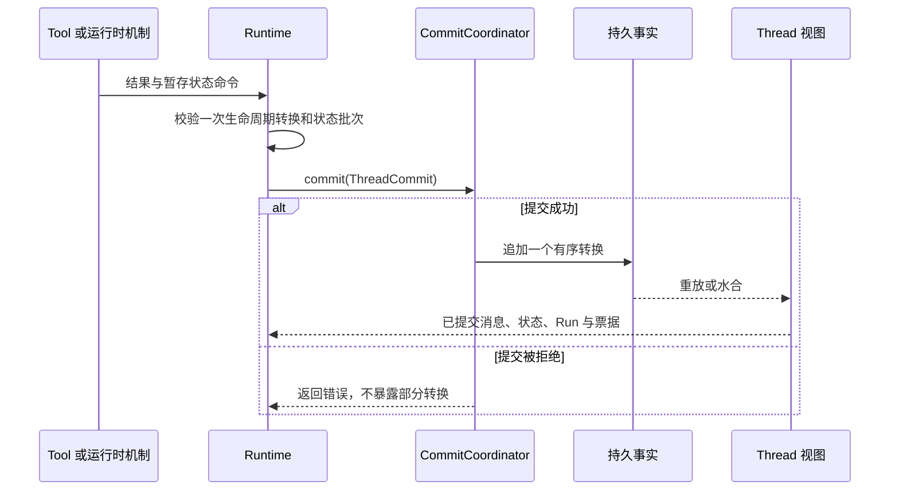

先确定需要承受哪种故障。只在当前进程使用的数据放在内存中；同一 Thread 的后续
Run 仍要读取的值放进 Thread 状态；单进程需要重启恢复时选择文件适配器；多个进程
需要共同提交时选择 PostgreSQL。

| 需求 | 选择 | 必须保留的边界 |
| --- | --- | --- |
| 测试或只存活于一个进程 | 内存 Coordinator | 重启后状态丢失 |
| 单机重启恢复 | `FsCommitCoordinator` | 一个进程独占该目录 |
| 多个 Runtime 进程或数据库运维 | `PostgresCommitCoordinator` | 迁移和启动水合是明确的部署步骤 |
| 多个 Thread 共享业务数据 | 由应用持有的存储，经 Resource 与 Tool 暴露 | 它不属于 Runtime Thread 状态 |
| Thread 之间可靠投递消息 | Run ingress Outbox | 不要用状态键复制消息 |

## 保留唯一权威

`ThreadCommit` 是消息、状态命令、Run 处置、等待票据变更和审计草稿的写入边界。
`CommittedThreadView` 重建执行视图，`CheckpointReader` 增加持久事件读取。实时
`Store` 是投影，不是另一个写入端。

Awaken Agents 执行内核不拥有租户记录、Profile、客户数据库、队列或 HTTP 资源。嵌入应用提供
这些能力，并通过 Resource 与 Tool 只暴露 Agent 可以使用的操作。

## 一次提交做什么

Token 增量和进度通知是尽力交付的观察数据，不能决定 Tool 是否执行、状态是否改变，
也不能决定 Run 是否结束。

文件持久化见[把运行时状态存入文件](/zh/docs/agents/runtime/how-to/use-file-store/)；
PostgreSQL 与独立迁移步骤见
[把运行时状态存入 PostgreSQL](/zh/docs/agents/runtime/how-to/use-postgres-store/)；
精确的状态键接口见[选择状态键](/zh/docs/agents/runtime/reference/state-keys/)。

Awaken Agents 会增加全局队列、Lease、公开 Session、恢复 Worker 和协议重放。
这些服务组合 Runtime 端口，但不会替代本页说明的 Thread 事实权威。
