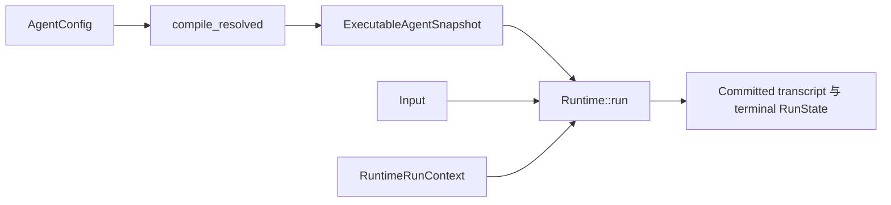

## 目标

创建一份本地 Agent 配置，并把它的不可变 snapshot 运行到
`Ended(NaturalEnd)`。这项任务修改 Agent 数据，不修改 Runtime 内核。

从 `hello_agent.rs` 开始。它是这条路径唯一维护的最小示例。不要在另一篇教程里再复制
一套更长的 Runtime 与 Tool 装配代码。

## 前置条件

- Awaken 源码 checkout 与页面版本横幅中的 revision 一致；
- Rust toolchain 满足 workspace 要求；
- 终端位于仓库根目录。

示例使用确定性的本地 model double `GreeterLlm`。它不会访问 provider，也不评价 prompt
质量。

## 1. 运行受检基线

```sh
cargo run -p awaken-runtime-examples --example hello_agent
```

确认输出同时包含：

```text
run finished: Ended(NaturalEnd)
--- committed transcript ---
```

## 2. 修改 Agent 配置

打开 `crates/devtools/awaken-runtime-examples/examples/hello_agent.rs`，先只修改
以下 `AgentConfig` 值：

- `id`：Agent 的稳定标识；
- `instructions`：模型应遵循的行为；
- `max_steps`：loop 的硬上限；
- `model_binding`：逻辑 provider、model 与 backend 选择。

同时修改传给 `runtime.run` 的用户输入。保留 `compile_resolved`、
`RuntimeRunContext` 与 commit coordinator。它们是共享执行边界，不是 Agent 行为。

`compile_resolved` 把编写的 config 变成一份 `ExecutableAgentSnapshot`。
`Runtime::run` 消费这份 snapshot；run 进行期间不会再读取第二份可变 Agent 定义。

## 3. 验证

```sh
cargo test -p awaken-runtime-examples --test hello_agent
```

测试必须通过，示例仍应以 `NaturalEnd` 结束，已提交 transcript 中应有 assistant message。
这说明修改后的配置仍能编译到同一种可执行契约。

如果 Cargo 报告找不到 `awaken-runtime-examples`，回到 Awaken workspace 根目录。如果
修改后对应测试失败，先根据 compiler error 检查改动的 config 字段，再添加 provider 或
Tool。确定性示例没有另一套恢复流程。

## 保持分开的边界



- `AgentConfig` 是编写数据。
- `ExecutableAgentSnapshot` 是一次 publication 的不可变可执行形态。
- `Runtime` 拥有进程级 model 与 Tool 实现。
- `RuntimeRunContext` 拥有一次 attempt 的接线，包括持久化与 streaming。

把示例移入应用时仍要保持这些所有者分离。不要把 credential、live store 或 request-only
handle 放进 snapshot。

## 下一步

- 运行一次模型请求的 Tool：[第一个 Tool](/zh/docs/agents/runtime/tutorials/first-tool/)。
- 在应用中装配这些边界：[构建 Agent](/zh/docs/agents/runtime/how-to/build-an-agent/)。
- 通过已解析配置绑定真实 provider：[Agent 解析](/zh/docs/agents/runtime/explanation/agent-resolution/)。
