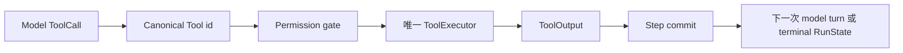

## 目标

运行一次由模型请求的 Tool，并在已提交 transcript 中找到它的结果。本页使用唯一维护的
`direct_runtime` 示例。实现新 Tool 由[添加 Tool](/zh/docs/agents/runtime/how-to/add-a-tool/)
负责；state command 由[状态与快照模型](/zh/docs/agents/runtime/explanation/state-and-snapshot-model/)
负责。

## 前置条件

- 已完成[创建第一份 Agent 配置](/zh/docs/agents/runtime/tutorials/first-agent/)；
- Awaken 源码 checkout 与页面版本横幅中的 revision 一致；
- 终端位于仓库根目录。

示例使用 `ScriptedLlm`，因此可以离线、确定性地运行。

## 1. 运行受检 Tool 路径

```sh
cargo run -p awaken-runtime-examples --example direct_runtime
```

transcript 应包含 `echoed: hello`，run 应以 `Ended(NaturalEnd)` 结束。

## 2. 找到四处一致的声明

并排打开：

- `crates/devtools/awaken-runtime-examples/examples/direct_runtime.rs`；
- `crates/devtools/awaken-runtime-examples/src/lib.rs`。

沿着 `echo` 标识查看四个位置：

| 边界 | 要找什么 | 所有者 |
| --- | --- | --- |
| 模型请求 | `ScriptedLlm` 发出 `tool_id: "echo"` 的调用 | 本地 model double |
| 模型可见契约 | snapshot 包含 `echo` 的 `ToolDescriptor` | Agent publication |
| 可执行实现 | `Runtime::with_tool(Arc::new(EchoTool))` | 进程 Runtime |
| 授权 | permission rules 允许 `echo` | permission gate |

四处指向同一次 Tool 调用。不要增加第二个 dispatcher，也不要把动作实现写进 prompt。

## 3. 验证

```sh
cargo test -p awaken-runtime-examples --test direct_runtime
```

测试检查 run 到达 `NaturalEnd`，并且已提交 message 包含 `echoed: hello`。

如果 Cargo 找不到 package，回到 workspace 根目录。如果本地修改后对应测试失败，逐项比较
上面的四处声明。Tool invocation error 会被转换成模型可见的错误结果，模型可以在下一次
调用中纠正；除非 run 最终给出需要修改配置或实现的明确结果，否则不要增加人工恢复流程。

## Runtime 如何处理



Tool 不拥有 transcript 或 commit boundary。Runtime 把 Tool result 与 step 的其余内容一起
暂存。这样 replay、permission 与 state 始终走同一条执行路径。

## 下一步

- 实现一项不重复 schema 的类型化 Tool：[添加 Tool](/zh/docs/agents/runtime/how-to/add-a-tool/)。
- 选择 state scope 与 merge policy：[状态与快照模型](/zh/docs/agents/runtime/explanation/state-and-snapshot-model/)。
- 加入人工审批：[启用 Tool permission HITL](/zh/docs/agents/runtime/how-to/enable-tool-permission-hitl/)。
