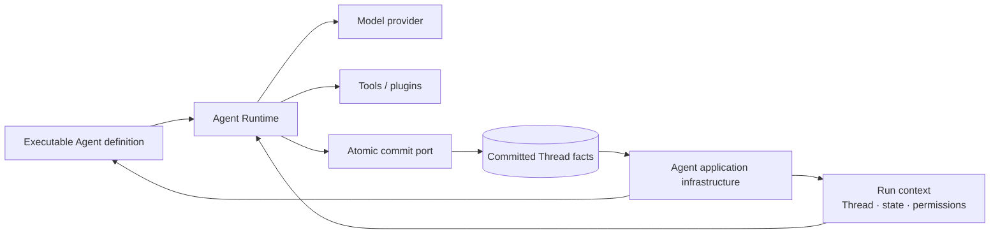
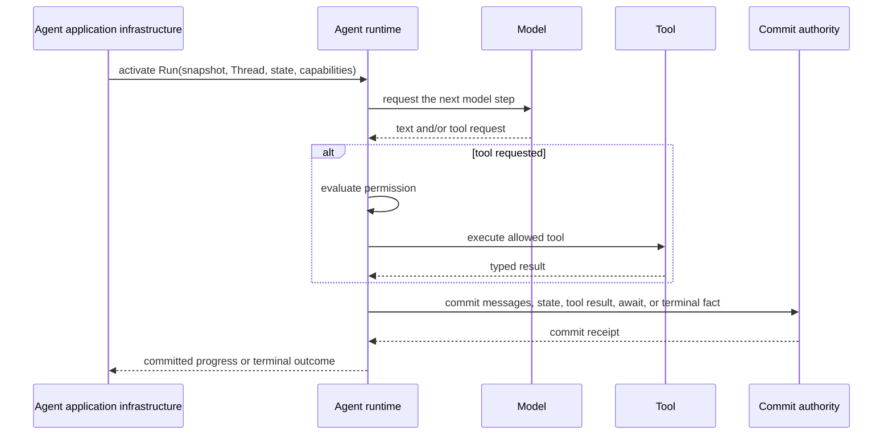

An **AI Agent runtime** is the execution layer that runs an Agent's model-and-tool
loop, applies permission decisions, evolves typed state, and commits the facts
produced by each step. It consumes an executable Agent definition and a Run
context; it is not, by itself, the complete user-facing Agent application.

## The runtime boundary

| The runtime owns | A surrounding Agent application platform owns |
| --- | --- |
| model invocation and streamed output | published Agent identity and revisions |
| tool selection, permission gates, and tool results | durable Session identity and client-facing events |
| typed state transitions during execution | dispatch, Worker placement, and Sandbox lifecycle |
| atomic step commits through a commit port | authentication, protocol APIs, recovery operations, and administration |

This separation matters because a local loop can execute successfully without
solving publication, reconnect, recovery, isolation, or operations. Conversely,
the platform should not reimplement the Agent loop for every API protocol.

## Static structure

The runtime receives capabilities through narrow ports. Durable authorities stay
outside the loop, so a retry or a different Worker can reconstruct execution
from committed facts instead of from process memory.

## Dynamic behavior

A failure before a fact is committed does not become durable history. Recovery
starts from the last committed Thread facts and the applicable tool-recovery
policy. Exact claim, retry, and indeterminate-effect rules belong to
[Production reliability](./production-reliability), not to this definition.

## Awaken's implementation

**Awaken Runtime** is the Rust execution core inside **Awaken Agents**. It owns
the Agent loop, tools, typed state, permission checks, plugins, and staged atomic
commits. Awaken Agents adds durable Sessions, publication, protocol adapters,
Workers, Sandboxes, configuration, and recovery around that core.

Use [Framework vs Runtime vs Agent application infrastructure](./framework-runtime-infrastructure)
when choosing the layer you need. Then read [Runtime internals](/docs/agents/runtime/)
only when you need to extend execution behavior, or [Run your first Awaken
Session](/docs/agents/get-started/) when you want to integrate an application.
