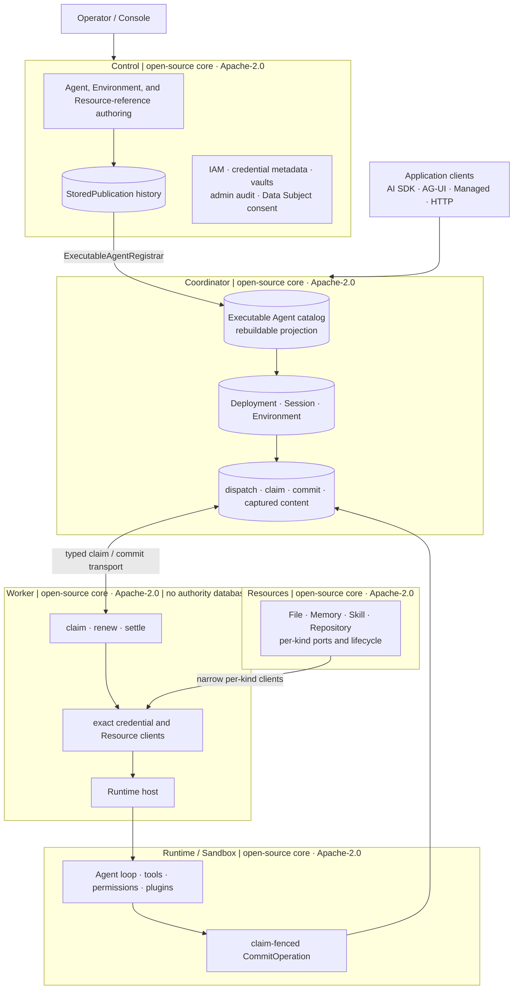
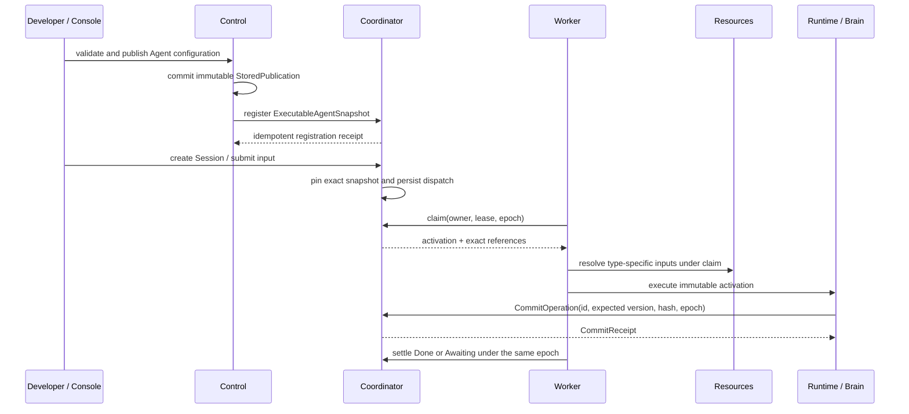
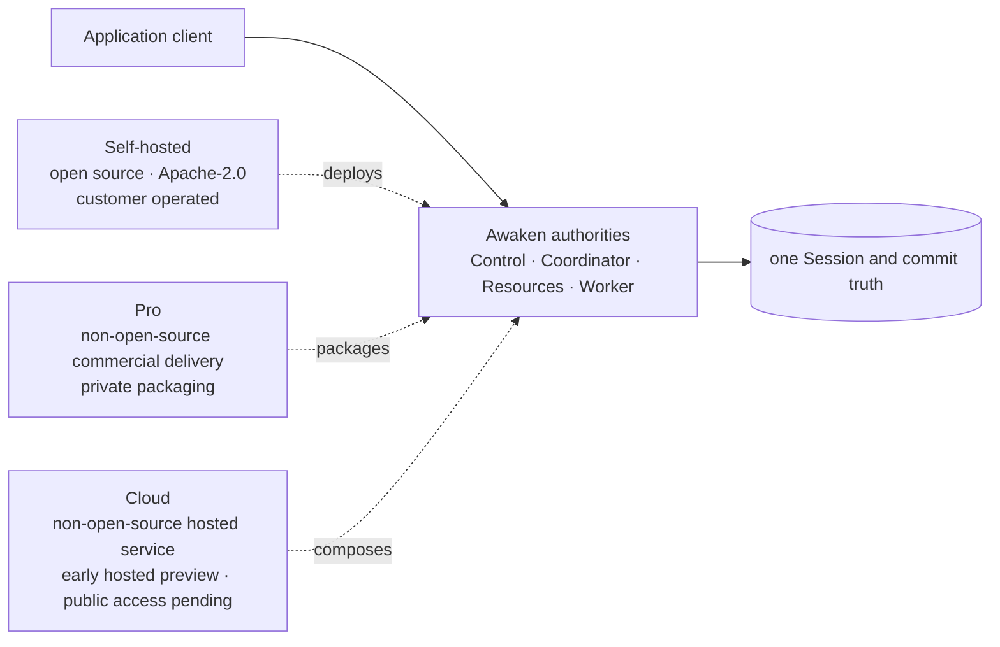

The system view answers three practical questions first: where an application
connects, which owner preserves completed work, and which components your team
operates. The Awaken Agents execution core is open source under Apache-2.0.
Awaken Pro and Awaken Cloud are non-open-source commercial delivery around that
same core; neither creates another Agent or Session record.

When deciding how many Awaken processes to run, start
with `awaken all-in-one` for a local evaluation or one trusted team. Split
Control, Coordinator, and Workers when their operators, scaling needs, or trust
boundaries differ. The Agent publication and execution model stays the same.

## Choose the deployment shape first

| What you need to do | Start with | What does not change |
| --- | --- | --- |
| Evaluate Awaken locally or run it for one trusted team | `awaken all-in-one` | Agent publication, Session history, Resource ownership, and the Runtime commit path |
| Keep administration and configuration away from live execution | Separate Control and Coordinator processes | Control still publishes immutable Agent revisions; Coordinator still owns Session and dispatch state |
| Scale execution or isolate workloads by environment | Add separate Workers and Sandboxes | Workers still claim work from Coordinator and return results through the same commit protocol |
| Offer hosted or dedicated enterprise deployment | Compose the same services as Pro or Cloud | The delivery model adds operations and policy; it does not add another Agent catalog or runtime |

If you are deploying one machine, continue with the
[self-hosted guide](/docs/agents/how-to/self-host/). If you are
changing how configuration becomes a running Agent, read
[Configuration to committed execution](./configuration-to-execution) after this
page.
If you are upgrading an earlier runtime or local server, first use the
[Awaken 1.0 migration guide](/docs/agents/how-to/migrate-to-1-0/); this page
remains the owner of the deployment model it references.

This page owns the whole-system context map. The exact publication-to-commit
state machine belongs to [Configuration to committed execution](./configuration-to-execution),
while [Production reliability](./production-reliability) owns lease, retry, and
recovery semantics. Runtime-loop detail remains in the
[Runtime internal documentation](/docs/agents/runtime/).

## Static structure: one owner for every durable responsibility

| Component | Durable authority | Uses | Must not own |
| --- | --- | --- | --- |
| Control | Agent authoring and immutable publication history; IAM; credential metadata and mutation; admin audit; Data Subject consent/accountability | `ExecutableAgentRegistrar`, Environment authoring, authenticated Coordinator application ports | Session, Deployment, dispatch, runtime commits, captured runtime content, or Resource content |
| Coordinator | executable-Agent registration; Deployment/DeploymentRun; Session; Environment execution state; dispatch, commit, replay, captured content | Control read/command ports, Resources component, Worker transports | mutable Agent authoring, credential mutation, Control seal key, or Worker-local execution state |
| Resources | Resource catalog plus type-specific File, Memory, Skill, and Repository content/lifecycle ports | exact references and claim context | universal optional-behavior Resource service or Agent/Session truth |
| Worker | ephemeral attempt state, leases, local processes, mounts, and installed clients | Coordinator claim/commit protocol; per-kind Resource and credential clients | any authority database, Control seal key, publication history, or Session truth |
| Runtime / Sandbox | Agent-loop behavior, permission gates, tool effects, plugins, and staged commits | immutable `ExecutableAgentSnapshot`, live run context, commit port | public protocol DTOs, publication workflow, dispatch authority, or product policy |
| AllInOne | no new authority; composes the same Control, Coordinator, Resources, and optional Worker builders | local adapters for the same ports | alternate stores, warm-install path, or second Agent catalog |

`ProcessStores` is therefore a role-scoped bundle, not a shared bag of database
handles. A split Coordinator cannot open Control catalog, credential, config,
admin, or Data Subject stores. A split Worker rejects every authority database
field and private Control-to-Coordinator token. These are configuration errors,
not recommended conventions.

## Product edges converge before execution

Protocol adapters translate AI SDK, AG-UI, Managed Agents, A2A, MCP, and HTTP
shapes at the edge. They do not create one Session implementation per protocol.
All accepted input reaches the Coordinator's Session/Run identity and the same
committed history.

MCP, ACP, and A2A name different boundaries:

- MCP exposes tools and Resources to an Agent;
- ACP adapts an external Agent harness as a Brain attempt;
- A2A delegates a remote Agent task;
- the native Awaken Agents execution core runs the built-in loop.

Selection may change which Brain executes. It never changes the permission path,
claim fence, commit authority, or Session ledger.

## Dynamic behavior: publication and execution share one canonical path

The short sequence hides no alternative fast path. Local publication uses a
local registrar and split publication uses an authenticated HTTP registrar, but
both call the same port. Local execution and remote Worker execution likewise
use the same activation and commit contracts.

At the application surface, a Session either shows the action needed to resume
an Awaiting Run or exposes its committed terminal `RunState`. The exact states
and events remain in [Sessions and events](./sessions-and-events); this page only
shows where that outcome becomes authoritative.

## Consistency, retry, and failure boundaries

- Control commits `StoredPublication` before registration. If Coordinator is
  unavailable, publication history remains durable and the same registration is
  safe to retry.
- Registration is idempotent by Workspace, Agent, and source revision. The same
  fingerprint converges; a different fingerprint for the same identity fails
  closed. Older exact revisions remain addressable.
- Session creation pins an exact registered snapshot. A mutable draft or latest
  pointer is never resolved in the Worker.
- Dispatch is persisted before execution. Wake signals only reduce latency.
- A Worker commits with operation id, expected Thread version, payload hash, and
  current claim epoch. A stale lease cannot append truth or settle a replacement's
  work.
- File, Memory, Skill, and Repository materialization remain type-specific.
  Claim loss prevents credential materialization and mutable Resource write-back.
- Streaming output is interactive evidence, not durable authority. Recovery and
  public replay derive from committed facts.

## Environment realization keeps package installation out of live Sessions

Coordinator freezes the Environment revision into the activation. Its neutral
network and package requirements cross the provisioning contract; the Worker is
the only owner that translates them into a Sandbox implementation. Container
tiers derive an immutable OCI image from the exact base identity, package
requirements, and frozen resolution id.

The OCI registry owns image bytes. Coordinator owns the durable image-build
demand, state, lease, and immutable Registry digest; a build Worker or bounded
rootless Kubernetes job performs the work without acquiring an authority
database. Registry credentials remain outside the Session. Environment
preparation can delay or fail Session creation, but it cannot mutate Session
truth, weaken isolation, or create a second Environment authority.

## Security follows the same boundaries

The security chain is continuous: publication validates references and excludes
secret material; protocol ingress authenticates and scopes the request;
placement checks Worker eligibility; Sandbox selection enforces the isolation
floor; runtime permission gates authorize each tool; the commit fence rejects
duplicates and stale writers.

The split also limits blast radius. Coordinator receives secret-free credential
pins from Control. A Worker receives only exact material projected into its trust
domain and never the Control seal key. Data Subject consent stays Control-owned;
captured runtime content and erasure adapters stay Coordinator-owned behind
authenticated application ports.

## Delivery composition: self-hosted, Pro, and Cloud do not create new authorities

Delivery changes operating responsibility, not the product's domain model.

| Mode | Composition | Operating responsibility | Current public boundary |
| --- | --- | --- | --- |
| Self-hosted Awaken | canonical AllInOne or split Control, Coordinator, Resources, and Worker builders | the adopting team deploys, upgrades, secures, observes, and recovers the platform | open source · Apache-2.0 |
| Awaken Pro | offline or private single-tenant packaging around the same Awaken authorities | the adopting team and AwakenWorks define private packaging, integration, upgrades, and operations together | non-open-source commercial delivery · [business cooperation](/enterprise#apply) |
| Awaken Cloud | Product Workspace, provider-routing, and usage services compose around Awaken | the adopting team and AwakenWorks validate one managed boundary during the early preview | non-open-source hosted service · early hosted preview · [public access pending](/enterprise#apply) |

Cloud owns commercial and multi-tenant composition facts such as subscription,
Product Workspace, provider route, usage, and frozen charge. It consumes exact
Awaken product contracts; it does not copy Agent configuration, publication,
Session, Run, Worker, or commit stores. Pro follows the same rule for offline
single-tenant delivery. Consequently:

1. a Cloud entitlement may admit or deny new product work, but it cannot become
   Session truth;
2. a provider usage fact may become a frozen billing charge, but billing cannot
   settle an Awaken Run;
3. local, Pro, and Cloud adapters must enter the same publication, Session,
   dispatch, permission, and commit ports;
4. a deployment label is never evidence of production availability, support,
   or SLA. Those require an independently qualified and signed boundary.

## Architecture invariants

1. One immutable publication history in Control; one rebuildable executable
   registration projection in Coordinator.
2. One Session and committed-fact authority regardless of client protocol,
   Brain, Worker, or Sandbox.
3. AllInOne composes canonical components; it is not another implementation.
4. Workers are database-free and authority-free.
5. Resources retain type-specific contracts instead of a universal service.
6. Queue, wake, stream, and read projections never become execution truth.
7. Runtime extensions can restrict or stage effects but cannot bypass permission
   or the commit boundary.
8. Pro and Cloud compose delivery responsibility around Awaken; they never copy
   its domain authorities or introduce a second execution path.

## Non-goals

Awaken does not define a team's business Workflow or decide whether a business
outcome is acceptable; Workforce or the adopting application owns that decision.
Streams, queues, deployment labels, and Cloud billing records can observe,
wake, package, or charge for work, but they do not become Agent execution truth.

Continue with [Configuration to committed execution](./configuration-to-execution)
for the detailed state machine and failure matrix.
