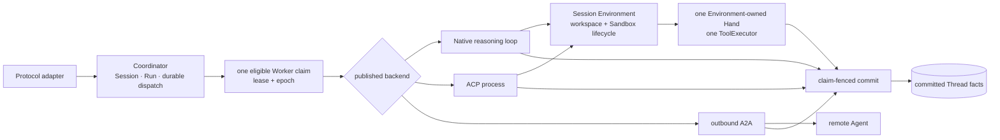
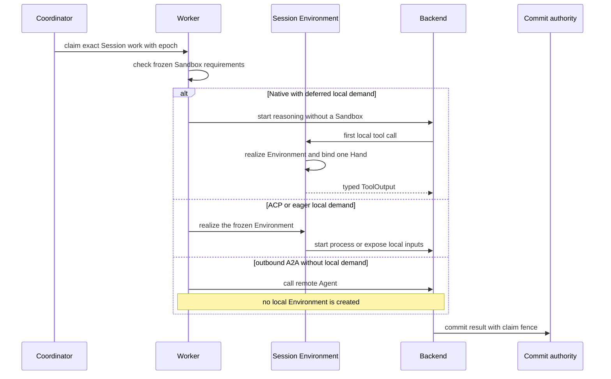

A Session needs a local execution environment only when its work depends on a
filesystem, a local process, a mounted resource, or a local tool. Model
reasoning alone does not require one. This distinction lets an application avoid
creating a Sandbox for work that never uses it, without introducing a second
execution path.

## Start with the work that must run locally

| Session work | Environment decision |
| --- | --- |
| Native model work with no local input or tool | With `on_tool_use`, start without a Sandbox. |
| Native work that reaches a local tool | Realize the Session Environment before the first local tool executes. |
| Work with mounted files, repositories, executable Skills, or an `eager` policy | Realize the Environment before execution depends on those inputs. |
| ACP process | Run the process inside the realized Session Environment. Deferred provisioning is not accepted. |
| Outbound A2A call with no local dependency | Call the remote Agent without creating a local Environment. A Session that also requires local inputs is rejected instead of silently changing backend. |

The invariant is one Worker claim, one Session Environment, and one tool
executor. Brain and Hand name different responsibilities inside that path; they
are not independently scheduled services.

## Static structure

| Owner | Owns | Does not own |
| --- | --- | --- |
| Coordinator | Session and Run truth, dispatch, eligibility, claim epoch | a live Sandbox or tool process |
| Worker | one claimed attempt and the physical Environment it realizes | the Agent catalog or durable conversation history |
| Session Environment | workspace, Sandbox lifecycle, local processes, one Hand channel | model selection or commit authority |
| Native backend | the model loop; local calls route through the Environment | another tool placement decision |
| ACP backend | the external process inside the same Environment | a host-global work path |
| Outbound A2A backend | authenticated remote Agent I/O | local mounts, local tools, or a local Hand |

`ConnectionPlan` carries secret-free topology. It does not select another Hand
or create another execution owner. Agent publication and deployment
configuration also do not carry a separate Hand selector.

## Dynamic behavior

`sandbox_provisioning` is part of the published Environment policy. `eager`
realizes the Environment before the backend needs it. `on_tool_use` allows a
Native Run to begin without one, but local inputs can still make realization
necessary before the first model step.

Image preparation, capacity, mounts, networking, credential delivery, and
health checks remain separate realization stages. If the frozen requirements
cannot be met, placement fails closed. The system does not fall back to a weaker
Sandbox or another backend.

## What the system handles on its own

An idle Hand hibernates without changing Environment or workspace ownership.
The next undispatched local call recreates it through the same Environment; this
does not create a maintenance task. A Session created with `on_tool_use` may
therefore have no Sandbox until local demand appears.

After a tool has been dispatched, a lost channel is not silently replayed
because the external effect may already have happened. That Run result follows
the indeterminate-effect rules in [Production reliability](./production-reliability).
Terminal Environment release is irreversible.

Continue with [Execution modes](./execution-modes),
[Configure Sandbox tiers](/docs/agents/how-to/configure-sandbox-tiers/), and
[Production reliability](./production-reliability). Exact Managed Agents wire
differences belong to the [compatibility matrix](/docs/agents/compatibility/).
