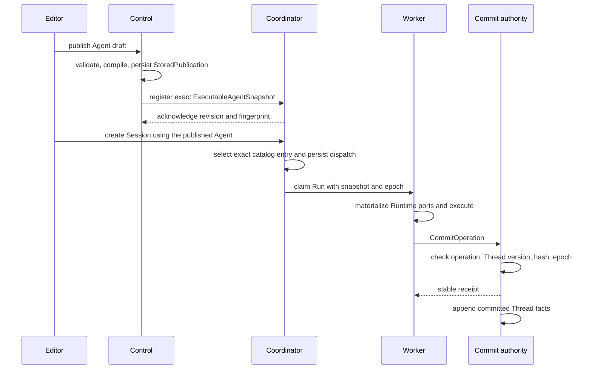

When a Run behaves differently from a recently edited Agent, start with the
revision and fingerprint selected for that Session. A Run never follows the
latest draft. It executes the exact immutable publication carried into its
activation.

## Follow the revision and fingerprint

Check the path in this order:

1. the draft was validated and stored as an immutable publication;
2. Coordinator registered the same revision and fingerprint;
3. Session creation selected that exact catalog entry;
4. Worker execution used the snapshot carried by the activation;
5. the result crossed the claim-fenced commit boundary and became committed
   Thread facts.

This is one path with one authority at each boundary. There is no second
latest-config lookup in the Worker and no second transcript beside the Thread.

## Static structure

```mermaid
flowchart LR
    Draft["AgentConfig draft<br/>mutable · Control-owned"]
    Publication["StoredPublication<br/>immutable Control truth"]
    Snapshot["ExecutableAgentSnapshot<br/>revision + fingerprint"]
    Catalog["ExecutableAgentCatalog<br/>rebuildable Coordinator projection"]
    Activation["RunActivation<br/>Session + Run + exact snapshot"]
    Runtime["RuntimeRunContext<br/>process-local ports"]
    Commit["CommitOperation<br/>operation + version + hash + epoch"]
    Facts[(Committed Thread facts)]

    Draft -->|"validate · compile · persist"| Publication
    Publication -->|"register exact value"| Snapshot
    Snapshot --> Catalog
    Catalog -->|"select exact entry"| Activation
    Activation -->|"materialize one attempt"| Runtime
    Runtime --> Commit --> Facts
```

| Boundary | Owner | Stable identity | Must not contain |
| --- | --- | --- | --- |
| Draft | Control authoring | Workspace and Agent draft revision | runtime handles or Session facts |
| `StoredPublication` | Control publication history | Workspace, Agent, source revision, fingerprint | plaintext credentials or live registries |
| `ExecutableAgentCatalog` | Coordinator projection | exact revisions and current pointer | draft editing or publication history authority |
| `RunActivation` | Coordinator dispatch | Session, Thread, Run, exact snapshot, placement requirements | mutable Control state |
| `RuntimeRunContext` | Worker attempt | current claim and attempt | durable truth |
| `CommitOperation` | Coordinator commit boundary | operation id, expected Thread version, payload hash, claim epoch | unfenced writes |

The catalog can be rebuilt from publications. It is not another authoring store.
The Worker receives an executable value rather than access to either store.

## Dynamic behavior

AllInOne and split deployments use the same registrar command. Only the adapter
changes. Startup rehydration also registers the same exact snapshots; it does
not install a second whole-catalog path.

Registration is idempotent for one Workspace, Agent, and source revision. The
same fingerprint returns the existing result. A different fingerprint for the
same identity is a semantic conflict and does not overwrite the entry.

## Why a commit can be retried safely

A commit is accepted only when four values agree: stable operation id, expected
Thread version, payload hash, and current claim epoch. Repeating the same
operation and bytes returns the earlier receipt after an ambiguous response.
A changed payload, stale Thread prefix, or old Worker epoch fails closed.

The accepted receipt, not a streamed token or queue status, marks the durable
boundary. Another Worker can recover from the committed prefix without reading
mutable Control state.

## Act only on errors surfaced before dispatch

| Surfaced result | What remains true | What to do |
| --- | --- | --- |
| Draft validation or compilation fails | no new publication exists | Correct the named field or dependency. Retrying unchanged input cannot help. |
| Registration is unavailable after publication | the immutable `StoredPublication` remains stored; the catalog entry is absent | Restore the Coordinator connection, then repeat the same publish intent. |
| The same registration identity carries another fingerprint | the existing catalog entry is unchanged | Review the source revision and intended publication. Do not treat the conflict as temporary availability. |
| Session resolution reports an unregistered exact revision | no dispatch exists | Restore registration for that publication, or deliberately select an available revision. |

After dispatch, claim loss, a lost commit response, stale Worker return, and
retry exhaustion are handled by the queue, stable receipt, Thread version, and
claim epoch. They are not separate repair procedures. Persistent dependency
failure, an explicit terminal result, or an indeterminate external effect is
explained in [Production reliability](./production-reliability).

## Verify one execution path

Use one published Agent and record its revision and fingerprint. Create a new
Session, confirm that its activation carries the same identity, run one
recognizable input, and read the committed result after reconnecting. If testing
takeover, interrupt the Worker only after the dispatch is durable and verify
that the next attempt continues from the last committed Thread prefix.

For the whole component map, read [Awaken architecture](./architecture). For
exact fields and routes, use [Configuration reference](/docs/agents/reference/configuration/)
and [HTTP API reference](/docs/agents/reference/api/).
