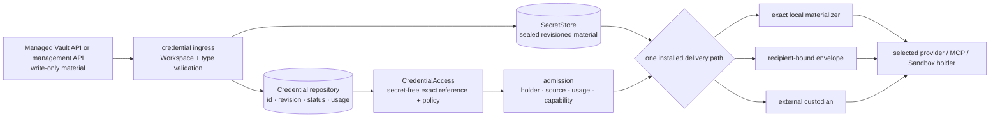
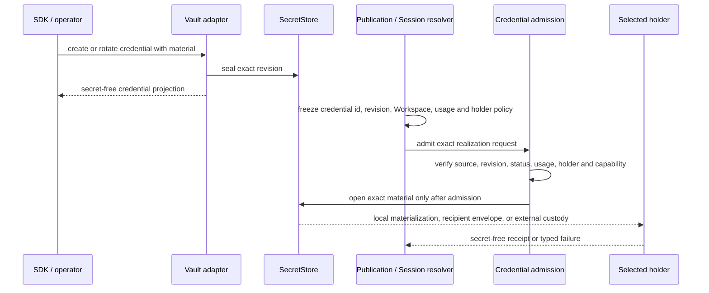

Choose the custody path before publishing an Agent or creating a Session. Do not
paste secret material into Agent configuration. Publish the exact credential
reference and let the installed custody path open it only for the admitted
holder.

## Choose one custody path before publication

| Deployment | What to choose and operate |
| --- | --- |
| Open-source or self-hosted | Use an operator `SecretStore` and the exact local materializer for the selected provider or MCP path. Operate sealing keys, backup, rotation, Worker trust boundaries, and audit. |
| Hosted | Use the recipient-envelope or external-custody path named by the platform's installed contract. The platform states its custody and isolation boundary; the tenant manages credential lifecycle and access. |
| Enterprise or customer-owned custody | Name the KMS, Vault, network boundary, holder, and delivery mechanism in the deployment profile. Record ownership, rotation, revocation, recovery, and audit duties there. |
| No admitted holder or installed delivery path | Fail closed. Do not fall back to an environment variable, another credential, or a second material path. |

Before publication:

1. Create or rotate the credential through the write-only API.
2. Keep the returned credential id and exact revision, never the plaintext.
3. Select the one installed delivery path and allowed holder.
4. Freeze that secret-free reference in the publication or Session.
5. Open material only after source, revision, status, usage, holder, and
   capability admission succeeds.

Awaken therefore separates credential storage from credential use. Material
enters one `SecretStore`; Agent publications and Sessions retain only an exact,
secret-free reference; the selected revision reaches one admitted last-mile
holder only when execution needs it.

This page owns the cross-cutting custody design. The
[model publication boundary](/docs/agents/reference/provider-model-config/)
owns model selection, while [MCP](/docs/agents/protocols/mcp/) owns attachment
realization. Neither page defines another secret store or delivery path.

## Static structure: one material authority and one selected holder

| Owner | Owns | Must not do |
| --- | --- | --- |
| Managed Vault adapter | SDK DTOs, Vault ACL, write-only secret ingress, secret-free responses | retain a second copy of material or return plaintext |
| `SecretStore` | sealed material for an exact credential revision | select a model, MCP server, Run, or plaintext holder |
| Credential repository | identity, revision, Workspace, status, type and usage metadata | store plaintext in the public row |
| Publication or Session resolver | exact `CredentialAccess` and allowed-holder policy | put plaintext in a snapshot or enumerate replacements at execution time |
| Material delivery composition | exactly one local, envelope, or external-custody path | disclose the same material across two custody boundaries |
| Last-mile holder | use material only for the admitted target and usage | turn possession into authorization or persist it into events and logs |

Vault identity is therefore not authorization. Ingress authorization decides who
may manage a Vault; publication policy decides which exact credential may be
referenced; runtime permission still decides whether a protected tool action may
run.

## Design considerations

| Concern | Decision |
| --- | --- |
| Reduce plaintext exposure | API responses, publication snapshots, Session baselines, dispatch envelopes, events, and ordinary logs remain secret-free. |
| Keep execution reproducible | A snapshot fixes credential id, revision, Workspace, usage, and holder policy. Execution does not enumerate credentials again. |
| Prevent duplicate custody | One realization selects exactly one local materializer, recipient envelope, or external custodian. |
| Support deployment boundaries | The deployment installs the `SecretStore` and last-mile delivery while the public `CredentialAccess` contract stays unchanged. |
| Keep possession separate from authority | A capable holder satisfies an execution condition; ingress authorization and Runtime permission still decide access and effects. |
| Fail without downgrade | A revision, Workspace, status, usage, holder, or capability mismatch returns an error instead of falling back to an environment variable or another credential. |

## Dynamic behavior: select and freeze before opening material

Rotation creates a new revision. It does not mutate an already frozen execution
snapshot. A revoked, archived, wrong-Workspace, wrong-revision, unsupported-holder,
expired-envelope, or custody-publication failure fails closed; it never falls
back to an environment variable, another credential, or an unsealed delivery
path.

## Deployment compositions

These compositions share one public Vault contract while installing different
SecretStore and last-mile delivery implementations. The deployment boundary
assigns operational responsibility.

| Composition | Material authority | Last-mile realization | Operator responsibility |
| --- | --- | --- | --- |
| Open-source / self-hosted | operator-configured `SecretStore` | exact local materializer installed with the selected provider or MCP path | configure sealing keys, backup, rotation, Worker trust boundary, and audit |
| Hosted | platform-selected custody implementation | one installed recipient-envelope or external-custody path, when configured for that holder | platform publishes the installed custody and isolation contract; tenant manages credential lifecycle |
| Enterprise deployment | deployment contract selects operator- or customer-owned custody | exact holder and delivery mechanism are fixed by the deployment profile | document KMS/Vault ownership, network boundary, rotation, revocation, and recovery |

A commercial deployment must state which implementation is installed. Do not
infer a particular KMS, region, HSM, or customer-managed-key guarantee unless the
deployment contract names it.

## Compatibility note

- Vault and Credential CRUD, archive, and MCP OAuth validation use the compatible
  Managed routes and DTOs.
- Anthropic Managed Agents defines the external wire. Awaken additionally defines
  the SecretStore, exact revision, holder policy, and last-mile realization.
  These are execution and deployment design, not extra wire fields.
- `vault_ids` are frozen when a Session is created and cannot currently be
  updated. See the [Anthropic Managed Agents compatibility matrix](/docs/agents/compatibility/)
  for the complete externally visible differences.
