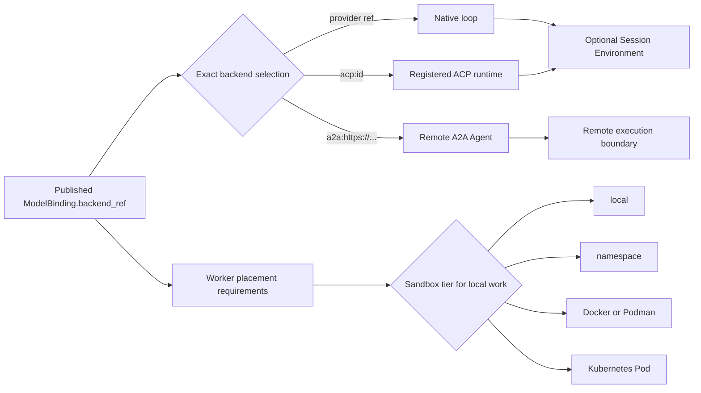
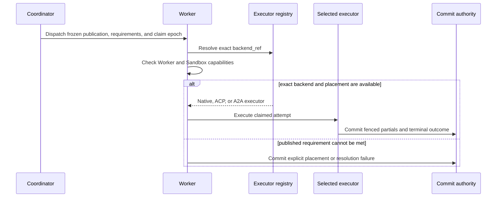

Make two decisions for each published Agent: who owns its reasoning loop, and
where any local files, commands, or tools may run. These decisions are
independent.

| Work to run | Execution backend | Sandbox decision |
| --- | --- | --- |
| Call a configured model through Awaken's loop | Native | Add a local Environment only when tools or Resources need one |
| Use a supported coding-agent CLI | Exact ACP runtime such as `acp:codex` | Choose `namespace`, `docker`, `podman`, or `k8s` from the required isolation boundary |
| Delegate the whole Agent to another system | Published `a2a:<absolute-endpoint>` | Do not attach local-only Resources that the remote Agent cannot receive |

Choosing ACP does not provide isolation. Choosing a Sandbox tier does not
change the published backend.

## Static structure

The immutable publication owns `backend_ref`. `AttemptExecutorRegistry` owns
one Native executor and exact ACP or A2A registrations. The deployment owns the
available Sandbox implementations. The Session Environment owns its workspace,
process lifecycle, mounts, credentials, and at most one Hand.

## Backend boundary

| Backend | Published reference | Execution owner | Selection rule |
| --- | --- | --- | --- |
| Native | Any provider reference that is not ACP or A2A | Awaken's in-process model and tool loop | Resolve one configured provider route |
| ACP | Exact `acp:<catalog-id>` | Supervised external CLI | Match a registered runtime exactly |
| A2A | Exact `a2a:<absolute-endpoint>` | Remote Agent | Pin the endpoint and Agent Card contract |

The [ACP runtime matrix](/docs/agents/protocols/acp/) owns runtime versions,
credentials, model delivery, and persistence differences. The
[model and ACP selector guide](/docs/agents/how-to/select-models-and-acp-runtimes/)
owns the exact API syntax.

## Sandbox boundary

| `sandbox_tier` | Isolation boundary | Required before use |
| --- | --- | --- |
| `local` | Unsandboxed host subprocess | Explicit opt-in and trusted code |
| `namespace` **(default)** | Linux user namespace or macOS Seatbelt | Working host support such as `bwrap` on Linux |
| `docker` | Docker container | Enabled backend, daemon, and immutable image |
| `podman` | Podman container | Enabled backend, runtime, and immutable image |
| `k8s` | Kubernetes Pod | Enabled backend, cluster access, and immutable image |

Awaken does not silently lower an unenforceable requirement to `local` unless
the deployment explicitly opts into local fallback. Configure and verify a tier
with [Configure Sandbox tiers](/docs/agents/how-to/configure-sandbox-tiers/).

## Dynamic behavior

Model candidates may fail over only before a partial for the current step is
committed and only when policy permits it. Candidate failover never changes the
backend. A missing `acp:codex` registration cannot become Native execution.

## What the system handles, and when to act

| Observed condition | System behavior | External action |
| --- | --- | --- |
| A dispatch waits briefly for an eligible Worker | The durable dispatch remains available for an eligible claim | None while the required Worker is expected to register |
| A Worker crashes or its lease expires | Claim and epoch fencing reject the old owner; another eligible Worker can reclaim the attempt and recover persisted resources | None unless the Environment remains without any eligible Worker |
| A model candidate fails cleanly before a partial commit | The runtime tries the next allowed candidate | None |
| The exact backend is not registered, or the Sandbox minimum cannot be enforced | The attempt fails closed with an explicit placement or resolution result | Provide the required Worker capability or correct the publication; do not enable a weaker fallback to hide the mismatch |
| Execution fails after a partial commit | The runtime keeps the committed facts and does not replay the step through another provider | Inspect the terminal outcome before deciding whether a new Run is safe |

Verify the published `backend_ref`, effective Sandbox tier, Worker capability,
resolved model candidate, and committed Session outcome. These values describe
the actual execution choice; the client protocol does not.
