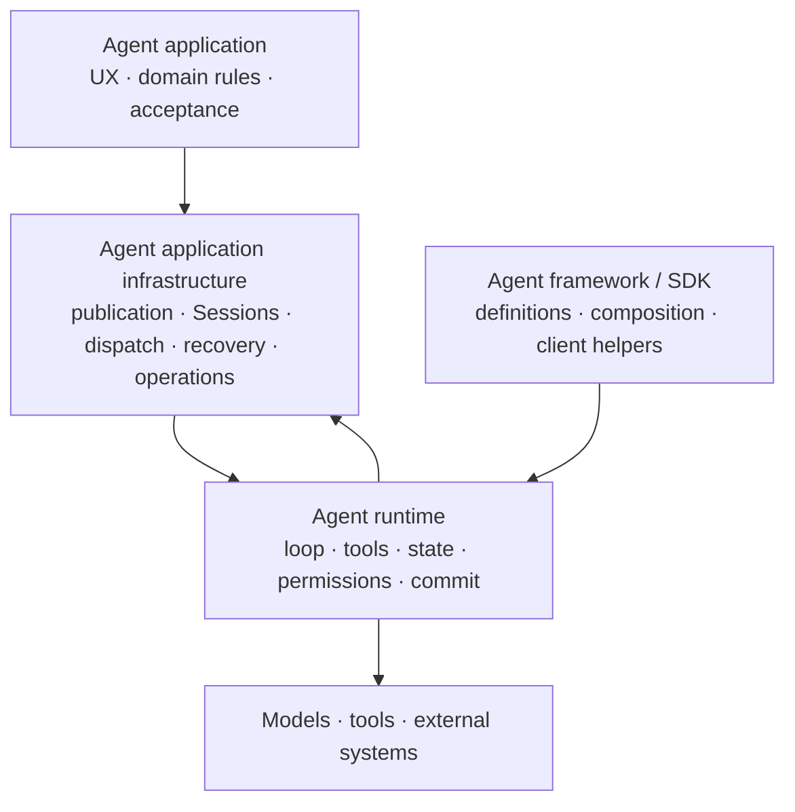
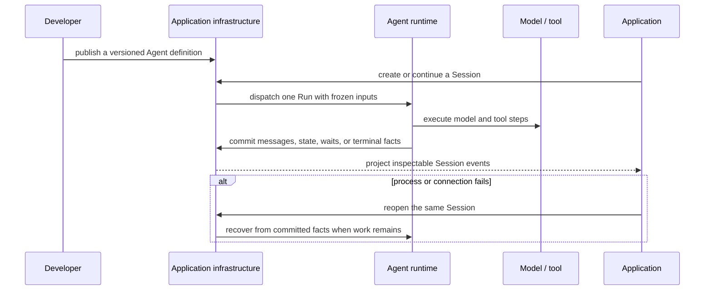

An **Agent framework** helps developers define Agent behavior. An **Agent
runtime** executes that behavior. **Agent application infrastructure** keeps the
result usable across users, Sessions, deployments, failures, and operating
boundaries. A product may use all three layers, and one implementation may span
more than one layer.

## Compare ownership, not product labels

| Responsibility | Agent framework | Agent runtime | Agent application infrastructure |
| --- | --- | --- | --- |
| Define prompts, tools, and Agent composition | Primary concern | Consumes the definition | Publishes and versions the definition |
| Run the model-and-tool loop | May provide a local loop | Primary concern | Places and supervises execution |
| Enforce permissions and commit typed state | Implementation-dependent | Runtime concern | Supplies policy and durable authorities |
| Keep a user-facing Session across reconnects | Usually left to the application | Executes against a Thread or state input | Primary concern |
| Dispatch work to Workers and Sandboxes | Usually external | Consumes an execution environment | Primary concern |
| Recover, inspect, and operate deployed work | Usually external | Exposes execution facts | Primary concern |

The table describes responsibilities, not a compliance score. Before comparing
products, inspect which layer owns each durable fact and whether two layers are
silently keeping competing copies.

## Static structure

The application remains the owner of its customer experience and business
outcome. Infrastructure owns the durable application lifecycle. Runtime owns one
execution path. A framework or SDK can help author behavior without becoming a
second Session or recovery authority.

## Dynamic behavior

## Where Awaken fits

Awaken Agents spans the **runtime** and **Agent application infrastructure**
layers. Awaken Runtime is its Rust execution core; Awaken Agents adds published
Agents, durable Sessions, protocol adapters, Workers, Sandboxes, configuration,
and recovery around that core. It does not replace the product interface,
domain model, or acceptance rules of the application built on top.

Continue with [What is an AI Agent Runtime?](./agent-runtime) for the runtime
boundary, [Sessions and events](./sessions-and-events) for durable identity, and
[system architecture](./architecture) for deployment ownership.
