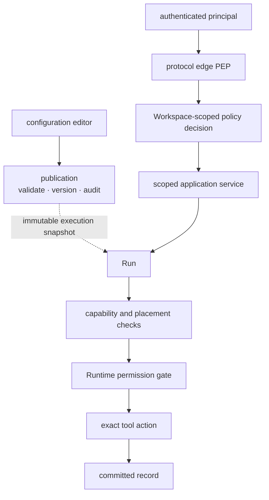
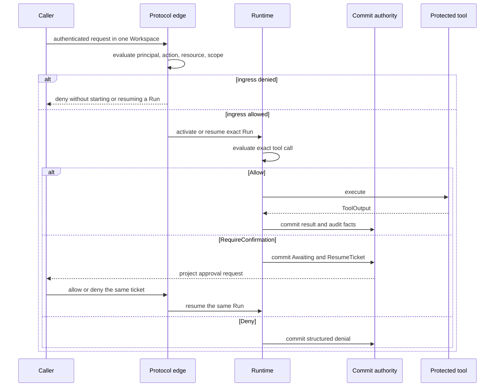

Governance is easier to maintain when each decision answers one question.
Changing what an Agent may do, accepting a request, and approving one tool call
happen at different times and have different authorities.

## Start from the decision being made

| Decision | When it happens | Authoritative result |
| --- | --- | --- |
| Which Agent behavior may run? | publication | an immutable, versioned publication |
| May this principal perform this action on this Workspace resource? | protocol ingress | an allow or deny from the configured authorization profile |
| May this exact tool call execute now? | inside a Run | `Allow`, `Deny`, or `RequireConfirmation` from the Runtime permission gate |

Passing one decision never passes another. A visible tool, a matching Worker, a
healthy MCP server, or an available credential is an execution condition, not
an authorization grant.

## Static structure

Publication owns behavior history. The ingress policy owns resource access.
The Runtime gate is the only path that can let a protected tool execute.
Placement and materialization may preserve or narrow authority; they cannot add
it.

## Awaken Agents roles are fixed grants, not product access levels

Awaken Agents publishes fixed role grants. An IAM implementation binds these
role ids to an exact Workspace. A hosting product may compose several bindings
into a user-facing access level, but it must not redefine the actions or scopes
owned by Awaken.

The Workspace action vocabulary is `workspace.*`, `apikey.*`,
`model_supply.*`, `file.*`, `skill.*`, and `tunnel.manage`. Each role below
receives only its listed subset.

| Profile | Fixed role id | Grant inside an exact Workspace |
| --- | --- | --- |
| `awaken.workspace` | `awaken.workspace:hosted_admin` | `workspace.*`, `apikey.*`, `model_supply.read`, `file.*`, `skill.*`, `tunnel.manage` |
| `awaken.workspace` | `awaken.workspace:hosted_builder` | `workspace.*`, `model_supply.read`, `file.*`, `skill.*` |
| `awaken.workspace` | `awaken.workspace:workspace_user` | `workspace.read`, `model_supply.read`, `file.read`, `skill.read` |
| `awaken.workspace` | `awaken.workspace:publisher` | `workspace.*`, `model_supply.read`, `skill.*` |
| `awaken.workspace` | `awaken.workspace:credential_ingress` | `apikey.*` |
| `awaken.workspace` | `awaken.workspace:tunnel_manager` | `tunnel.manage` |
| `awaken.runtime` | `awaken.runtime:workspace_admin` | `run.*` |
| `awaken.runtime` | `awaken.runtime:workspace_user` | `run.read` |
| `awaken.runtime` | `awaken.runtime:agent_executor` | `run.*` |

Workspace and Runtime remain separate profiles because their actions have
different relying parties and lifecycles. A hosting product may compose both
profiles atomically for its own access model, but it must not redefine Awaken
Agents actions, scopes, or fixed role grants.
`awaken.runtime:agent_executor` is a workload identity, not a human access
level.

## Dynamic behavior

The approval task appears only after `Awaiting` and its `ResumeTicket` have been
committed together. A restart can therefore show the same pending decision
without creating another task. The response must match the same Run, ticket,
and tool call.

An authorization denial is a completed policy decision, not a platform fault.
The caller changes the request or an administrator changes the binding through
the owning IAM system. There is no retry path that turns a denial, capability
match, or successful credential opening into permission.

## Keep the records distinct

Configuration history answers who changed published behavior. Authorization
records answer why a scoped request was allowed or denied. Runtime committed
facts answer what one Run attempted and completed. Combining them into one
mutable log would erase their different consistency and retention boundaries.

A credential reference only identifies material and its permitted delivery
path. It does not authorize ingress or a tool action. See
[Credential custody](./credential-custody) and
[Provider model configuration](/docs/agents/reference/provider-model-config/).
