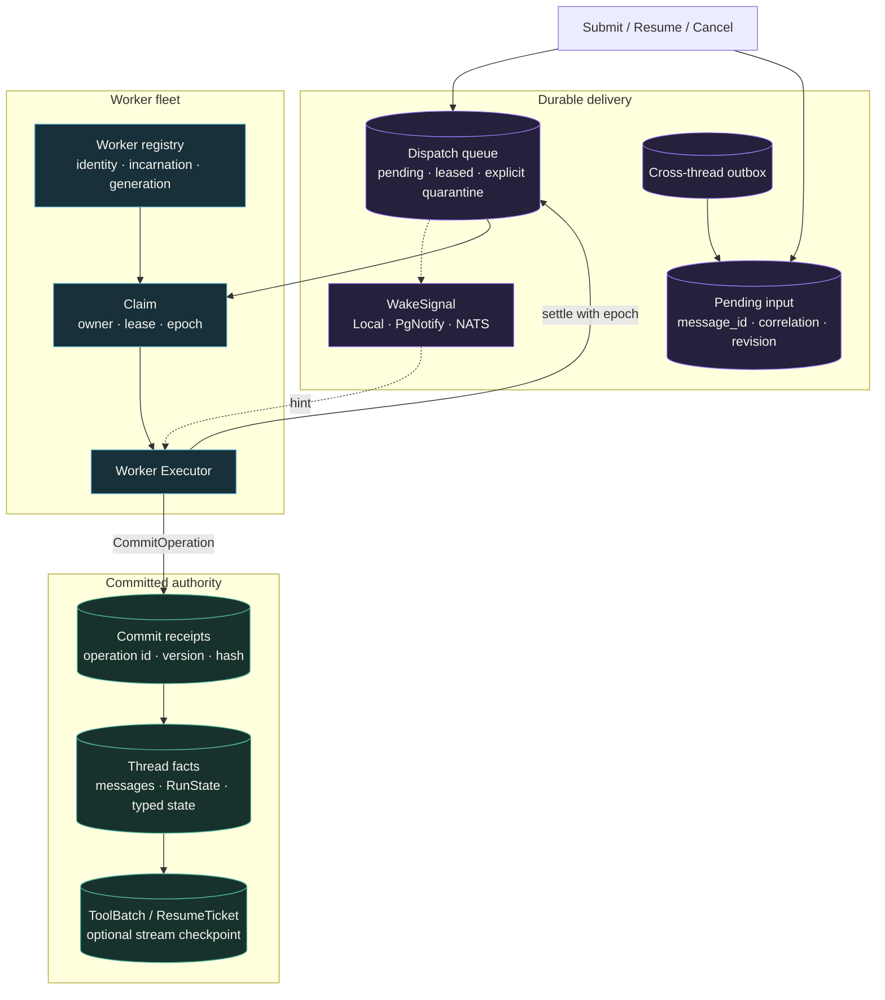
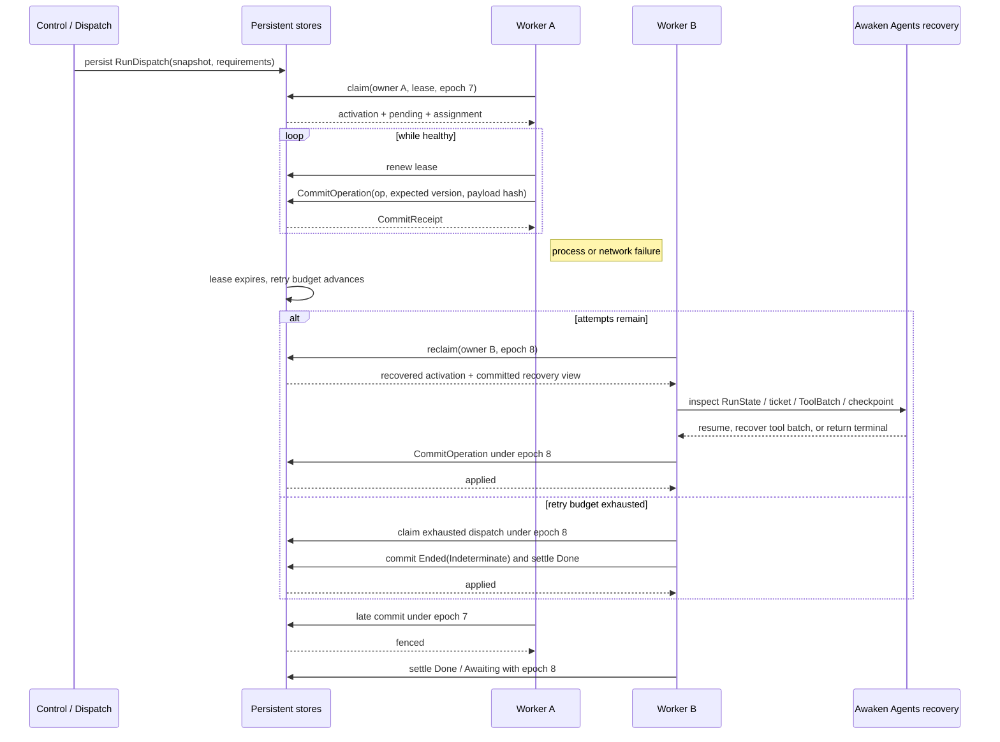
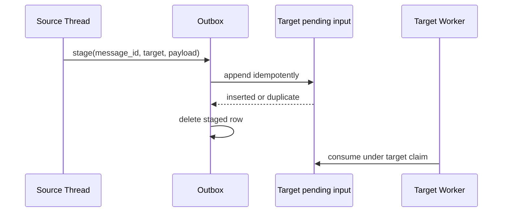

Most process, network, wake, and lease failures do not need manual repair.
Awaken reclaims durable work and reconstructs it from committed facts. Start
investigating only when the application exposes a terminal result, a typed
dependency error persists, an external side effect is indeterminate, or a Run
was explicitly quarantined.

## First decide whether any action is needed

| Observable result | What Awaken does | When to act |
| --- | --- | --- |
| A Worker or wake signal disappears, with no terminal error | Another eligible Worker can claim the durable dispatch; periodic draining covers a lost wake signal. | Do not repair or duplicate the Run while it is still making progress. |
| A commit response is lost | The same `operation_id` and payload return the original receipt. | Retry only the identical operation; changed bytes are a new intent. |
| An old Worker returns after takeover | The current claim epoch rejects its renew, commit, and settle. | No action unless the current owner also reports a persistent dependency error. |
| A model stream is interrupted | Runtime uses a useful checkpoint or restarts the current inference from committed Thread facts. | Reconnect to committed history; do not reconstruct state from partial deltas. |
| The retry budget is exhausted | The drainer commits `Ended(Indeterminate)` through the normal fenced terminal path and settles the dispatch. | Decide the business outcome after observing that terminal state; do not search for an automatic dead letter. |
| A tool may have changed an external system but no result was committed | `ToolRecoveryPolicy` can replay an idempotent call, reconnect to a recoverable call, or preserve `Indeterminate`. | Reconcile the original business operation before any new execution. |

If none of the last column applies, there is nothing to troubleshoot. Awaken Agents
persists the dispatch first, lets one Worker lease claim it, commits progress
through execution checkpoints, and accepts final facts only under the current
claim fence. A retry can continue work; it cannot make an unknown external
effect successful.

## Static structure: the queue delivers; the Thread store owns truth



Wake is only a hint: loss adds latency and duplication causes another drain, but
neither changes correctness. Recovery reads `RunState`, `ResumeTicket`,
`ActiveToolBatch`, and Thread version instead of treating queue status as Agent
truth.

## Dynamic behavior: failure, takeover, and stale-writer fencing



Worker identity combines a logical `worker_id`, a boot-specific
`incarnation_id`, and registry-assigned `generation`. The dispatch `epoch` is the
current claim's fencing token. An old Worker cannot renew its replacement's
lease, append new facts, or make a stale settle look successful.

## Why commits are safely retryable

A cross-node commit is not a bare `ThreadCommit`:

```text
CommitOperation {
  operation_id: { run_id, ordinal },
  expected_thread_version,
  payload_hash,
  commit
}
```

- Retrying the same operation id and payload returns the original receipt.
- Reusing an operation id with a different payload fails closed.
- A stale recovery prefix cannot append after Thread version advances.
- An old owner is fenced before authoritative storage when the claim epoch changes.

This prevents duplicate **committed facts** when an HTTP response is lost. It
does not make arbitrary external side effects exactly once.

## Tool side-effect recovery boundaries

| Failure window | Committed evidence | Recovery action |
|---|---|---|
| before executor entry | ToolBatch `Requested` | pass the gate, then execute for the first time |
| executor entered | `Executing { attempt }` + `ToolRecoveryPolicy` | replay, reconnect, or `Indeterminate` |
| one result returned | `Completed` / result state | reuse it; do not make it a new call |
| full batch completed | `Finalized` + ordered tool-result messages | next inference may consume it |
| Awaiting | matching `ResumeTicket` | accept only a matching correlation/snapshot |

A Remote Hand can also suppress duplicate execution with a stable operation id
and its own idempotency ledger. For a third-party system without idempotency,
choose `NeverReplay` or add a business idempotency key/transaction in the tool
adapter. The accurate promise is:

> Delivery may be at least once. Committed facts and idempotency-aware effects
> can be deduplicated. Unknown external outcomes remain `Indeterminate` instead
> of being guessed successful.

## The stream-recovery boundary

At a retryable model-stream interruption, runtime may put partial text and tool
arguments in `StreamCheckpointStore`. A new process can continue the text, reuse
fully parsed tool calls, or restart the current inference when no useful partial
exists.

This checkpoint is a best-effort, short-lived recovery optimization:

- it covers one in-flight inference Step;
- write failure does not fail the Run;
- it is deleted when recovery concludes;
- committed transcript remains owned by `ThreadCommit`.

It therefore does not mean every token is durable or that every crash preserves
all in-progress generation.

## Retry budgets and explicit quarantine

A repeatedly crashing dispatch consumes its retry budget. Once the budget is
exhausted, the next drainer claims that dispatch, commits
`Ended(Indeterminate)`, notifies terminal observers, and settles it as `Done`.
This is the automatic path. It does not create a dead letter.

Dead letters exist only for an explicit maintenance decision that removes
already exhausted work from automatic terminal resolution. Do not quarantine as
a routine response to retries. Use it only when you intentionally want to stop
automatic terminalization. The [Public HTTP API](../reference/api) is the single
owner of the exact quarantine, inspection, requeue, and purge routes, including
their parameters and destructive boundaries.

Cancellation also persists intent first. Cancelling a running dispatch advances
the epoch and releases the old lease, fencing subsequent commits by that owner.
A new claimant commits terminal `Cancelled` before delivery state is removed.

## Cross-Thread delivery

`send_message` is backed by a durable outbox and idempotent inbox append:



If relay crashes after append but before delete, the next relay appends again
and the same `message_id` makes it a no-op. The exactly-once effect here refers
only to this controlled store transaction/idempotency combination, not arbitrary
business systems.

## Verification boundary

The repository drives memory, SQLite, and Postgres through shared dispatch
conformance tests; Postgres claims with `FOR UPDATE SKIP LOCKED`. It also contains
crash-before-settle, committed-resume, Worker fencing, Remote Hand
idempotency/indeterminate, and Sandbox recovery scenarios.

Those tests prove named storage, protocol, and fault paths. They do not prove LLM
semantics, and they do not replace deployment acceptance against the real
provider, database, network, Sandbox backend, and downstream idempotency model.

Continue with [Run, Step, and tool batches](/docs/agents/runtime/explanation/run-lifecycle-and-phases/),
[Brain and Hand](/docs/agents/concepts/brain-and-hand/), and
[Sessions and events](/docs/agents/concepts/sessions-and-events/).
