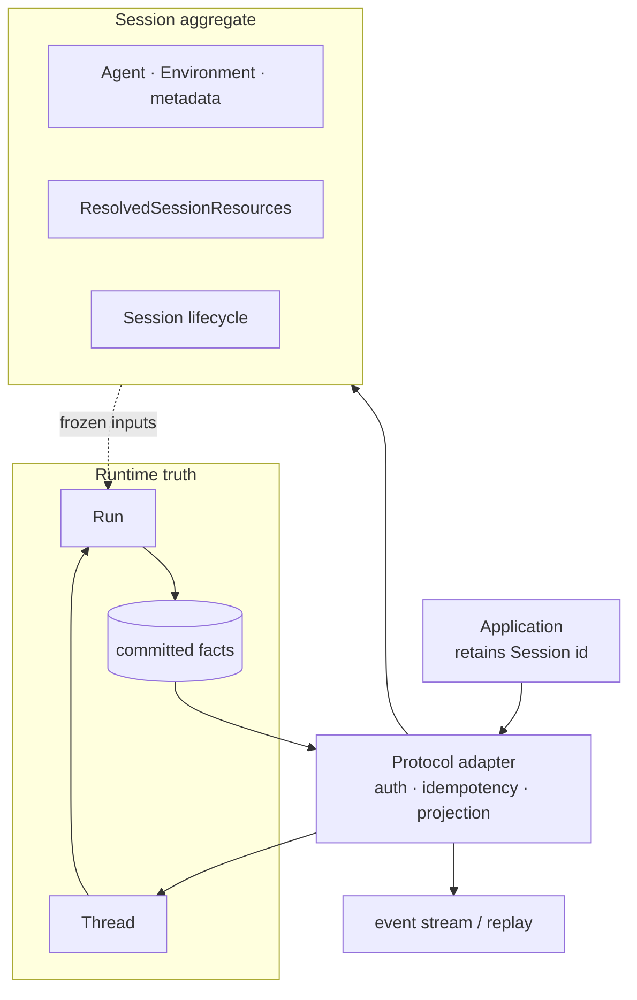
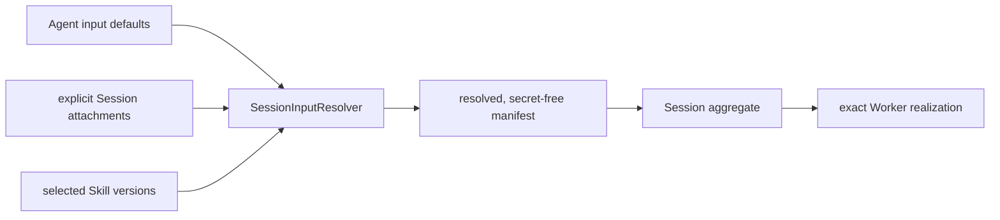
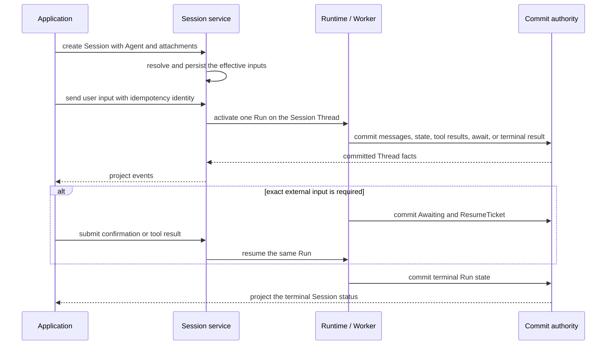

An **Agent Session** is the durable application identity for continuing one
Agent conversation across turns, reconnects, or process restarts. Keep its
identifier and send new input to that Session. Do not rebuild durable history
from browser state or a partially received stream.

## Choose the durable identity first

| Concept | What it owns | What it is not |
| --- | --- | --- |
| Session | the application conversation identity, selected Agent and Environment, resolved resources, and protocol lifecycle | one model request or another execution ledger |
| Thread | append-only committed messages, state changes, tool results, and Run history | mutable Session configuration |
| Run | one activation on the Thread, including running, awaiting, and terminal state | the long-lived conversation identity |
| Event stream | a low-latency projection of Session and committed Runtime facts | not another store and not the recovery authority |

A Session status can summarize the application-facing state. The Run state in
committed Thread facts decides whether execution has actually ended or is
waiting for input.

## Static structure

The Session repository keeps application facts that do not belong in the
transcript. The Thread keeps execution facts needed for replay and recovery.
Neither copies the other's state.

## Resources are resolved before the Session runs

Agent defaults and explicit Session attachments use the same input-binding
contract. Session creation resolves them into one secret-free
`ResolvedSessionResources` value before opening an execution environment.

The manifest pins the configuration each resource type can honestly freeze.
Files use an immutable File identity. Repository and Memory inputs retain their
selected configuration versions without pretending that mutable content is a
Git commit or byte snapshot. Skills retain an exact version and bundle hash.

Current ownership, authorization, credential validity, and lifecycle can still
deny use. A frozen identity is reproducible input selection, not permanent
permission.

## Dynamic behavior

The live stream is useful for rendering progress. Committed Thread facts are
used for replay, reconnect, and decisions that must survive a restart. If a
stream disconnects, the application reconnects with the same Session identity;
the system projects committed history again. That normal reconnect does not
require repair.

If Session creation has persisted its aggregate but dispatch projection is
temporarily unavailable, the lifecycle reconciler retries that projection. It
does not ask the client to create a second Session.

## Keep neighboring rules with their owners

This page owns the Session, Thread, Run, and event mental model. Exact event
DTOs, batch limits, and Managed Agents differences belong to the
[compatibility matrix](/docs/agents/compatibility/). Exact MCP attachment
states and transport behavior belong to [MCP protocol](/docs/agents/protocols/mcp/).
Claim takeover, commit ambiguity, and indeterminate effects belong to
[Production reliability](./production-reliability).

For application wiring, continue with
[Connect one published Agent](/docs/agents/how-to/connect-a-published-agent/).
