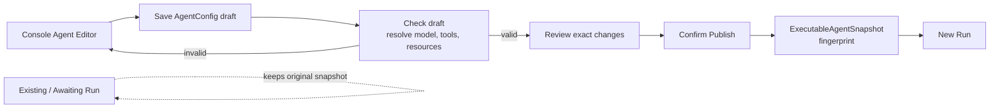

Use this guide when an Agent should behave differently without changing platform
code. You will save one draft, correct its validation errors, publish it, and
start a new Session that uses the new publication. Work already attached to an
existing Session keeps the publication it started with.

## Goal

Finish with a published Agent and a new Session in which the changed
instructions or capabilities are visible. Keep the previous publication
available to work that already uses it.

## Decide what to change

| If you want the Agent to... | Change | Check before publishing |
| --- | --- | --- |
| answer or plan differently | system instructions, model, fallback candidates, or `max_steps` | the model resolves and the instructions describe an observable behavior |
| take a different action | Tools, Skills, or MCP servers | every selected capability exists and its credential or resource is ready |
| delegate work | multi-Agent roster and delegation limits | every allowed Agent resolves and the roster is no broader than needed |
| retain a different amount of working context | Memory/resource bindings, context-window policy, or compaction | the selected resources resolve and the policy fits the intended Session |
| recover a Tool differently | per-Tool recovery policy | the retry or stop behavior is explicit for that Tool |

This table helps choose the editing surface. The complete field definitions and
lifecycle remain in [Agent configuration reference](/docs/agents/runtime/reference/config).

## Prerequisites

- a running Awaken deployment and access to `/w/<workspace>/agents`;
- a Provider Connection whose model can be resolved;
- any Tools, Skills, MCP servers, credentials, and resources the Agent will use.

Complete [Configure providers, models, and credentials](./configure-providers-models-credentials)
before publishing if the model readiness check does not yet succeed.

## 1. Edit and save the draft

Create or open an Agent in the Console. Change only the behavior needed for the
next Session, then save the draft.


Online configuration can select or narrow capabilities the system already
provides. It cannot add a Rust Tool, provider adapter, Plugin, or Sandbox backend,
and it cannot grant authority that the current Workspace does not hold.

## 2. Check the draft

Choose **Check draft**. Fix each field-addressed issue until model, capability,
credential, and resource resolution succeeds. Validation does not replace the
installed publication.

### Configure an MCP integration as one unit

Open **Build → Skills & MCP** when the Agent calls an external MCP server. Each
MCP integration contains the connection and the ToolSet policy that governs its
discovered tools:

1. choose HTTP or Sandbox stdio, then enter a unique server name and target;
2. choose the credential reference for an HTTP server when it requires one;
3. set the default permission to **Ask before use** or **Allow without asking**;
4. add a named override only when one tool needs a different permission or must
   be unavailable.

New tools discovered from that server inherit the ToolSet default. Renaming the
integration updates its MCP ToolSet references. Removing it also removes the
related overrides and recovery entries, so the draft cannot retain a policy for
a server it no longer uses.

Use **Tools & permissions** for built-in Agent tools and client-executed Custom
Tools. A Custom Tool declares the name, description, and input schema that the
model sees. The calling application executes it and returns the matching result;
Awaken does not turn that declaration into a server-side implementation.

## 3. Publish explicitly

Choose **Review & publish** after checking the draft. Review the exact
draft-versus-published changes, then confirm **Publish** only when they match
your intent. Admin Assistant can draft or patch the same source configuration
from natural language, but it has no publish tool. Publication remains a
deliberate developer action.

## 4. Start a new Session

Create a new Session from the Agent. Confirm that it uses the new publication
fingerprint, then send one input that makes the intended change observable. Do
not expect an existing or awaiting Run to switch versions.



## Automate through the API

Console and automation use the same boundary. The server projects the following
managed-shaped payload into the one `AgentConfig`; it is not a second Agent
definition:

Save this payload as `agent.json`:

```json
{
  "name": "Research assistant",
  "system": "Answer from the configured sources and cite evidence.",
  "model": {"id": "claude-sonnet", "provider_identity_ref": "anthropic", "backend_ref": "genai"},
  "mcp_servers": [{"name": "issues", "url": "https://mcp.example.com/issues"}],
  "tools": [
    "web_search",
    {
      "type": "mcp_toolset",
      "mcp_server_name": "issues",
      "default_config": {"enabled": true, "permission_policy": {"type": "always_ask"}},
      "configs": [{"name": "search_issues", "enabled": true, "permission_policy": {"type": "always_allow"}}]
    }
  ],
  "skills": ["source-review"],
  "max_steps": 12,
  "context_policy": {"kind": "keep_last", "keep_last": 40}
}
```

Use that same file for the saved draft and the read-only validation request:

```bash
curl -sS -X PUT http://localhost:8080/v1/config/agents/research-assistant \
  -H 'content-type: application/json' \
  -d @agent.json

curl -sS -X POST http://localhost:8080/v1/config/agents/research-assistant/validate \
  -H 'content-type: application/json' -d @agent.json

curl -sS -X POST http://localhost:8080/v1/config/agents/research-assistant/publish
```

Unknown Tools, unresolved models, invalid credential references, or malformed
configuration stop validation without changing the installed publication.
Publish creates the secret-free execution snapshot used by new Runs.

## Verify

- the Agent shows a successful validation result;
- publication returns a fingerprint;
- a newly created Session reports that fingerprint;
- the test input produces the intended changed behavior;
- an existing Session remains on its earlier publication.

## Troubleshooting

If the table does not resolve the problem, record the Workspace, Agent ID,
draft revision, validation field path and error code, publication fingerprint,
and correlation ID before contacting support. Do not include prompt content,
tokens, or credential material.

| Symptom | Check | Action |
| --- | --- | --- |
| model resolution fails | Provider Connection and model selector | repair the connection or choose a model that the connection exposes, then validate again |
| a Tool, Skill, MCP server, or resource is unknown | catalog entry and Workspace access | install or grant the existing capability through its owning path; do not encode a new capability in Agent config |

## Next steps

- [Read the exact Agent configuration fields and lifecycle](/docs/agents/runtime/reference/config).
- [Configure providers, models, and credentials](/docs/agents/how-to/configure-providers-models-credentials)
  when a model is not ready.
- [Manage the new Session](/docs/agents/how-to/manage-a-session).
