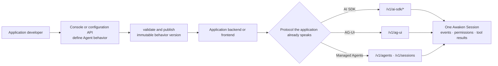

Start from the protocol your application already uses. You are done when the
application receives its native stream and the same Session appears in Console
with readable history, status, and tool activity.

## Goal

Send one recognizable task from your application, receive the protocol's native
stream, and reopen the same committed Session in Console.

## Prerequisites

- one running Awaken deployment and its application base URL;
- one runnable published Agent;
- the authentication required by the selected application protocol;
- access to the application logs and Console Session view.

## 1. Choose one application path

1. Prepare and publish one runnable Agent.
2. Open the [protocol connection matrix](/docs/agents/protocols/connect/) and
   choose a **Client → Awaken Agents** row.
3. Follow the linked integration guide for that protocol.
4. Send one task whose input and result you can recognize later.
5. Check the application stream, then open the same Session in Console.

Use one protocol for the first pass. A second frontend or backend can be added
after the shared Session path works.

## 2. Prepare a runnable Agent

After Awaken Agents starts, prepare a provider, model, and credential in the Console
or API, then save, validate, and publish the Agent. Publication fixes the model,
tools, Skills, Memory, resources, and configuration revisions used by that
behavior. New Sessions use the new version; running or awaiting Sessions do not
drift.

- [Configure providers, models, and credentials](/docs/agents/how-to/configure-providers-models-credentials/);
- [Configure and publish an Agent](/docs/agents/how-to/configure-agent-behavior/);
- [Console, authentication, and configuration authority](/docs/agents/reference/admin-console/).

For local work, `awaken all-in-one` serves the API and Console together. Before an
internet-facing application calls the service, complete [self-hosting and
authentication](/docs/agents/how-to/self-host/#authentication).

## 3. Connect through the canonical matrix

The [protocol connection matrix](/docs/agents/protocols/connect/) owns the
direction, endpoint, Console location, and completion signal for every supported
connection. If the application initiates work, use a **Client → Awaken Agents** row.
If Awaken calls a remote provider, tool server, or Agent instead, leave this guide
and follow the corresponding **Awaken Agents → remote** row.

The selected wire does not change Agent behavior. AI SDK, AG-UI, and Managed
Agents can read and advance one Awaken Session rather than maintain separate
chat histories.

## 4. Bind product-specific capability

Your team still provides product-specific capability, without describing it
again in every frontend:

- bind existing Memory, files, repositories, and Skills through configuration;
- connect third-party tool services through MCP;
- add a Rust Tool for a product-specific Awaken Agents capability;
- constrain model-visible actions with tool aliases, descriptions, state machines,
  and permission policy.

Binding and selecting are application-development work. Adding a Rust Tool,
provider adapter, Plugin, or Sandbox backend belongs to the
[contribution and extension](/docs/agents/runtime/) path. A product integration does not
therefore become a second Agent execution implementation.

## Verify

After an integration, check that:

1. the Console shows the published Agent used by the application;
2. the frontend or backend receives its native streaming response;
3. the same thread / Session history is readable;
4. the Console shows the matching Session, status, and tool activity.

If only browser text is visible, keep checking. The integration is not complete
until the Session can also be reopened and inspected.

For exact fields and routes, use the selected integration guide and the
[Public HTTP API](/docs/agents/reference/api/).

## Troubleshooting

If the table does not resolve the problem, record the selected protocol,
sanitized base URL, Agent ID and publication revision, thread or Session ID,
HTTP status, response content type, last event type, and correlation ID before
contacting support. Do not include tokens, service keys, or message content.

| Symptom | Check | Action |
| --- | --- | --- |
| The application receives 404 | connection direction, selected protocol guide, base URL, and route | Return to the protocol matrix and use the exact **Client → Awaken Agents** path |
| The application receives 401 or 403 | token expiry, scope, protocol, and requested operation | Obtain a new least-scope application token; never move a service key into a browser |
| Text appears but no Session can be reopened | response Session/thread ID and the history read in the selected guide | Preserve the returned identity and load committed history; do not treat browser text as storage |
| The application and Console show different histories | base URL, Workspace, Agent publication, and Session/thread ID | Point both views at the same deployment and reuse the same identity on continuation |

## Next steps

- Keep the selected integration guide beside the application code.
- [Manage the resulting Session](./manage-a-session).
- Review production [credential custody](../concepts/credential-custody) and
  [deployment](./self-host).
