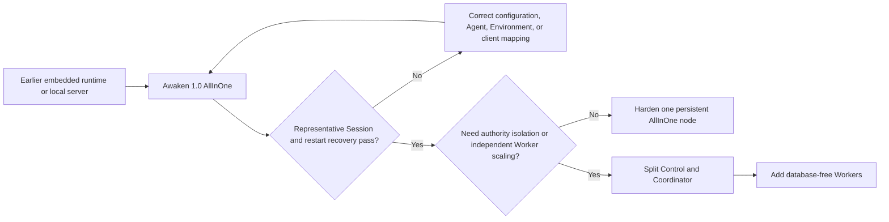

Use this guide when an application was built against an earlier Awaken runtime
library, local starter server, or separate Admin Console. The first migration
target is one verified Awaken 1.0 AllInOne Session. Split deployment is a later
operating decision, not a separate application migration.

This page is the public owner of the **Awaken release migration**. The
[Managed Agents compatibility matrix](../compatibility) owns SDK and wire
compatibility. [Agents architecture](../concepts/architecture) owns component
authority, and [self-hosting](./self-host) owns deployment configuration and
operations. This page links to those owners instead of copying them.

## Goal

Run one recognizable earlier-version job as a published Awaken 1.0 Agent,
observe its committed Session events after a restart, and retain a tested
rollback boundary. Only then decide whether AllInOne is sufficient or whether
Control, Coordinator, and Workers must be separated.

## Choose the 1.0 entry point

| Earlier use | 1.0 target | Migration decision |
| --- | --- | --- |
| Rust runtime library in an application process | `awaken-runtime`, or a published Agent behind Awaken | Keep direct embedding only when the application should still own hosting, I/O, and integration. Move to a published Agent when Awaken should own Session persistence, dispatch, placement, and recovery. Do not assume source compatibility with the earlier `awaken` facade. |
| `ai-sdk-starter-agent` or another local server binary | `awaken all-in-one` | Replace the starter composition with the product launcher. AllInOne includes Control, Coordinator, Resources, a local Worker, protocol APIs, and the Console. |
| Separately started Admin Console | Console embedded in `awaken` | Node.js is not required at runtime. Open the Console served by the same process and verify that it addresses the intended data directory and listener. |
| AI SDK, AG-UI, A2A, MCP, or Managed Agents client | The matching 1.0 protocol adapter | Preserve the application protocol where possible, but recheck its current route, authentication, headers, request shape, error envelope, stream, and replay behavior. |
| Host-local tools or coding-agent process | Published Environment plus Worker and Sandbox selection | Local execution is now an explicit placement and isolation decision. `local` is trusted-host execution; `namespace` is the default supported isolation where available. |
| One local process that now needs independent scaling or trust separation | First AllInOne, then split Control, Coordinator, and `awaken-worker` | The split changes process and transport adapters. It must not create another Agent, Session, or runtime path. |

## Map startup and configuration

Earlier development commands and environment variables are not a second 1.0
configuration surface:

| Earlier coordinate | 1.0 coordinate | Required action |
| --- | --- | --- |
| `cargo run -p ai-sdk-starter-agent` | `awaken all-in-one --config <file>` | Build or install the `awaken` binary and start the canonical AllInOne composition. |
| `AWAKEN_HTTP_ADDR` | `bind` in TOML, or the documented local `--port` override | Choose one explicit listener and update every client base URL. |
| Earlier storage-directory environment variable | `data_dir` in the local TOML profile | Start with a new 1.0 directory. Preserve the earlier directory as rollback evidence. |
| `AWAKEN_ADMIN_API_BEARER_TOKEN` | Current `identity_mode` and a purpose-scoped application or Workspace credential | Do not mechanically rename the token. Configure the current identity boundary and issue the credential required by the selected route. |
| Other `AWAKEN_*` deployment settings | Typed TOML configuration | Use `awaken config --json` to inspect the redacted effective configuration. Environment variables are not an alternate deployment schema. |
| Application startup that creates shared schemas | `awaken database migrate` before split services | Local embedded stores migrate during local startup. Shared server schemas are written only by the explicit migration command. |

Use [Deployment configuration](../reference/configuration) for the complete
current key set. Do not infer a 1.0 key from an earlier environment-variable
name.

## Preserve data before changing behavior

The current public contract does not promise that an earlier local store can be
opened in place by 1.0. Do not point 1.0 at the only copy of an earlier data
directory unless release notes explicitly identify that exact migration path.

Before starting 1.0:

1. record the earlier Awaken version or revision, startup command, client SDK
   version, protocol routes, and configured providers;
2. stop the earlier server and take a restorable copy of its data directory and
   external database;
3. record one representative input, its expected business-visible output, and
   any tool, approval, file, Memory, or Skill effects;
4. start 1.0 with a separate `data_dir` and do not copy plaintext credentials
   into source control or the new configuration file;
5. keep the earlier installation stopped but recoverable until the 1.0
   acceptance path passes.

If a release-specific importer is provided later, it must name its supported
source version, destination schema, idempotency behavior, secret handling, and
rollback procedure. The existence of ordinary 1.0 schema migrations does not
by itself prove an earlier product store is importable.

## Move one application path

1. Start 1.0 AllInOne with the new data directory.
2. Configure one Provider Connection and confirm that at least one model is
   executable.
3. Recreate or deliberately translate one Agent configuration, review its
   resolved behavior, and publish an immutable revision.
4. Create the required Environment and select its Sandbox boundary.
5. Update one client to the current base URL and authentication.
6. Run the representative input, wait for `session.status_idle` or an explicit
   terminal or attention result, and save the Session id.
7. Restart AllInOne with the same data directory and read the same committed
   events again.

For an Anthropic client, make the separate compatibility decision in the
[Managed Agents compatibility matrix](../compatibility). For other clients,
use the [protocol connection matrix](../protocols/connect) and its adapter-owned
guide.

## Choose the deployment after behavior matches

AllInOne and split deployment use the same publication, Session, dispatch, and
commit authorities. The [architecture page](../concepts/architecture) owns the
static and dynamic component model. The [self-hosting guide](./self-host) owns
the exact hardening, PostgreSQL migration, private service authentication,
Worker, wake-up, and recovery steps.

## Cut over or roll back

Cut over only when all rows below pass:

| Evidence | Pass condition |
| --- | --- |
| configuration | `awaken config --json` reports the intended role and effective non-secret values |
| Agent | the reviewed immutable publication resolves an executable model and Environment |
| client | the selected protocol completes the operations the application actually uses |
| Session | the representative job reaches the expected committed result without duplicate effects |
| recovery | the same Session and committed events reopen after process restart |
| rollback | the earlier data and startup procedure remain restorable and have not been mutated by 1.0 |
| deployment | the chosen AllInOne or split topology passes the self-hosting verification checklist |

If a row fails, keep traffic on the earlier installation, preserve the failed
1.0 Session and correlation evidence, and correct that boundary. Do not weaken
Sandbox isolation, bypass authentication, or create a parallel data path merely
to make the migration appear complete.
