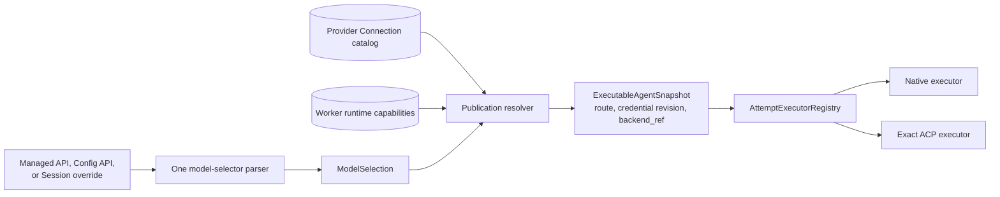
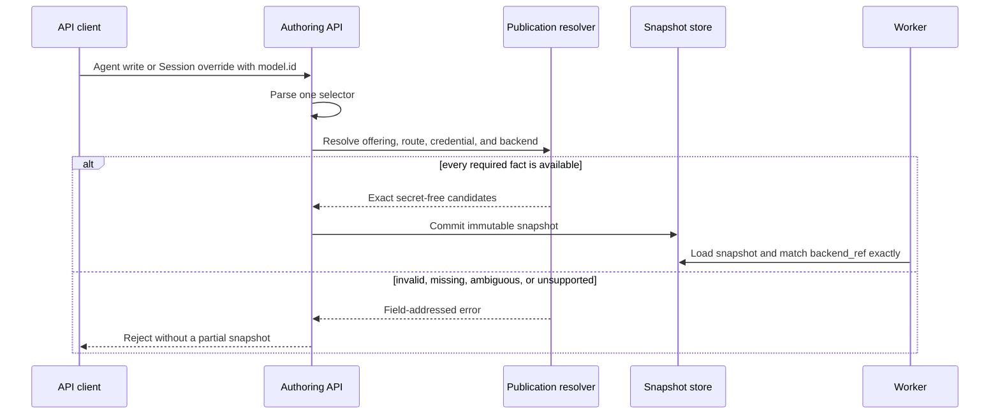

Use this guide when an API request must choose the model and execution runtime.
First connect the provider and import its models. Then choose one selector and
publish it. The task is complete when Agent creation or Session creation returns
success and the publication contains an exact model route and `backend_ref`.

The selector makes three independent choices:

| Choice | Example | Where it must already exist |
| --- | --- | --- |
| Model | `claude-sonnet-5` | Active Workspace model offering, unless the ACP runtime owns its model |
| Provider route | `provider`, `api`, and `endpoint` qualifiers | Provider Connection |
| Executor | Native or `executor=acp:codex` | Worker runtime capability |

Sandbox placement is separate. `acp:codex` can use a namespace, container, or
Kubernetes Pod; the selector does not choose that boundary.

## Choose a `model.id`

| Need | `model.id` |
| --- | --- |
| Use the only matching Native offering | `<model-id>` |
| Pin a Native provider route | `<model-id>;provider=<provider>;api=<dialect>;endpoint=<endpoint>` |
| Use a provider model through an ACP runtime | `<model-id>;provider=<provider>;api=<dialect>;endpoint=<endpoint>;executor=acp:<runtime>` |
| Let the ACP runtime use its own default model and login state | `executor=acp:<runtime>` |
| Use a configured inference profile | `profile=<profile-id>` |

An `api` qualifier requires `provider`. An `endpoint` requires both `provider`
and `api`. Runtime ids are exact; a near match is rejected rather than routed to
another CLI.

```text
claude-sonnet-5;provider=anthropic;api=anthropic_messages;endpoint=primary
claude-sonnet-5;provider=anthropic;api=anthropic_messages;endpoint=primary;executor=acp:claude
executor=acp:codex
```

## Static ownership



Provider Connection is the only writer for providers, endpoints, credentials,
and imported offerings. The selector refers to that configuration; it does not
create another route. Agent writes and Session overrides reuse the same parser
and publication resolver.

The [ACP runtime matrix](/docs/agents/protocols/acp/) owns supported runtime
ids, versions, credentials, model delivery, and persistence. The
[execution-modes concept](/docs/agents/concepts/execution-modes/) owns backend
and Sandbox boundaries.

The model selector does not choose application ingress. One publication can be
reached through the supported protocols; choose direction and endpoint in the
[protocol connection matrix](/docs/agents/protocols/connect/).

## Publish through the official SDK

The official SDK keeps `model.id` as a string. Awaken resolves it while handling
`POST /v1/agents`:

```ts
import Anthropic from '@anthropic-ai/sdk';

const client = new Anthropic({
  baseURL: process.env.AWAKEN_BASE_URL ?? 'http://127.0.0.1:8080',
  apiKey: process.env.AWAKEN_API_KEY ?? 'local',
});

const agent = await client.beta.agents.create({
  name: 'Repository assistant',
  model: {
    id: 'claude-sonnet-5;provider=anthropic;api=anthropic_messages;endpoint=primary;executor=acp:claude',
  },
});
```

Remove the `executor` qualifier to run the same provider route through the
Native loop. The model may be the same, but the Agent behavior can differ
because an ACP runtime owns its loop, context conventions, and tool protocol.

## Override one Session

Use `agent_with_overrides` when one Session needs a different selection without
changing the Agent publication:

```ts
const session = await client.beta.sessions.create({
  agent: {
    type: 'agent_with_overrides',
    id: agent.id,
    model: {
      id: 'qwen/qwen3-235b;provider=anyrouter;api=open_ai_responses;endpoint=primary;executor=acp:codex',
    },
  },
  environment_id: process.env.AWAKEN_ENVIRONMENT_ID,
});
```

Awaken resolves the entire override again. It never splices one new string into
the old snapshot or stores a mixture of old and new facts.

## Use backend-owned configuration

Use `/v1/config/agents/*` when you need draft, validate, and publish stages, or
when the ACP runtime owns its model and options:

```json
{
  "name": "Codex workspace agent",
  "model": {
    "mode": "backend_exact",
    "backend_ref": "acp:codex",
    "model_ref": "gpt-5",
    "configuration": {
      "mode": "read-only",
      "options": { "model": "gpt-5" }
    }
  }
}
```

`backend_default` supplies only `backend_ref`; `backend_exact` also supplies
`model_ref`. The runtime must accept the requested mode and options through its
negotiated capability. Use `model.id` for an Awaken-managed provider target
with custom ACP configuration.

## Dynamic validation and execution



## Read the result

| Result | Meaning | What to do |
| --- | --- | --- |
| Agent or Session creation succeeds | One complete selection was resolved and stored | Run the Session and observe its committed events |
| Selector syntax is rejected | The dependency between qualifiers or runtime id is invalid | Correct the named field; no partial state needs cleanup |
| Offering, credential, or provider route is unavailable | Publication cannot produce an executable candidate | Complete the existing Provider Connection or choose an available offering |
| Exact ACP capability is unavailable | The requested runtime cannot be placed | Register a Worker with that exact capability or choose another published backend |
| A Worker lease expires after dispatch | Claim fencing and reclaim handle execution ownership | Do not change the selector unless a terminal placement result says the backend is unavailable |
| An allowed model candidate fails before a partial commit | Candidate policy may try the next model | No selector change is required; backend identity remains fixed |

Use `/v1/config/executable-models` for Native readiness and `/v1/models` for the
Managed compatibility projection. Neither is a complete ACP runtime directory;
ACP capability is checked during validation and publication.

Model vendor, Managed wire compatibility, and hosting responsibility are
separate. Selecting an Anthropic model does not turn an Awaken deployment into
the Anthropic hosted service. For wire-resource and beta-header differences, use the
[Managed Agents compatibility page](/docs/agents/compatibility/).
