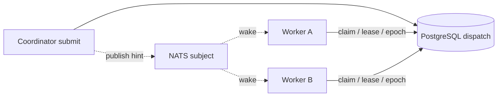

Use NATS only after a multi-node fleet works correctly by polling its shared
PostgreSQL dispatch store. NATS carries best-effort wake hints. It never stores
work, chooses an owner, renews a lease, or proves completion.

## Static boundary



Lost hints add latency until the next poll. Duplicate hints cause another drain.
Neither changes the single-owner claim enforced by the store.

## Configure every participating Coordinator consistently

```toml
role = "coordinator"
mode = "server"
runtime_database_url = "postgres://<projected-at-deploy-time>"
dispatch_wake = "nats"
dispatch_wake_channel = "awaken_dispatch_wake"
nats_url = "nats://nats.internal:4222"
dispatch_owner = "coordinator-a"
```

The deployed binary must include the NATS feature. Give every process sharing a
dispatch store a unique `dispatch_owner`; use the same wake channel for the same
fleet. Keep the database URL and NATS credentials in your deployment's secret
projection rather than committing real values.

`dispatch_wake = "pg-notify"` is the PostgreSQL-native alternative.
`dispatch_wake = "none"` preserves correctness through polling and is the
diagnostic baseline.

## Verify the dynamic behavior

1. Start with `dispatch_wake = "none"`; submit work on one node and prove another
   Worker can claim and complete it.
2. Enable NATS on all fleet participants and confirm claim latency falls.
3. Stop NATS and submit again. Work must still complete after polling delay.
4. Restore NATS and publish duplicate hints. Only the store's valid claimant may
   execute.
5. Kill a claimant, wait for lease expiry, and confirm a new owner uses a higher
   epoch while the old owner is fenced.

## Disable the optional wake path

If NATS does not reduce measured claim latency, set `dispatch_wake = "none"` or
`"pg-notify"` and restart the Coordinator. Pending work stays in PostgreSQL and
continues through polling. Do not move pending records into NATS or introduce a
second queue.

See [Production reliability](../concepts/production-reliability) for claim and
commit semantics.
