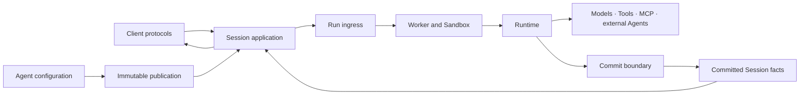
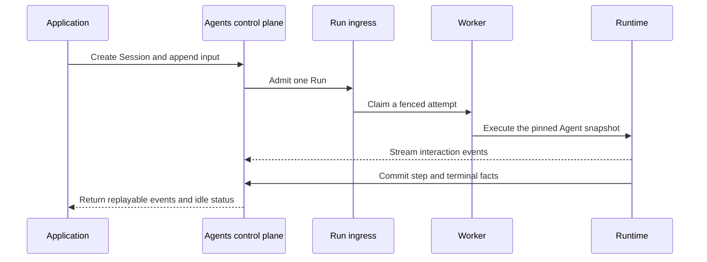

Awaken is a self-hosted platform for running Agents as durable Sessions. An
application publishes Agent behavior, sends work through a supported protocol,
and reads committed events from the same Session after a wait, retry, Worker
change, or process restart.

Start here when the application should not own its own Agent loop, Tool
execution, placement, persistence, and recovery.

## Choose the smallest boundary

| Need | Use | It owns |
| --- | --- | --- |
| One stateless model response | A model API | request and response |
| Durable Agent execution behind an application API | Awaken Agents | Agent publication, Session, policy, dispatch, execution placement, and committed events |
| Work ownership, dependencies, human decisions, and acceptance around Agent execution | [Awaken Workforce](/docs/workforce/) | the accountable work record |

Keep these boundaries separate. A Session records Agent execution; it does not
become the business acceptance record. A frontend protocol changes how input
and events travel; it does not create another Agent implementation.

## The application contract

An application works with four objects:

| Object | Stable responsibility |
| --- | --- |
| Agent | Versioned instructions, model choices, Tools, MCP servers, Skills, delegation, and limits |
| Environment | Execution placement, isolation, resources, and network constraints |
| Session | One durable Agent instance bound to an Agent publication and Environment |
| Event | Input, progress, Tool interaction, usage, status, and committed output |

Workers, Sandboxes, stores, and the Runtime implement this contract. They are
deployment and execution components, not additional application-facing records.

Managed Agents, AI SDK, AG-UI, A2A, and MCP all enter this one contract. Choose
between them in the [protocol connection matrix](/docs/agents/protocols/connect/).

## What happens in one Session turn

Queueing, bounded retry, waiting for approval, and lease recovery stay inside
their owning mechanisms. External action begins only when the Session exposes a
terminal or attention result. [Production reliability](/docs/agents/concepts/production-reliability/)
explains those results and the corresponding action.

## Run the first path

Follow [Run your first Awaken Session](/docs/agents/get-started/). It starts an
AllInOne process, connects one provider, publishes one Agent, sends input with
the official Anthropic SDK, and reopens the committed Session after a restart.

The path is complete when the application receives Agent output, observes
`session.status_idle`, saves the Session id, and can read the same committed
events again.

## Continue from the next task

| Next task | Continue with |
| --- | --- |
| Move an earlier runtime or local server to 1.0 | [Migrate to Awaken 1.0](/docs/agents/how-to/migrate-to-1-0/) |
| Connect a frontend, backend, or compatible Agent | [Connect a published Agent](/docs/agents/how-to/connect-a-published-agent/) |
| Choose local, durable, or multi-Worker deployment | [Self-host Agents](/docs/agents/how-to/self-host/) |
| Understand control, persistence, execution, and isolation | [Agents architecture](/docs/agents/concepts/architecture/) |
| Change prompts, models, Tools, Skills, or limits without rebuilding | [Configure Agent behavior](/docs/agents/how-to/configure-agent-behavior/) |
| Add a Rust Tool, provider adapter, Plugin, or execution behavior | [Extend Awaken Agents internals](/docs/agents/runtime/build-agents/) |

Awaken Agents is open source, and its first stable release is coming soon. Its
interfaces and behavior may still change before that release. A hosted service, support commitment, security
certification, or independently measured production result requires a separate
published statement.
