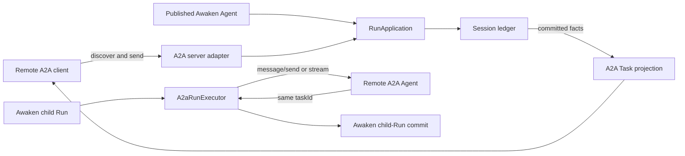

Use A2A when two Agents must communicate across a process, service, or
organizational boundary. Awaken supports both directions:

| Direction | Choose it when | Awaken owns |
| --- | --- | --- |
| Remote client to Awaken | Another A2A client needs to discover and call a published Awaken Agent. | Agent Card projection, version negotiation, Task projection, streaming, subscription, cancellation, and push configuration. |
| Awaken to remote Agent | A published Awaken Agent delegates bounded work to an A2A endpoint. | Remote task identity, polling or streaming continuation, cancellation, recovery, and terminal artifact projection. |

Do not use A2A for two components that already share one runtime and state
owner. In-process delegation avoids a network protocol and its distributed
failure boundary.

## One runtime, two protocol edges



The inbound adapter is an anti-corruption layer over the shared
`RunApplication`; it does not create another Agent runtime or Session ledger.
The outbound `A2aRunExecutor` owns no local Environment or Hand and never falls
back to Native execution.

## Discover and choose a wire version

Use `/.well-known/agent-card.json` for standard discovery. Awaken also exposes
the card on its documented A2A aliases. The card is derived from registered
Agent information; it is not a protocol-side catalog that can drift from the
publication.

For REST bindings, `A2A-Version` selects the payload projection:

| Header value | Projection |
| --- | --- |
| absent, empty, `0.3`, or `0.3.0` | A2A v0.3 |
| `1.0` or `1.0.0` | A2A v1 |
| any other value | unsupported-version error |

Use `POST /v1/a2a` when the client already speaks A2A JSON-RPC. HTTP+JSON,
streaming, task, subscription, and push-notification routes are indexed in the
[Public HTTP API](/docs/agents/reference/api/). Keeping that inventory in one
place prevents protocol semantics from becoming a second route reference.

## Preserve context and task identity

```mermaid
sequenceDiagram
  participant C as A2A client
  participant A as Awaken A2A adapter
  participant R as RunApplication
  participant L as Session ledger

  C->>A: message with optional contextId and taskId
  A->>A: negotiate version; resolve published Agent
  alt no current awaiting task
    A->>R: start context-bound Run
  else task is input-required
    A->>R: resume the same pending call
  end
  R->>L: commit Run facts
  L-->>A: state, messages, artifacts, terminal cause
  A-->>C: Task response, SSE update, or push notification
```

When supplied, `contextId` and `taskId` survive the adapter boundary. A Runtime
await maps to A2A `input-required`; it means the task is waiting for input, not
that it failed. A follow-up message in that context resumes the same pending
call. Committed terminal causes project to completed, failed, canceled, or
rejected.

A terminal A2A Task is immutable. A refinement begins a new task in the same
`contextId`; it must not restart the terminal task. This keeps each accepted
input, artifact, and outcome traceable to one unit of work.

## Call a remote A2A Agent

Publish the outbound model id as `a2a:<absolute-http-url>`. The executor sends a
message, stores the returned remote task id, and continues that exact task
through working, waiting, cancellation, recovery, and terminal artifacts. The
remote Agent remains opaque; Awaken does not import its private tools, memory,
or reasoning.

The configuration and observable loopback check belong in
[Connect an A2A Agent](/docs/agents/how-to/connect-an-a2a-server/). Delegation
is still a bounded child Run. Long-lived responsibility transfer belongs in a
work system with an explicit owner and acceptance state, not in a new A2A task
state.

## Decisions a caller must make

| Observable result | Meaning | Next action |
| --- | --- | --- |
| Unsupported A2A version | The client requested a projection Awaken does not implement. | Send `0.3.0` or `1.0.0`; do not retry the same header. |
| `input-required` | The same task is waiting for additional input or a permission decision. | Continue with its `contextId` and `taskId`. Do not classify it as an incident. |
| completed, failed, canceled, or rejected | The task is terminal and cannot restart. | Begin a new task in the same context if more work is needed. |
| A2A error envelope or HTTP `500` with internal A2A code | The request reached the adapter but did not produce an accepted terminal result. | Preserve the request id, task/context ids, status, and sanitized error. Retry only according to the operation's idempotency and the remote service contract. |

Task polling, resubscription, and push delivery are normal protocol mechanisms.
They are not separate repair paths.
