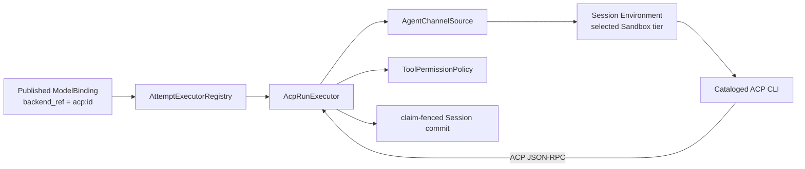
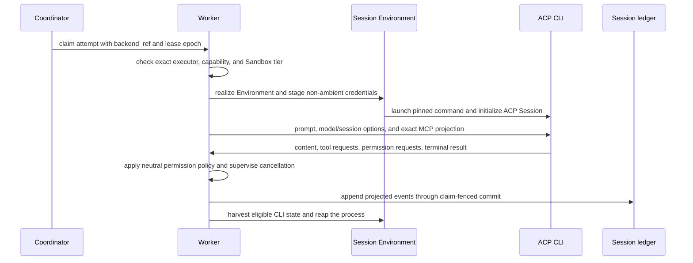

Use ACP when a supported external agent CLI should supply the coding-agent
behavior for an Awaken Agent. The CLI reasons and requests tools; Awaken keeps
the Session ledger, permission decision, credential staging, placement,
recovery, and final commit.

ACP is an inward-facing Brain protocol. It is not another frontend ingress.
Managed Agents, AI SDK, AG-UI, A2A server, and MCP export project Awaken outward
to callers; ACP adapts one supervised process into the neutral execution
contract.

## Choose the Brain separately from its isolation

Two independent choices define an ACP attempt:

1. `acp:<id>` selects the exact cataloged CLI contract.
2. `sandbox_tier` selects the process and filesystem boundary.

For example, `acp:codex` can run in a namespace or container. Codex is not an
isolation tier. Placement validates both exact capabilities and fails closed
when either is unavailable.

## Static structure

`ModelBinding.backend_ref` is the immutable execution selector. It must match an
executor registered for the exact value. `AttemptExecutorRegistry` does not
guess a near match or fall back to Native. `AcpRunExecutor` opens an
`AgentSession` through `AgentChannelSource`; a model change is
`ModelSwitch::Relaunch`, not an in-place mutation of an opaque process.

The catalog is the single source of truth for supported commands, capability
probes, model and credential delivery, Memory entry files, and portable CLI
state. Adding a runtime is a catalog and capability-contract change, not an
arbitrary executable setting.

## Supported runtime matrix

| Runtime id | Launch and pinned image requirement | Memory entry | Model API dialect |
| --- | --- | --- | --- |
| `acp:claude` | `claude-agent-acp`; `@agentclientprotocol/claude-agent-acp@0.69.0` plus Claude Code `2.1.221` | `CLAUDE.md` | `anthropic_messages` |
| `acp:codex` | `codex-acp`; `@agentclientprotocol/codex-acp@1.1.9` plus Codex `0.146.0` | `AGENTS.md` | `open_ai_responses` |
| `acp:gemini` | native `gemini --acp`; Gemini CLI `0.53.1` | `GEMINI.md` | `gemini` |
| `acp:opencode` | native `opencode acp`; OpenCode `1.18.12` | `AGENTS.md` | `open_ai_chat` |
| `acp:hermes` | native `hermes-acp`; `hermes-agent[acp,bedrock]==0.19.0` | `AGENTS.md` | `open_ai_chat` |

Claude Code and Codex use the pinned ACP wrappers shown above. Gemini, OpenCode,
and Hermes expose the listed direct entrypoints.

### Model, credential, and Session differences

A runtime uses either its backend-owned login and model, or an Awaken-managed
provider route. These launch modes are mutually exclusive. Backend-owned mode
leaves provider material with the CLI. Managed mode projects the resolved
endpoint, model, and brokered credential according to the catalog row.

| Runtime | Exact backend-owned model selection | Managed model delivery | Managed credential delivery | Portable CLI session |
| --- | --- | --- | --- | --- |
| Claude Code | Config override `-c model=…` | Environment | Process secret | `projects`, keyed by stable cwd; excludes `.credentials.json` and `settings.json` |
| Codex | ACP session config option `model` | Environment plus generated provider config | `.codex/auth.json` artifact | None; neutral thread history remains authoritative |
| Gemini CLI | `--model` flag | Environment | Process secret | `tmp`, internal-id keyed; catalog path is provisional |
| OpenCode | Not guaranteed; CLI default only | Environment plus generated provider config | Process secret | `storage`, internal-id keyed; catalog path is provisional and excludes `auth.json` |
| Hermes Agent | Not guaranteed; CLI default only | ACP `session/set_model` | Process secret | None; neutral thread history remains authoritative |

For a `LocalDir` row, a configured `SessionHomeProvider` restores the eligible,
credential-excluding subtree before launch and harvests it afterward. Without
that host binding, execution still recovers from committed Awaken thread
history, but native CLI state does not move across machines. `None` never means
the Awaken Session is lost.

## Sandbox tiers

| Sandbox tier | Enforced boundary |
| --- | --- |
| `local` | Unsandboxed host child process; an explicit trust decision |
| `namespace` | Bubblewrap namespace sandbox; default |
| `docker` | Docker container |
| `podman` | Podman container |
| `k8s` | Kubernetes Pod |

Choose the tier from code trust, filesystem access, network policy, and the
deployment's available capabilities. Do not infer the tier from the CLI name.

## Dynamic behavior

The executor opens a fresh channel for each turn. Cancellation reaps the child
process. Permission requests pass through the same neutral
`ToolPermissionPolicy` as Native runs. The production path uses the ACP JSON-RPC
codec; the newline codec is a fixture transport behind the same projection
boundary.

Discovery runs bounded version and login probes and emits secret-free
observations. Missing, timed-out, or unrecognized evidence fails admission. It
does not copy a developer's credential files or silently select another Brain.

## What the system resolves without manual repair

| Condition | Built-in outcome |
| --- | --- |
| A model changes between turns | The process is relaunched with newly staged model material. |
| A client cancels the attempt | The supervised process is reaped; claim fencing prevents a stale process from committing. |
| A runtime has no portable native CLI state | The next turn reconstructs from committed Awaken thread history. |
| An eligible `LocalDir` runtime moves to another prepared Environment | `SessionHomeProvider` restores the harvested, credential-excluding subtree before launch. |

These are lifecycle behavior, not troubleshooting steps. External action is
not needed for them. The executor also relaunches once when the ACP handshake
drops before `session/new` returns an id, before the prompt is sent, and before
any Agent fact exists. That bounded retry is automatic.

## Conditions to correct before starting a new Run

| Observed outcome | What Awaken has already done | Next action |
| --- | --- | --- |
| Admission rejects the exact CLI, login, provider route, or Sandbox capability | Execution has not crossed the admitted ACP effect boundary. No nearby Brain is selected. | Correct the named prerequisite, keep the intended `backend_ref`, and submit a new Run. |
| The committed Run ends with `acp_failure` and the message identifies a rejected or expired credential | The failure is classified, the explanatory message is committed, and the process is reaped. | Repair the declared login or credential source, then submit a new Run. |
| The committed Run ends with `acp_failure` after a quota or rate-limit signal | The provider message and any retry hint are preserved; the ACP executor does not reschedule the terminal Run. | Wait for the stated reset when present, verify the selected provider identity, then submit a new Run. |
| Launch stage `Failed`, or a committed `acp_failure` reports a transport or protocol failure after the one safe handshake retry | The current Run is terminal and its partial facts and failure message are committed; the process is reaped. | Record the exact `backend_ref`, runtime pin, `sandbox_tier`, launch stage, `acp_failure` code, and sanitized message. Correct an identifiable CLI, provider, network, or Sandbox prerequisite before submitting a new Run. If the message does not identify a safe correction, stop and report that evidence instead of repeatedly replaying the task. |

An ACP permission wait is not a failure: answer its committed resume ticket so
the same Run can continue. A refusal or deadline is a terminal task outcome, not
by itself evidence of a broken CLI. Never attach access tokens, credential files,
generated provider configuration, or raw environment dumps to a diagnostic.
Do not change `backend_ref` merely to force a fallback.

## Select and verify a runtime

- Choose Claude Code or Codex when their coding-agent behavior and pinned
  wrapper contract are required.
- Choose Gemini when native ACP mode and its exact backend model flag fit the
  provider route.
- Choose OpenCode or Hermes when their listed API dialect fits, without
  promising exact backend-owned model selection.
- Select the Sandbox tier independently.

Verify `awaken.runtime=acp:<id>`, the resolved model route, credential mode,
Sandbox policy, and committed Session events. Request shapes belong in
[Select models and ACP runtimes through the API](/docs/agents/how-to/select-models-and-acp-runtimes/).

The source includes a gated real-CLI, cross-directory recovery test. It requires
a matching CLI and provider credentials and is not a default CI result. The
documented mechanism therefore establishes an implemented recovery path, not a
claim that every runtime/version combination is continuously exercised in a
public environment.

See [Execution modes](/docs/agents/concepts/execution-modes/) and
[Brain, Hand, and Session Environment](/docs/agents/concepts/brain-and-hand/)
for the larger execution boundary.
