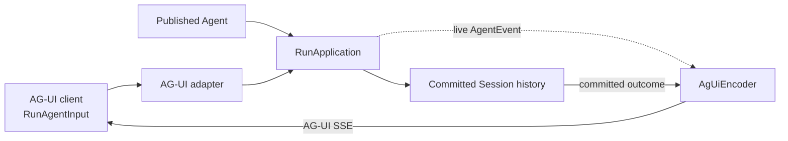
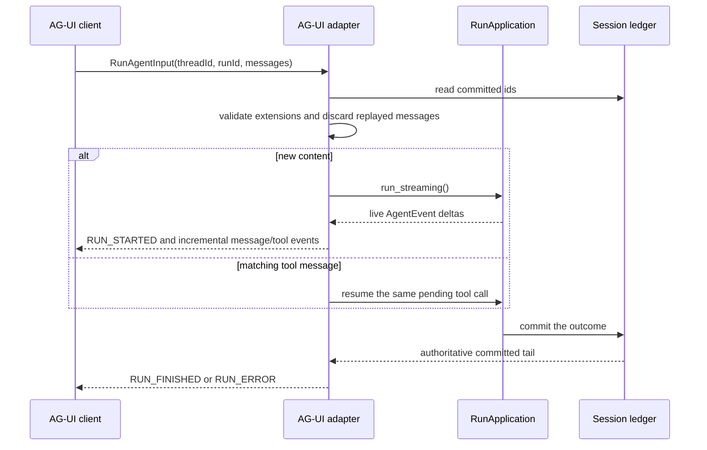

Use this protocol when the frontend already speaks AG-UI, including a
CopilotKit application built around `HttpAgent`. The application sends
`RunAgentInput`; Awaken streams AG-UI events and keeps the resulting conversation
in the same Session history used by every other application protocol.

AG-UI is the frontend wire, not the place to copy an Agent's tools, Memory, or
permission policy. Those remain on the published Agent. Use the
[connection matrix](/docs/agents/protocols/connect/) if the frontend can also
choose AI SDK or Managed Agents.

## Boundary and ownership

The adapter owns request validation, AG-UI event framing, and message-history
projection. `RunApplication` remains the execution owner; the Session ledger
remains the history owner. There is no AG-UI-specific Agent definition or
second run state machine.

## Current contract

The default run entry point is `POST /v1/ag-ui`. Agent-scoped and history paths
are indexed in the [Public HTTP API](/docs/agents/reference/api/).

| Task | Request boundary | Result |
| --- | --- | --- |
| Start a turn | `RunAgentInput` with new supported content | AG-UI SSE stream |
| Resume a pending tool call | One matching tool message | Continuation of the same Run |
| Rehydrate a thread | `threadId` and an optional current cursor | `{ items, cursor }` page of committed AG-UI messages |

Fresh input accepts user, system, or developer text, plus image parts supplied as
a URL or inline base64. The current adapter does not implement AG-UI per-run
`tools`, `context`, `parentRunId`, non-empty `state`, `forwardedProps`, or
`resume`, and it does not accept audio, video, document, or binary input. These
fields fail before execution rather than being silently ignored.

## Run and resume

A client-executed tool returns a `role: "tool"` message with the matching
`toolCallId`. For a built-in tool waiting at a permission gate, the same message
without `error` allows the call; a present `error` denies it. Both paths resume
the existing pending call. A result for another call fails closed.

Live events provide low-latency text and tool arguments. Completion comes from
the committed outcome. After a lost connection, page through message history
and continue from the returned `cursor`; do not reconstruct durable state from
the last live event seen in the browser.

## Read outcomes

| Observable result | Meaning | Application action |
| --- | --- | --- |
| `RUN_STARTED` then message or tool events | The turn was admitted and is in progress. | Render events in order. |
| Tool call events with no terminal success yet | The Run may be waiting for a client result or permission. | Return one matching tool message. Waiting is normal, not a fault. |
| `RUN_FINISHED` | The committed outcome completed. | Treat the turn as complete and keep its `threadId`. |
| `RUN_ERROR` with a code | Awaken rejected the input or the Run failed with a classified cause. | Correct an input-contract error. Otherwise read committed history for the same `threadId` and retain the `runId`, code, and sanitized message. |
| History `400` | The supplied cursor is not present in the current committed page sequence. | Drop the fabricated or stale cursor and read from the first page again. |
| History `503` | The history store is unavailable; this is not an empty thread. | Keep the current `threadId` and cursor. Retry the read with bounded backoff after the service is available; do not replace local state with an empty history. |

Malformed JSON, a wrong content type, and unsupported fields are returned as a
single `RUN_ERROR` stream. They do not start a Run. An unavailable history store
returns `503`, not a false empty thread. A browser disconnect needs no manual Run
cleanup: the adapter interrupts the in-flight Run automatically.

## Verify the integration

Seeing text in the browser proves only that the live wire works. A complete
check uses the same `threadId` to read committed history and confirms the
Session in the Console. The concrete CopilotKit setup and production proxy
boundary are maintained in
[Integrate CopilotKit with AG-UI](/docs/agents/how-to/integrate-copilotkit-ag-ui/).

The Public HTTP API remains the complete route index.
