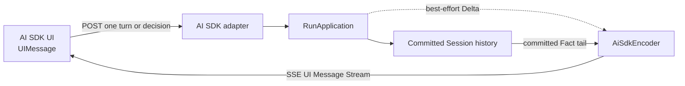

Use this protocol when the application already renders conversations with the
Vercel AI SDK `UIMessage` model. Awaken accepts that request shape and returns an
AI SDK v6 UI Message Stream, so the frontend can use its normal stream parser
while Awaken continues to own Agent configuration and Session history.

Choose [AG-UI](/docs/agents/protocols/ag-ui/) instead when the application
needs an AG-UI `HttpAgent`. Choose [Managed Agents](/docs/agents/protocols/managed-agents/)
when an official Anthropic SDK should own the application contract. The
[connection matrix](/docs/agents/protocols/connect/) is the sole comparison of
all protocol choices.

## What crosses this boundary



The adapter is a wire projection over the shared `RunApplication`. It does not
define another Agent, tool registry, permission policy, or history store.
`AiSdkEncoder` is the single stateful projection for both live `Delta`s and the
committed `Fact` tail.

## Send one turn

The default entry point is:

```text
POST /v1/ai-sdk/chat
```

```json
{
  "messages": [
    {
      "id": "msg-1",
      "role": "user",
      "parts": [{ "type": "text", "text": "Summarize the latest support request" }]
    }
  ],
  "threadId": "support-demo-1",
  "agentId": "support-agent"
}
```

| Field | What to send |
| --- | --- |
| `messages` | AI SDK v6 `UIMessage[]`. New user and system text is input. Image `file` parts may use a hosted URL or a base64 Data URL. Other file media and UI-only parts are not model input. |
| `threadId` | Reuse the same non-empty value for one conversation. Omit it only when the returned identifier does not need to be chosen by the application. |
| `agentId` | Select one published Agent. Omit it to use the configured default. |

Thread-scoped, Agent-scoped, and history routes are listed once in the
[Public HTTP API](/docs/agents/reference/api/). The copy-ready React transport
belongs in [Integrate an AI SDK frontend](/docs/agents/how-to/integrate-ai-sdk-frontend/).

## Follow one request to completion

```mermaid
sequenceDiagram
  participant U as AI SDK UI
  participant A as AI SDK adapter
  participant R as RunApplication
  participant L as Session ledger

  U->>A: UIMessage[] + threadId
  A->>L: read committed message ids
  A->>A: discard replayed ids; decode new input or one tool decision
  alt new user or system input
    A->>R: run_streaming(thread, Agent, new messages)
    R-->>A: best-effort live Deltas
    A-->>U: start, text and tool-input SSE parts
  else matching tool result or approval
    A->>R: resume the awaiting tool call
  end
  R->>L: commit the Step outcome
  L-->>A: authoritative Fact tail and usage
  A-->>U: tool result or finish/error, then [DONE]
```

Each event is framed as an SSE `data:` line containing one JSON object. The
response identifies the format with `x-vercel-ai-ui-message-stream: v1`, sends
keep-alive comments while a turn is quiet, and ends with `data: [DONE]`.

Live text and tool-argument deltas make the interface responsive. They are not
the recovery record. The committed tail owns complete messages, tool
availability and results, usage, awaiting state, and the terminal outcome. Read
the thread history after reconnecting or when the application needs a durable
view.

## Interpret the stream

| What the UI observes | Meaning | Application action |
| --- | --- | --- |
| `text-start` / `text-delta` / `text-end` | One displayable text block is being assembled. | Render deltas in order. Treat the matching end as a block boundary, not as Session completion. |
| `tool-input-*` followed by `tool-approval-request` | A built-in tool is waiting for a permission decision. | Return an AI SDK `approval-responded` part with the same `toolCallId`. |
| `tool-input-available` for a client-executed tool | The application owns tool execution. | Return its output or error with the same `toolCallId`; this resumes the same awaiting call. |
| `finish` with `tool-calls` | The Run is waiting, not failed. | Resolve the displayed tool or approval request. Do not start an unrelated turn. |
| `finish` with `stop` | The committed Step ended normally. | The turn is complete. Read history when durable reconstruction matters. |
| `error` followed by `finish` with `error` | The request or Run ended with a surfaced error. | Show the error without treating partial live text as committed completion. |

Reasoning lifecycle boundaries may be emitted, but private reasoning bytes are
not sent. The adapter closes open text or reasoning blocks before changing to a
tool block, so the UI does not need to repair block ordering.

## Conditions the application must correct

Only errors that survive protocol handling and require a caller decision belong
here:

| Observable condition | Check | Corrective action |
| --- | --- | --- |
| The stream contains `error` before useful output | Validate JSON, `Content-Type`, and the `UIMessage` field types. Decode failures are deliberately returned inside the stream rather than as plain-text HTTP errors. | Correct the request and send it once. |
| A tool decision returns `error` saying no Run is awaiting, or names the wrong call | Compare the submitted `toolCallId` with the current pending tool in committed history. | Refresh history and submit a decision only for the current call. Do not reuse a decision from an older render. |
| `error` follows partial live output | Read committed history for the same `threadId` before deciding whether more work is needed. | Preserve the error text and current ids. Do not resend the same input merely because the browser displayed only a prefix. |

A browser disconnect is not a manual recovery task. The adapter interrupts the
in-flight Run automatically so it does not continue detached. Reopen the thread
from committed history; do not invent a reconnect, cancel, or draft-preview URL
under `/v1/ai-sdk`.

## Related

- [Integrate an AI SDK frontend](/docs/agents/how-to/integrate-ai-sdk-frontend/)
- [Sessions and events](/docs/agents/concepts/sessions-and-events/)
- [Events](/docs/agents/runtime/reference/events/)
