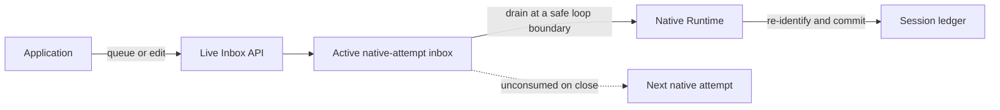
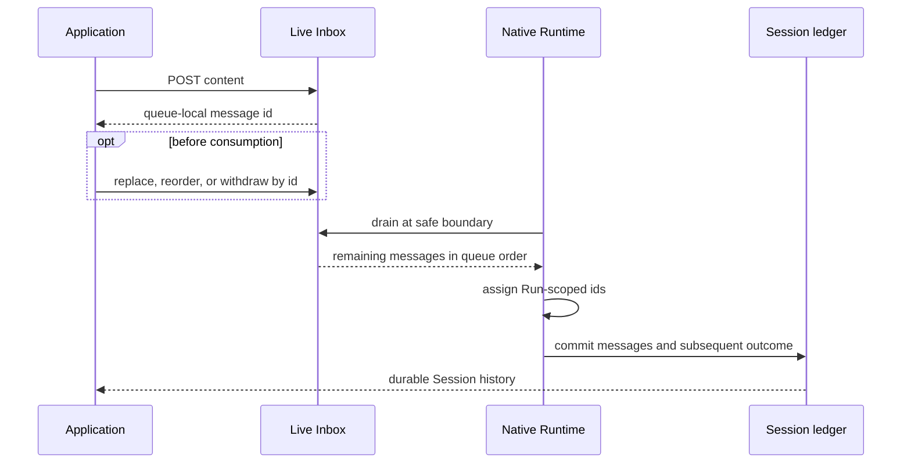

Use Live Inbox only when a native Run is active and the application needs to
change input the Agent has not consumed yet. You can queue a message, replace
it, change its position, or withdraw it while it remains visible in the queue.

This is a best-effort steering window, not durable message ingress. Use ordinary
Session events when the input must be retained, when no Run is active, or when
the selected executor is ACP. The extension is deliberately namespaced under
`/v1/awaken`; it is not part of the Managed Agents compatibility surface.

## Where editing is possible



The queue is process-local and attached to one active native attempt. A message
is editable only until the Runtime drains it at a safe loop boundary. The drain
removes the queue identity, assigns a Run-scoped message identity, and folds the
content into the transcript before the next model decision. The Session commit,
not presence in the queue, makes that input authoritative.

Unconsumed entries are carried into the next native attempt owned by the same
Runtime host. The current implementation does not open this inbox for an ACP
executor, and the queue itself is not a cross-process recovery channel.

## Queue and edit

All operations share this base path:

```text
/v1/awaken/sessions/{session_id}/live-inbox
```

| Intent | Request | Success |
| --- | --- | --- |
| Read the editable window | `GET` the base path | `{ active, version, messages }` |
| Queue content | `POST` the base path with `{ "content": [...] }` | Stable queue-local `{ "id": ... }` |
| Replace content | `PUT /{message_id}` with `{ "content": [...] }` | `204 No Content` |
| Withdraw content | `DELETE /{message_id}` | `204 No Content` |
| Reorder the queue | `PUT /order` with every current id in the desired order | `204 No Content` |

A reorder is an exact full permutation, not a partial move. Read a fresh
snapshot, arrange all returned ids once, then submit that list. The queue is
unchanged when validation rejects a stale permutation.

## Follow one message



There is no race-free promise that an edit sent after a snapshot will win. The
HTTP result tells the application whether the queue still accepted it.

## Conditions the application must handle

| Result | What it establishes | Action |
| --- | --- | --- |
| `404 Not Found` on the base path | The Session is unknown or not visible in the current Workspace scope. | Verify the Session id and Workspace-bound credential. The boundary intentionally does not reveal which check failed. |
| `404 Not Found` for a message id | That id is no longer editable: it was consumed, withdrawn, or never belonged to this queue. | Read a fresh snapshot. If the message is absent, inspect committed Session history instead of repeating the edit. |
| `409 Conflict` | The submitted order is not the current queue's complete permutation. No reorder was applied. | `GET` a new snapshot and retry once with exactly those ids. |
| `410 Gone` | No native attempt currently accepts live input. | Stop editing and send the content as an ordinary durable Session event. |
| `500 Internal Server Error` | Session ownership could not be read, so the queue mutation was not attempted. | Keep the content in the caller. Retry only after the Session read path is available, or use the durable event path when it is available. |

Normal consumption needs no troubleshooting. A message disappearing from the
editable snapshot can mean the system already drained it; committed history is
the way to distinguish accepted input from an entry that was withdrawn.

## Related

- [Sessions and events](/docs/agents/concepts/sessions-and-events/#live-inbox)
- [Manage a Session](/docs/agents/how-to/manage-a-session/)
- [Public HTTP API](/docs/agents/reference/api/)
